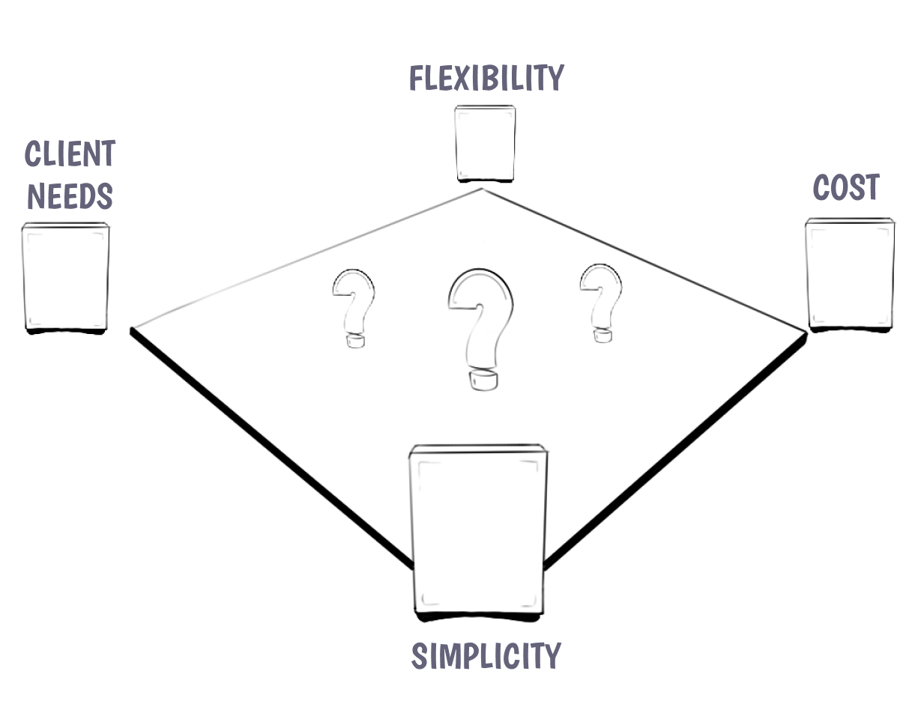
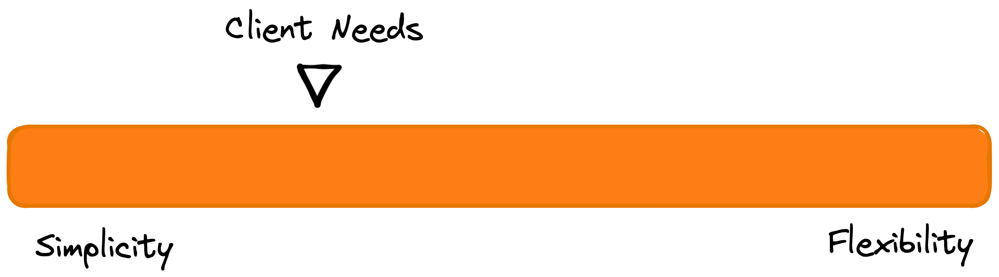
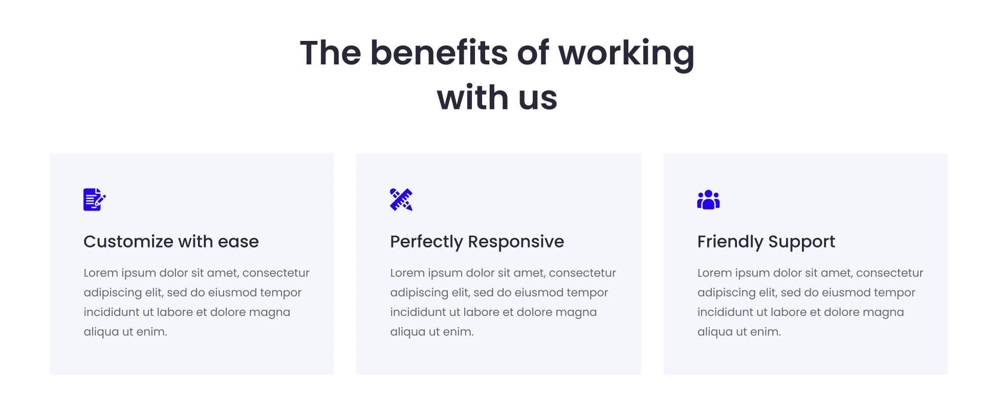

# A Complete Guide on How to Choose what to Build



The two first and most important questions to answer before diving in and choosing how to implement a design in WordPress are:

1. _**"Who is going to use this?"**_ - as in who are the people that are going to be doing content entry
2. _**"What are their goals?"**_ - as in do they want to share information in a strict format or do they need flexibility over the page design

When you are building editorial experiences it is important to understand the goals of the people you are crafting these experiences for. There are clients who _just_ want to share their content and don't want to worry about how things are going to look. That is what they hired us for. And there are other clients that essentially want a page builder that has their defaults set but gives them freedom to design every aspect of their page.


This also isn't a black or white question. Most clients fall somewhere in between these two extremes. Nevertheless it is crucial to get these questions answered as early in the process as possible in order to make the right editorial decisions for the client.

## Atomic vs. Molecular structures

Depending on what the answer to these first questions is, you can figure out whether your client needs a system that is super composable &mdash; built out of individual atomic pieces that they then can use to build whatever they want &mdash; or whether they need more structure.

Looking at this design for example, there are several ways in which you can approach building this in the editor.


### 1. Using Core Blocks

This design could be built entirely using core blocks.

```plaintext
Group
    Heading
    Columns
        Column
            Image
            Heading
            Paragraph
        Column
            Image
            Heading
            Paragraph
        Column
            Image
            Heading
            Paragraph
```

### 2.a Using Core Blocks + a Block Pattern

You can easily enhance the editor experience by also adding a block pattern for this arrangement of core blocks. This allows editors to quickly and easily create this section whilst leaving them the flexibility to change everything to their liking.

:::caution
As mentioned in the [block pattern reference](../reference/Blocks/block-patterns) patterns have no connection to what created them. So any updates you make to the pattern in the future will not update instances that were created before you updated it.
:::caution

### 2.b Using Core Blocks + a Block Pattern with Restrictions

If you want to lock down the abilities of the editors a bit more you can use the block locking API to lock down certain aspects of the editorial experience. You could, for example, remove the ability for them to move & remove any of the items within each of the columns. Therefore they would no longer be able to move the icon underneath the heading or remove the heading altogether. You can also lock down the list of allowed blocks of the column so that the editor can only insert images, headings, paragraphs and lets say a button. Or nothing at all.

### 3. Building a Custom Icon Card Block

There are also valid reasons why the client needs an even more locked down experience. If the spacing needs to be just right and editors should not have to think about needing to design at all this can also be built as a _simple_ Icon Card Block. The block itself would consist of an icon picker and two `RichText` fields. With maybe an option to change the color theme of the entire card.

This Icon Card block can then be inserted inside the columns block with a heading placed above.

:::info
The custom block should also get a block pattern created to make it even easier to insert the entire design on the page. Since we build dynamic blocks at 10up we now also don't have the issue of not being able to update markup in patterns anymore. Because we can update the markup of our dynamic block which gets reflected everywhere.
:::info
