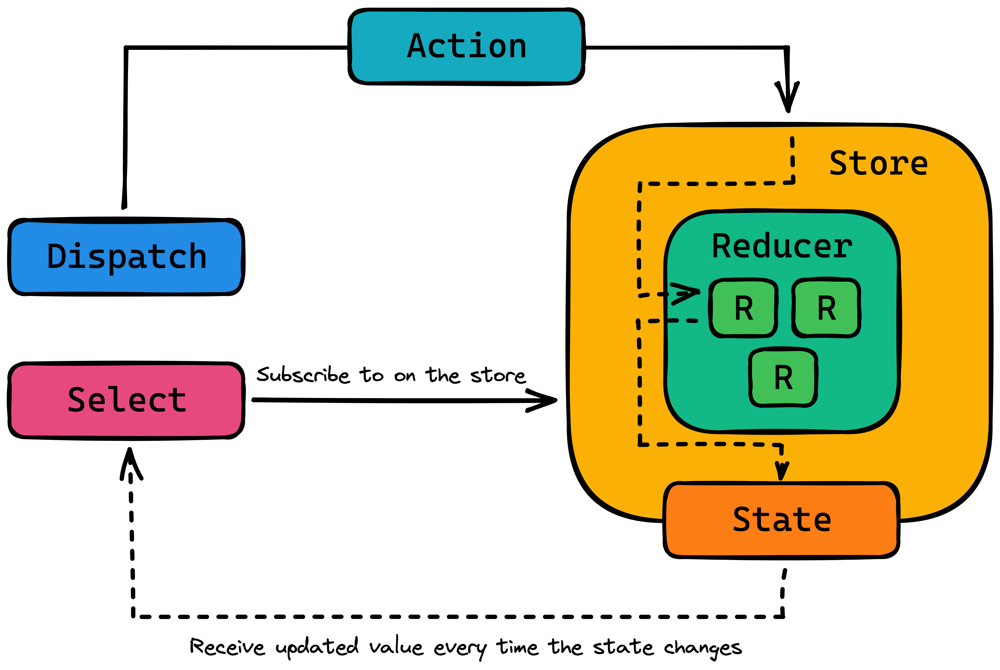
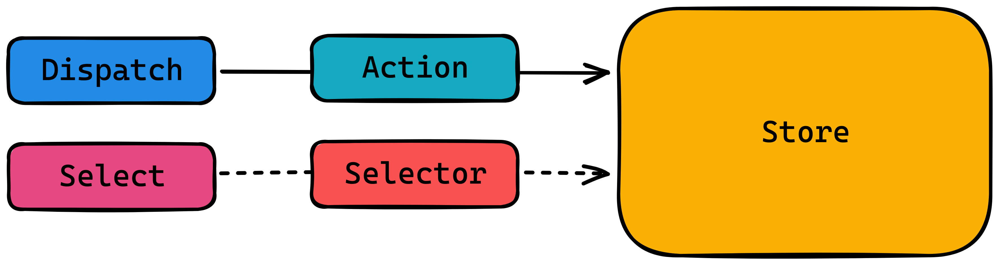
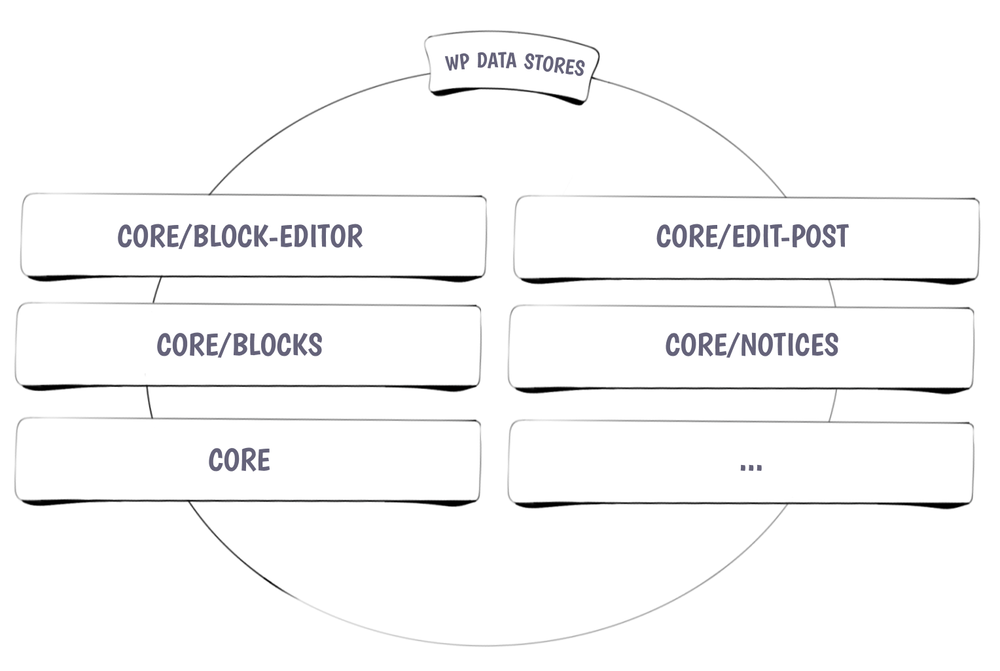
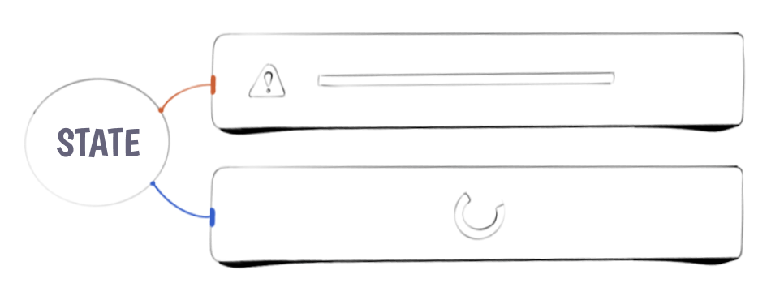
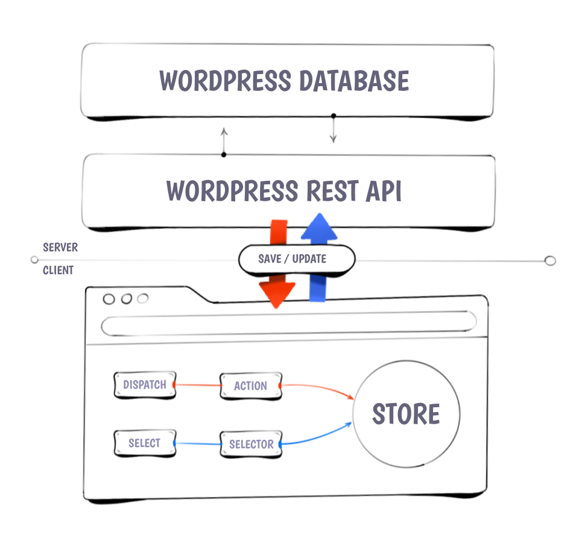

# A Complete Guide to the WordPress Data API

<details>
<summary>Background</summary>

The Data API in WordPress is used to manage the global application state within the editor. It is a wrapper around the popular state management library [Redux](https://redux.js.org).  



In redux and therefore in the WordPress Data API there is the concept of a Store that manages the global application state. This global state can only be updated by dispatching actions on the store. These actions will then get consumed by reducers to determine what the next version of the state should look like. If you want to access the state you can subscribe to the store and receive the value of the current state every time it is being updated.


</details>

## Basics and terminology

- **`Store`**: A Store is where the logic of the application lives. It contains the state and reducers to update said state.
- **`dispatch`**: Trigger an update of the value in the store
- **`select`**: Read the value of a value in the store
- **`subscribe`**: In most cases you want to be aware of any changes that happen to a value in the store. In order to receive updates when the value has changed you need to subscribe to changes. In react you can do this with the `useSelect` and `useDispatch` hooks.

## Stores in WordPress



The editor does not only have one global data store but rather multiple different stores that each focus on different areas of the site. These stores can be refereed to by their namespace or you can import the store object from the individual packages.

| Namespace           | Name | Purpose |
|---------------------|------|---------|
| `core`              | WordPress Core Data | Interact with global settings etc. |
| `core/blocks`       | Block Types Data | Interact with all the registered blocks, styles etc. |
| `core/block-editor` | The Block Editor’s Data | Interact with the block editor. Insert, move, remove etc. |
| `core/editor`       | The Post Editor’s Data | Interact with the current post like getting the post type. |
| `core/edit-post`    | The Editor’s UI Data | Interact with the editor interface. Toggle interface areas etc. |
| `core/notices`      | Notices Data  | Interact with notices in the editor. |

## Interacting with Stores

You can interact with a store by either dispatching an action on it to update a piece of state or by selecting a piece of information to use in your block.
In order to interact with a store you either need to know its namespace or you can import it from the `wordpress/` package directly.

```js
import { store } from '@wordpress/...';
```

since you may want to interact with several stores at a time it is a common pattern to import the store and give it a new name that includes the package it is coming from.

```js
import { store as packageStore } from '@wordpress/package';
```

:::note
`@wordpress/package` does not actually exist
:::note

You can then use this imported store object either by passing it to the `useDispatch` hook if you want to trigger actions on the store:

```js
import { store as packageStore } from '@wordpress/package';
import { useDispatch } from '@wordpress/data';

const { doSomething } = useDispatch( packageStore );
```

or by passing it to the `select` function we get passed as the first parameter to the function we pass to the `useSelect` hook:

```js
import { store as packageStore } from '@wordpress/package';
import { useSelect } from '@wordpress/data';

const something = useSelect( function(select) {
    return select( packageStore ).getSomething();
});
```

If we want to get multiple pieces of information out of a given store it is a common pattern to group the request in one `useSelect` statement per store.

```js
import { store as packageStore } from '@wordpress/package';
import { useSelect } from '@wordpress/data';

const { something, somethingElse } = useSelect( function(select) {
    const { getSomething, getSomethingElse } = select( packageStore );

    return {
        something: getSomething(),
        somethingElse: getSomethingElse();
    }
});
```

### Handling Error & Loading States



You get get access to whether or not a select statement has been resolved by using the `hasFinishedResolution` selector that is provided on every core store.

The `hasFinishedResolution` selector takes the name of the selector you want to monitor as the first parameter and the parameters you provided the selector as the second parameter. Because of that it is a good pattern to put the parameter for the main selector into a variable on its own and list the parameter in an array. You can then use this array to spread the parameter into the selector itself and also provide them to the `hasFinishedResolution` selector.

You can now use the value you get from the `hasFinishedResolution` selector to know whether you are still loading the information of whether it is done loading.

```js
import { store as packageStore } from '@wordpress/package';
import { useSelect } from '@wordpress/data';

const something = useSelect( function(select) {
    const { getSomething, hasFinishedResolution } = select( packageStore );

    const getSomethingParameters = [ 'exampleParam' ];

    return {
        something: getSomething(...getSomethingParameters),
        hasResolvedSomething: hasFinishedResolution('getSomething', getSomethingParameters),
    };
});
```

## Using the Data API vs. Using the Rest API

Under the hood the Data API uses the Rest API. With the very important difference that changes you make to values only actually get saved to the database when the post is saved. If you were to interface with the Rest API directly to manipulate information about a post that data would be updated and saved immediately without getting a preview or being aware of it. That is why it is always preferred to use the Data API when you are trying to manipulate anything.



## Examples

:::note
The hooks `useSelect` and `useDispatch` can only be used inside of react components.

If you want to interact with the data api from regular functions you can use the `select`, `dispatch`, and `subscribe` functions exported from the `@wordpress/data` package.
:::

### Get the current post type and selected post template

```js
import { useSelect } from '@wordpress/data';
import { store as editorStore } from '@wordpress/editor';

const { postType, template } = useSelect((select) => ({
    postType: select(editorStore).getCurrentPostType(),
    template: select(editorStore).getEditedPostAttribute('template'),
}));
```

### Insert a block if it isn't already on the page

```js
import { useSelect, useDispatch } from '@wordpress/data';
import { store as blockEditorStore } from '@wordpress/block-editor';
import { useEffect } from '@wordpress/element';
import { createBlock } from '@wordpress/blocks';

const { insertBlocks } = useDispatch(blockEditorStore);
const blocks = useSelect((select) => select(blockEditorStore).getBlocks());

useEffect(() => {
    const hasBlock = !!blocks.find((block) => block.name === BLOCK_NAME);

    if (!hasBlock) {
        insertBlocks( createBlock( BLOCK_NAME ) );
    }
}, [ blocks ]);
```

### Read and Write post meta values

```js
import { useSelect, useDispatch } from '@wordpress/data';
import { store as editorStore } from '@wordpress/editor';

const { editPost } = useDispatch( editorStore );
const meta = useSelect((select) => select( editorStore ).getEditedPostAttribute('meta'));

function setMetaValue(key, value) {
    editPost({
        meta: { [key]: value },
    });
}
```
