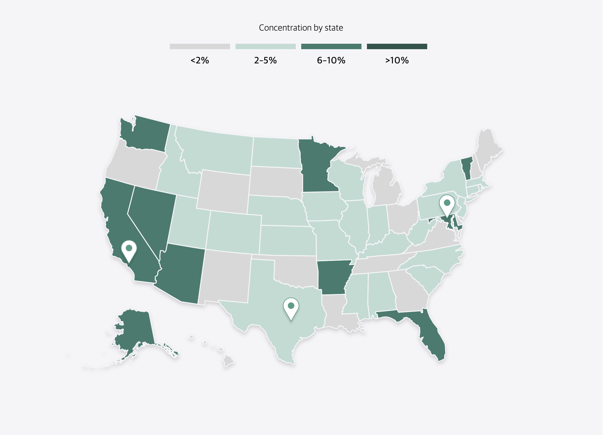
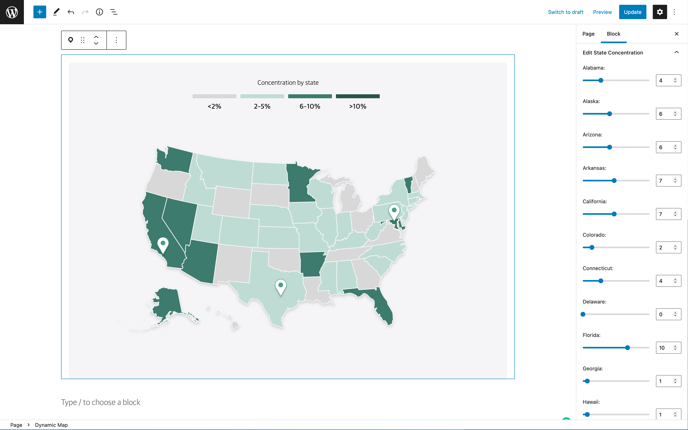

# Working with External Libraries in Custom Blocks

We can sometimes find ourselves with the need to integrate a 3rd party library into a Custom Block. In a recent example, I needed to integrate an interactive Map into the editor. The Map itself would be rendered using [D3.js](https://d3js.org). It should give editors the ability to change a percentage value for every state of the United States which would correlate to a color coating of that state.



Our goal was as always to have the editor match the frontend as much as possible. So in this case we wanted the map to fully render in the editor and provide `RangeControl` sliders in the sidebar for each state in order to change the percentage value between 0 and 15 in the blocks settings sidebar.

## How do you render some non react content inside a react application?

In order to render any non react elements inside a React document we need to get access to the actual DOM Node in the browser. The easiest and safest way to do that in modern react is using a `ref`.

```jsx
import { useBlockProps } from '@wordpress/block-editor';
import { useRef } from '@wordpress/element';

function BlockEdit(props) {
    const blockProps = useBlockProps();
    const ref = useRef();

    return (
        <div {...blockProps}>
            <div className="map" ref={ref} />
        </div>
    );
}
```

For [D3.js](https://d3js.org) specifically you select the DOM Node using the `d3.select` function in order to then manipulate the content further using all the helpers build into D3.

Because of that we wrote all our render functions for D3 in a way where you needed to pass the selected root element into the render function.

```js
function renderMap( rootElement ) {
    ...
}
```

from there we were able to call this function both on the frontend and in the editor by passing the relevant node into the render function.

```jsx title="edit.js"
import { useBlockProps } from '@wordpress/block-editor';
import { useRef, useEffect } from '@wordpress/element';
import * as d3 from 'd3';

import { renderMap } from './render-map';

function BlockEdit(props) {
    const blockProps = useBlockProps();
    const ref = useRef();

    useEffect( () => {
        if ( ref.current ) {
            const d3RootElement = d3.select(ref.current);
            renderMap( d3RootElement );
        }
    }, [])

    return (
        <div {...blockProps}>
            <div className="map" ref={ref} />
        </div>
    );
}
```

```js title="frontend.js"
import * as d3 from 'd3';

import { renderMap } from './render-map';

const mapBlocks = document.querySelectorAll( '.wp-block-namespace-map' );
mapBlocks.forEach( mapBlock => {
    const mapElement = mapBlock.querySelector( '.map' );
    const d3RootElement = d3.select( mapElement );
    renderMap( d3RootElement );
} );
```

## Making it dynamic

At this point we had the static map rendering on both the frontend and in the editor. All that was left to do was create some dynamic data that we saved to the blocks attributes and then pass them in as the second argument to our `renderMap` function. All we need to do in order to ensure that the editor view re-renders every time the attributes change is to make sure the relevant attributes get added to the dependency array of the `useEffect` hook.

```jsx
import { useBlockProps } from '@wordpress/block-editor';
import { useRef, useEffect } from '@wordpress/element';
import * as d3 from 'd3';

import { renderMap } from './render-map';

function BlockEdit(props) {
    const { attributes } = props;
    const { stateConcentration } = attributes;

    const blockProps = useBlockProps();
    const ref = useRef();

    useEffect( () => {
        if ( ref.current ) {
            const d3RootElement = d3.select(ref.current);
            renderMap(
                d3RootElement,
                { concentration: stateConcentration }
            );
        }
    }, [ stateConcentration ])

    return (
        <div {...blockProps}>
            <div className="map" ref={ref} />
        </div>
    );
}
```



## Making it reusable

In this case we actually ended up having the legend above the map and the markers for the cities be their own individual SVGs rendered by D3 and so we created a little helper react hook to make it easier working with the refs.

```js title="useD3.js"
import { useEffect, useRef } from '@wordpress/element';
import * as d3 from 'd3';

export const useD3 = (callback, dependencies = []) => {
    const ref = useRef();

    useEffect(() => {
        if ( ref.current ) {
            callback(d3.select(ref.current));
        }
    }, dependencies);

    return ref;
}
```

## Other examples

You can see another example of this by looking at the Apple Maps Block plugin that 10up has. We use a [similar approach there to get the map rendered in the editor](https://github.com/10up/maps-block-apple/blob/0b128ee79d1f67aca986ccc865584d179bc2c98a/src/edit.js#L25-L56).
