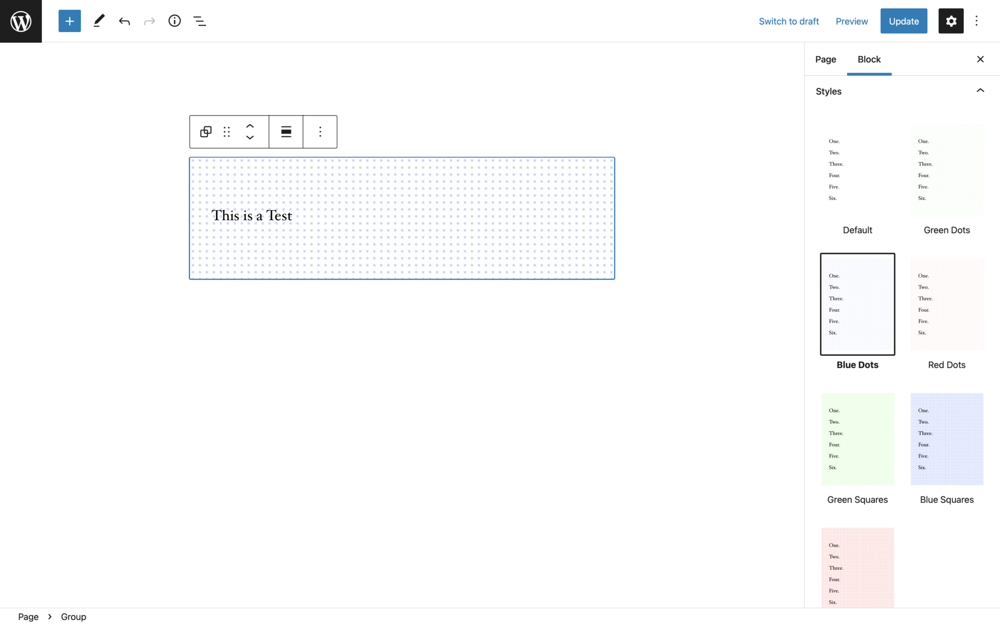
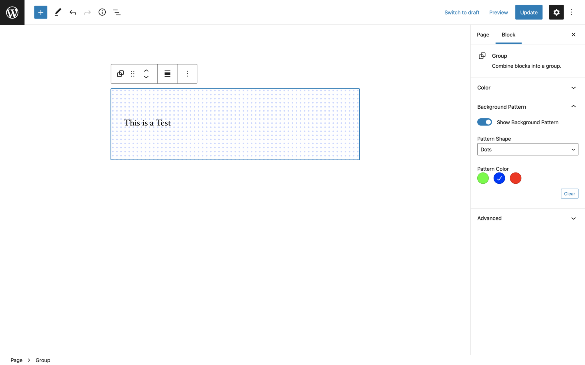

# The pitfall of Custom Block Styles in WordPress

The ability to create custom block styles for any block in Gutenberg is super cool. It is an easy API with a nice UI interface that allows us to quickly add some options to blocks.



```js
import { registerBlockStyle } from '@wordpress/blocks';
import domReady from '@wordpress/dom-ready';

const styles = [
    {
        name: "green-dots",
        label: "Green Dots"
    },
    {
        name: "blue-dots",
        label: "Blue Dots"
    },
    {
        name: "red-dots",
        label: "Red Dots"
    },
    {
        name: "green-squares",
        label: "Green Squares"
    },
    {
        name: "blue-squares",
        label: "Blue Squares"
    },
    {
        name: "red-squares",
        label: "Red Squares"
    },
];

domReady( () => {
    styles.forEach( style => {
        registerBlockStyle( 'core/group', style );
    } );
} );
```

It comes with a huge caveat though. Blocks can only select one block style at a time. And that means that you very quickly end up in the position where you all of the sudden have 10+ block styles that all do basically the same thing but with small variations because clients want to be able to combine two existing styles.

It also brings with it a massive performance impact. Block Styles show the visual preview in the inspector area. The way that works is that the editor actually creates a new iframe where it actually renders a copy of the block with the style applied. That means that for every style shown there in the inspector an additional iframe with the block in it gets rendered. Which can very quickly cause the editor to become slow to respond and for the experience to get janky.

Another thing you have to be aware of is that you may have to write quite a lot of CSS to support all the custom block styles. Each block style gets a custom class name for it. This is great for some things but in our example, it leads to a lot of duplicated code. We have to add the same styles again and again for all 6 generated classes.

```css
.is-style-green-squares {
    ...
}

.is-style-red-squares {
    ...
}

.is-style-blue-squares {
    ...
}

.is-style-green-dots {
    ...
}

.is-style-red-dots {
    ...
}

.is-style-blue-dots {
    ...
}
```

There is a different way to approach these problems though that is not as plug and play that also doesn't take a lot of effort.

For the example that we have used for the block styles here, we wanted our users to be able to choose a background pattern and the color of the pattern. This could also be a text style and size or any other arbitrary setting. Instead of registering a block style for every possible combination, we can instead add additional settings to the block.

We want two new settings to be added to the block in our example. One option to choose the pattern and one for the color. And based on the selection we then need to add a custom class name to the block.



The way we can achieve that is by using the hooks that Gutenberg provides and the `addFilter` function. We need to filter the block registration: `blocks.registerBlockType` to add any new attributes to the block, `editor.BlockEdit` to add out settings to the settings sidebar or toolbar, `editor.BlockListBlock` to add the generated class in the editor and `blocks.getSaveContent.extraProps` to add the class to the saved block markup.

Let's take this piece by piece. First, we need to add some attributes to the block we want the background pattern to apply to.

```js
import { addFilter } from '@wordpress/hooks';

const ALLOWED_BLOCKS = [ 'core/group' ];

const addAttributesToBlock = (settings, name) => {

    // return early from the block modification
    if (! ALLOWED_BLOCKS.includes(name)) {
        return settings;
    }

    // modify block registration object
    return {
        ...settings,
        attributes: {
            ...settings.attributes,
            hasBackgroundPattern: {
                type: 'boolean',
                default: false,
            },
            backgroundPatternShape: {
                type: 'string',
                default: 'dots',
            },
            backgroundPatternColor: {
                type: 'string',
                default: 'green'
            }
        }
    };
};

addFilter(
    'blocks.registerBlockType',
    'namespace/backgroundPatterns/addAttributesToBlock',
    addAttributesToBlock,
);
```

Now that we have registered the attributes we can use these values to add the UI for these settings.

```js
import { addFilter } from '@wordpress/hooks';
import { createHigherOrderComponent } from '@wordpress/compose';
import { InspectorControls } from '@wordpress/block-editor';
import { PanelBody, SelectControl, ToggleControl, ColorPalette, BaseControl } from '@wordpress/components';

const addSettingsToBlock = createHigherOrderComponent((BlockEdit) => {
    return (props) => {
        const { setAttributes, name, attributes, isSelected } = props;

        // return early from the block modification
        if (! ALLOWED_BLOCKS.includes(name)) {
            return <BlockEdit {...props} />;
        }

        const {
            hasBackgroundPattern,
            backgroundPatternShape,
            backgroundPatternColor
        } = attributes;

        const COLOR_OPTIONS = [
            {
                name: 'Green',
                slug: 'green',
                color: 'hsl(110, 100%, 50%)'
            },
            {
                name: 'Blue',
                slug: 'blue',
                color: 'hsl(230, 100%, 50%)'
            },
            {
                name: 'Red',
                slug: 'red',
                color: 'hsl(5, 100%, 50%)'
            }
        ];

        return (
            <>
                <BlockEdit {...props} />
                {isSelected && (
                    <InspectorControls>
                        <PanelBody title="Background Pattern">
                            <ToggleControl
                                label="Show Background Pattern"
                                checked={hasBackgroundPattern}
                                onChange={ value => setAttributes( { hasBackgroundPattern: value } ) }
                            />
                            { hasBackgroundPattern && (
                                <>
                                    <SelectControl
                                        label="Pattern Shape"
                                        value={backgroundPatternShape}
                                        options={[
                                            { value: 'dots', label: "Dots" },
                                            { value: 'squares', label: "Squares" },
                                        ]}
                                        onChange={value => setAttributes({backgroundPatternShape: value})}
                                    />
                                    <BaseControl label="Pattern Color">
                                        <ColorPalette
                                            colors={COLOR_OPTIONS}
                                            disableCustomColors
                                            value={COLOR_OPTIONS.find( item => item.slug === backgroundPatternColor ).color}
                                            onChange={value => {
                                                const colorName = COLOR_OPTIONS.find( item => item.color === value ).slug
                                                setAttributes({
                                                    backgroundPatternColor: colorName
                                                })
                                            }}
                                        />
                                    </BaseControl>
                                </>
                            ) }
                        </PanelBody>
                    </InspectorControls>
                )}
            </>
        );
    };
}, 'addSettingsToBlock');

addFilter(
    'editor.BlockEdit',
    'namespace/backgroundPatterns/addSettingsToBlock',
    addSettingsToBlock,
);
```

What we are doing here is filtering the block edit component of the block. So by using the `createHigherOrderComponent` function we get passed the React component that is the editorial experience of the block. We cannot really modify the already existing block edit functionality. But we can extend it. By using the `InspectorControls` component we are able to inject new settings into the blocks setting sidebar. In there we can do whatever we want. In our case that is using a toggle, a select control, and a color picker.

Now we have the attributes registered and are setting the values in the editor. But we are not doing anything with these values jet. So next we need to generate the classes we want to add to the block. We need to do this twice. Once for the editor and once for the saved markup for the frontend.

```js
import { addFilter } from '@wordpress/hooks';
import { createHigherOrderComponent } from '@wordpress/compose';

const ALLOWED_BLOCKS = [ 'core/group' ];

const addClassNameInEditor = createHigherOrderComponent((BlockEdit) => {
    return (props) => {
        const { name, attributes } = props;

        // return early from the block modification
        if (! ALLOWED_BLOCKS.includes(name)) {
            return <BlockEdit {...props} />;
        }

        const {
            className,
            hasBackgroundPattern,
            backgroundPatternShape,
            backgroundPatternColor
        } = attributes;

        if ( ! hasBackgroundPattern ) {
            return <BlockEdit {...props} />;
        }

        const backgroundPatternColorClassName = `has-${backgroundPatternColor}-background-pattern-color`;
        const backgroundPatternShapeClassName = `has-${backgroundPatternShape}-background-pattern-shape`;

        return <BlockEdit {...props} className={`${className || ''} has-background-pattern ${backgroundPatternColorClassName} ${backgroundPatternShapeClassName}`} />;
    };
}, 'addClassNameInEditor');

addFilter(
    'editor.BlockListBlock',
    'namespace/backgroundPatterns/addClassNameInEditor',
    addClassNameInEditor,
);
```

And now again for the saved block markup.

```js
import { addFilter } from '@wordpress/hooks';

const ALLOWED_BLOCKS = [ 'core/group' ];

function saveSpacingAttributes(props, block, attributes) {

    // return early from the block modification
    if (! ALLOWED_BLOCKS.includes(block.name)) {
        return props;
    }

    const {
        className,
        hasBackgroundPattern,
        backgroundPatternShape,
        backgroundPatternColor
    } = attributes;

    if ( ! hasBackgroundPattern ) {
        return props;
    }

    const backgroundPatternColorClassName = `has-${backgroundPatternColor}-background-pattern-color`;
    const backgroundPatternShapeClassName = `has-${backgroundPatternShape}-background-pattern-shape`;

    return {...props, className: `${className || ''} has-background-pattern ${backgroundPatternColorClassName} ${backgroundPatternShapeClassName}`};
}

addFilter(
    'blocks.getSaveContent.extraProps',
    'namespace/backgroundPatterns/saveSpacingAttributes',
    saveSpacingAttributes,
);
```

And since we now have separate better suited utility classes we can reduce the amount of CSS we need to write to something like this:

```css
.has-background-pattern {
    ...
}

.has-red-background-pattern-color {
    ...
}

.has-blue-background-pattern-color {
    ...
}

.has-green-background-pattern-color {
    ...
}

.has-dots-background-pattern-shape {
    ...
}

.has-squares-background-pattern-shape {
    ...
}
```

This is quite a bit more code at first and I do understand that it can be a bit scary. But it is a lot of scaffolding that always is the same and opens up soooo many doors to really control the options available.
