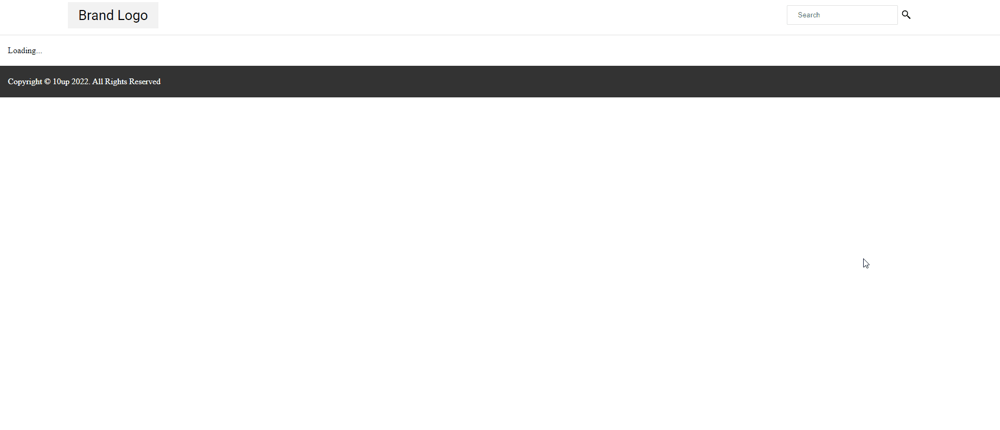
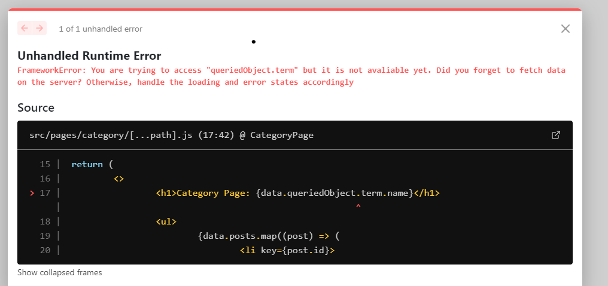

# Quick Introduction to the Framework

## Introduction

If you're familiar with Next.js you probably already know that it has a file-system-based router. In App Router, routes are declared under the `src/app` folder using special files like `page.tsx`, `layout.tsx`, and `loading.tsx`. To learn more about Next.js App Router, read the [official docs](https://nextjs.org/docs/app).

HeadstartWP fully supports Next.js App Router and takes advantage of its routing by leveraging a feature called "catch-all routes" which allows the framework to automatically map URL segments to WordPress routes and the proper REST API parameters necessary to fetch the appropriate data. It does so by adopting a convention of using a "catch-all" route named `[...path]/page.tsx` or `[[...path]]/page.tsx`.

## How Routing Works

To understand how routing works in the framework, let's take a look at the route in the starter project ([src/app/[...path]/page.tsx](https://github.com/10up/headstartwp/blob/develop/projects/wp-nextjs-app/src/app/%5B...path%5D/page.tsx)) that corresponds to a single post/page template (single.php) in WordPress.

First, note that it is using single brackets and not double brackets. That is because we only want to "catch" that route if no other top-level route is matched (such as `page.tsx` in the root). Therefore, any route in the form of /post-name or /2022/10/1 will match `src/app/[...path]/page.tsx`. You can confirm this by opening any post by either the /post-name route or the date route depending on how your permalinks settings are set up in WordPress E.g:

- https://headless-framework.vercel.app/2020/05/07/distinctio-rerum-ratione-maxime-repudiandae-laboriosam-quam
- https://headless-framework.vercel.app/distinctio-rerum-ratione-maxime-repudiandae-laboriosam-quam

The great thing about this is that you don't need multiple Next.js routes to handle the same resource!

### Basic Data Fetching with Server Components

Now let's look at how data fetching works with App Router Server Components. In App Router, components are Server Components by default, which means they run on the server and can fetch data directly using async/await.

```tsx title="src/app/[...path]/page.tsx"
import { queryPost } from '@headstartwp/next/app';
import { notFound } from 'next/navigation';
import type { Metadata } from 'next';

const singleParams = { postType: ['page', 'post'] };

interface PageProps {
	params: Promise<{ path?: string[] }>;
}

export async function generateMetadata({ params }: PageProps): Promise<Metadata> {
	try {
		const { seo } = await queryPost({
			routeParams: await params,
			params: singleParams,
		});
		
		return seo.metadata;
	} catch {
		return {};
	}
}

export default async function SinglePostPage({ params }: PageProps) {
	try {
		const { data } = await queryPost({
			routeParams: await params,
			params: singleParams,
		});

		return (
			<article>
				<h1>{data.post.title.rendered}</h1>
				<div dangerouslySetInnerHTML={{ __html: data.post.content.rendered }} />
			</article>
		);
	} catch (error) {
		// Handle 404s gracefully
		if (error.status === 404) {
			notFound();
		}
		throw error;
	}
}
```

This is much simpler than the Pages Router approach! The `queryPost` function is one of the framework's data-fetching functions for App Router. As its name suggests, it fetches a single post for a given set of params. We're passing one param called `postType`, which tells the function to fetch the current page from either the "page" or "post" post type. Note that we're not passing the slug. Passing the slug is optional and if you don't pass the slug, the framework will automatically extract the post/page slug from the URL.

> Extracting the *slug* from the url **only** works when using the `[...path]/page.tsx` or `[[...path]]/page.tsx` catch-all route style.



### Server Components vs Client Components

With App Router, components are Server Components by default, which means:

- They run on the server during rendering
- They can fetch data directly using async/await
- They have access to server-only resources
- They don't have access to browser APIs or React hooks

This eliminates the need for separate data fetching methods like `getStaticProps` or `getServerSideProps`. Data is fetched directly in the component using async/await.

The framework's data fetching layer is designed to work seamlessly with both Server and Client Components:

- **Server Components**: Use `query*` functions (e.g., `queryPost`, `queryPosts`) with async/await
- **Client Components**: Use `use*` hooks (e.g., `usePost`, `usePosts`) with traditional React patterns

Benefits of the Server Components approach:

- **Better Performance**: No client-side JavaScript needed for data fetching
- **Better SEO**: Content is available immediately in the HTML
- **Simpler Code**: No need to handle loading states for initial render
- **Automatic Error Handling**: Server-side errors can be caught and handled gracefully

### Static Generation and ISR

App Router supports static generation and Incremental Static Regeneration (ISR) using the `generateStaticParams` function and caching options:

```tsx title="src/app/[...path]/page.tsx"
import { queryPost, queryPosts } from '@headstartwp/next/app';

// Generate static params for popular posts
export async function generateStaticParams() {
	try {
		const { data } = await queryPosts({
			routeParams: {},
			params: { 
				postType: 'post',
				perPage: 10 // Generate for 10 most recent posts
			},
		});

		return data.posts.map((post) => ({
			path: [post.slug],
		}));
	} catch {
		return [];
	}
}

export default async function SinglePostPage({ params }: PageProps) {
	const { data } = await queryPost({
		routeParams: await params,
		params: singleParams,
		options: {
			next: {
				revalidate: 300, // Revalidate every 5 minutes
				tags: ['posts'], // Tag for on-demand revalidation
			},
		},
	});

	return (
		<article>
			<h1>{data.post.title.rendered}</h1>
			<div dangerouslySetInnerHTML={{ __html: data.post.content.rendered }} />
		</article>
	);
}
```

The `generateStaticParams` function tells Next.js which dynamic routes to pre-render at build time. This is the App Router equivalent of `getStaticPaths`.

## Main Query, Queried Object, and SEO handling

The framework handles SEO integration by using the `yoast_head` (or `yoast_head_json` object) added by the Yoast plugin to every resource in the REST API. It works for both single pages and archive pages. The `yoast_head_json` from either the main query or the queried object is used to populate the page's meta tags through the `generateMetadata` function.

The "Main Query" is the query that draws parameters from the URL. For example, in `src/app/[...path]/page.tsx`, the `queryPost` is the main query since it extracts parameters from the URL. Therefore the `yoast_head_json` associated with the resource returned by `queryPost` is used to populate the page's SEO meta tags.

```tsx title="src/app/[...path]/page.tsx"
export async function generateMetadata({ params }: PageProps): Promise<Metadata> {
	try {
		const { seo } = await queryPost({
			routeParams: await params,
			params: singleParams,
		});
		
		// The seo.metadata object contains all the necessary meta tags
		// including title, description, openGraph, twitter, etc.
		return seo.metadata;
	} catch {
		return {
			title: 'Page Not Found',
			description: 'The requested page could not be found.',
		};
	}
}
```

For instance, you might want to display an array of related posts at the bottom of the single post template. Since this doesn't represent the "main query" of the page, it won't be used to populate the page's SEO meta tags:

```tsx title="src/app/[...path]/page.tsx"
export default async function SinglePostPage({ params }: PageProps) {
	// Main query - used for SEO
	const { data: mainData } = await queryPost({
		routeParams: await params,
		params: singleParams,
	});

	// Secondary query - not used for SEO
	const { data: relatedData } = await queryPosts({
		routeParams: await params,
		params: {
			postType: 'post',
			perPage: 5,
			// Add logic to fetch related posts
		},
	});

	return (
		<article>
			<h1>{mainData.post.title.rendered}</h1>
			<div dangerouslySetInnerHTML={{ __html: mainData.post.content.rendered }} />
			
			{/* Related posts section */}
			<section>
				<h2>Related Posts</h2>
				<ul>
					{relatedData.posts.map((post) => (
						<li key={post.id}>
							<a href={post.link}>{post.title.rendered}</a>
						</li>
					))}
				</ul>
			</section>
		</article>
	);
}
```

There's also the concept of "queried object" which is very similar to [get_queried_object()](https://developer.wordpress.org/reference/functions/get_queried_object/) function in WP. It returns the resource that is being "queried for". For instance, in a category archive page, the queried object represents the category that's being queried for.

Let's take a look at an App Router category page:

```tsx title="src/app/category/[...path]/page.tsx"
import { queryPosts } from '@headstartwp/next/app';
import Link from 'next/link';
import type { Metadata } from 'next';

interface CategoryPageProps {
	params: Promise<{ path?: string[] }>;
}

export async function generateMetadata({ params }: CategoryPageProps): Promise<Metadata> {
	try {
		const { seo } = await queryPosts({
			routeParams: await params,
			params: { taxonomy: 'category' },
		});
		
		return seo.metadata;
	} catch {
		return {};
	}
}

export default async function CategoryPage({ params }: CategoryPageProps) {
	const { data } = await queryPosts({
		routeParams: await params,
		params: { taxonomy: 'category' },
	});

	return (
		<main>
			<h1>Category: {data.queriedObject.term?.name}</h1>
			<ul>
				{data.posts.map((post) => (
					<li key={post.id}>
						<Link href={post.link}>{post.title.rendered}</Link>
					</li>
				))}
			</ul>
			{/* Pagination can be added here */}
		</main>
	);
}
```

In this route, we're fetching a list of posts that belong to the category taxonomy. Note that again, we're not passing the category slug—it's automatically inferred by the framework.

Since we're querying posts that belong to a specific category, `data.queriedObject` is available with a term object representing the queried category.

Take some time to review the other routes, did you spot the pattern?

- Fetch data directly in Server Components using async/await
- Handle SEO through `generateMetadata`
- Use `generateStaticParams` for static generation

## Error Handling in App Router

App Router provides several ways to handle errors gracefully:

### Not Found Pages

```tsx title="src/app/[...path]/page.tsx"
import { notFound } from 'next/navigation';

export default async function SinglePostPage({ params }: PageProps) {
	try {
		const { data } = await queryPost({
			routeParams: await params,
			params: singleParams,
		});

		return (
			<article>
				<h1>{data.post.title.rendered}</h1>
				<div dangerouslySetInnerHTML={{ __html: data.post.content.rendered }} />
			</article>
		);
	} catch (error) {
		if (error.status === 404) {
			notFound(); // This will render the not-found.tsx page
		}
		throw error; // Re-throw other errors
	}
}
```

### Custom Error Pages

Create an `error.tsx` file to handle runtime errors:

```tsx title="src/app/[...path]/error.tsx"
'use client';

export default function Error({
	error,
	reset,
}: {
	error: Error & { digest?: string };
	reset: () => void;
}) {
	return (
		<div>
			<h2>Something went wrong!</h2>
			<button onClick={() => reset()}>Try again</button>
		</div>
	);
}
```

### Loading States

Create a `loading.tsx` file for loading UI:

```tsx title="src/app/[...path]/loading.tsx"
export default function Loading() {
	return <div>Loading post...</div>;
}
```



The framework provides helpful error messages when you try to access data that isn't available, helping you identify issues quickly.

## Client Components When Needed

While Server Components are great for initial rendering, you might need Client Components for:

- Interactive features
- Real-time updates
- Browser APIs
- React hooks

```tsx title="src/components/InteractivePost.tsx"
'use client';

import { usePost } from '@headstartwp/next';

interface InteractivePostProps {
	initialData: any;
	params: any;
}

export function InteractivePost({ initialData, params }: InteractivePostProps) {
	// This will use the initial data and can refetch when needed
	const { data, mutate } = usePost(params, {
		initialData,
	});

	const handleRefresh = () => {
		mutate(); // Refetch the data
	};

	return (
		<div>
			<button onClick={handleRefresh}>Refresh Content</button>
			<h1>{data.post.title.rendered}</h1>
			<div dangerouslySetInnerHTML={{ __html: data.post.content.rendered }} />
		</div>
	);
}
```

Then use it in your Server Component:

```tsx title="src/app/[...path]/page.tsx"
import { InteractivePost } from '@/components/InteractivePost';

export default async function SinglePostPage({ params }: PageProps) {
	const { data } = await queryPost({
		routeParams: await params,
		params: singleParams,
	});

	return (
		<InteractivePost 
			initialData={data} 
			params={singleParams}
		/>
	);
}
```

This pattern allows you to get the benefits of server-side rendering while still providing interactive features when needed.

## Summary

App Router with HeadstartWP provides a modern, efficient way to build WordPress headless sites:

- **Server Components** handle initial rendering and SEO
- **Direct async/await** eliminates complex data fetching patterns  
- **Built-in error handling** with `error.tsx` and `not-found.tsx`
- **Automatic caching** and revalidation support
- **Client Components** available when interactivity is needed

The framework makes it easy to build fast, SEO-friendly WordPress headless sites with modern React patterns!