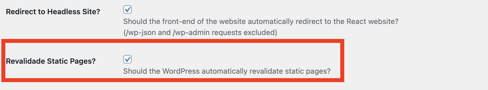

# Setting up the framework from scratch

The recommended way to get started with the framework is by installing the official starter project. See [Quick Setup](/learn/getting-started/quick-setup/) for more information.

This guide will help you set up the framework in a clean Next.js App Router project.

## Bootstrap the Next.js project

Start by bootstrapping your Next.js project with App Router enabled.

```bash
npx create-next-app@latest my-headless-site --typescript --eslint --app --src-dir
cd my-headless-site
```

and install the following packages

```bash
npm install --save @headstartwp/core @headstartwp/next
```

### headstartwp.config.js

Create a `headstartwp.config.js` file at the root of your Next.js project.

```js title="headstartwp.config.js"
/**
 * Headless Config
 *
 * @type {import('@headstartwp/core').HeadlessConfig}
 */
module.exports = {
	sourceUrl: process.env.NEXT_PUBLIC_HEADLESS_WP_URL,
	useWordPressPlugin: true,
};
```

### Env variables

Then create a `.env.local` with the following contents:

```
NEXT_PUBLIC_HEADLESS_WP_URL=https://my-wordpress.test
```

You can call the env variable anything you want, just make sure to update `headstartwp.config.js` accordingly.

If you're developing locally and your WordPress instance uses https but does not have a valid cert, add `NODE_TLS_REJECT_UNAUTHORIZED=0` to your env variables.

### next.config.js

Update your `next.config.js` file to include HeadstartWP configuration:

```js title="next.config.js"
const { withHeadstartWPConfig } = require('@headstartwp/next/config');

/**
 * Update whatever you need within the nextConfig object.
 *
 * @type {import('next').NextConfig}
 */
const nextConfig = {
	// Your Next.js config options
};

module.exports = withHeadstartWPConfig(nextConfig);
```

### Root Layout

In App Router, you need to set up a root layout. Update `src/app/layout.tsx`:

```tsx title="src/app/layout.tsx"
import { Inter } from 'next/font/google';
import './globals.css';
import { Link, PreviewIndicator, queryAppSettings, HeadstartWPApp } from '@headstartwp/next/app';
import type { SettingsContextProps } from '@headstartwp/core/react';
import { Menu } from '@headstartwp/core/react';

const inter = Inter({ subsets: ['latin'] });

const RootLayout = async ({
	children,
}: Readonly<{
	children: React.ReactNode;
}>) => {
	const { menu, data, config } = await queryAppSettings({ menu: 'primary' });

	const settings: SettingsContextProps = {
		...config,
		linkComponent: Link,
	};

	return (
		<html lang="en">
			<body className={inter.className}>
				<HeadstartWPApp settings={settings} themeJSON={data['theme.json']}>
					{menu ? <Menu items={menu} /> : null}
					{children}
					<PreviewIndicator className="form-container" />
				</HeadstartWPApp>
			</body>
		</html>
	);
};

export default RootLayout;

```

### Middleware Setup

Create a middleware file to handle HeadstartWP routing:

```ts title="src/middleware.ts"
import { AppMiddleware } from '@headstartwp/next/middlewares';
import { NextRequest } from 'next/server';

export const config = {
	matcher: [
		/*
		 * Match all paths except for:
		 * 1. /api routes
		 * 2. /_next (Next.js internals)
		 * 3. /fonts (inside /public)
		 * 4. all root files inside /public (e.g. /favicon.ico)
		 */
		'/((?!api|cache-healthcheck|_next|fonts|.*\\.\\w+).*)',
	],
};

export async function middleware(req: NextRequest) {
	return AppMiddleware(req, { appRouter: true });
}
```

### Setting up the preview endpoint

The WordPress plugin expects the preview endpoint to be located at `/api/preview`. Create the App Router API route:

```ts title="src/app/api/preview/route.ts"
import { previewRouteHandler } from '@headstartwp/next/app';
import type { NextRequest } from 'next/server';

/**
 * The Preview endpoint handles preview requests for WordPress draft content
 */
export async function GET(request: NextRequest) {
	return previewRouteHandler(request);
}
```

### Setting up the revalidate endpoint

The framework supports ISR revalidation triggered by WordPress. To enable ISR revalidate, make sure you have the WordPress plugin enabled and activate the option in WordPress settings.



Then create the revalidate API route:

```ts title="src/app/api/revalidate/route.ts"
import { revalidateRouteHandler } from '@headstartwp/next/app';
import type { NextRequest } from 'next/server';

/**
 * The revalidate endpoint handles revalidation requests from WordPress
 */
export async function GET(request: NextRequest) {
	return revalidateRouteHandler(request);
}
```

### Creating your first route

To make sure everything is working as expected, create a catch-all route called `src/app/[...path]/page.tsx`. This route will be responsible for rendering single posts and pages.

By creating a `[...path]/page.tsx` route, the framework will automatically detect and extract URL parameters from the `path` argument.

```tsx title="src/app/[...path]/page.tsx"
import { queryPost } from '@headstartwp/next/app';
import { BlocksRenderer } from '@headstartwp/core/react';
import type { HeadstartWPRoute } from '@headstartwp/next/app';
import { notFound } from 'next/navigation';
import type { Metadata } from 'next';

const params = { postType: ['post', 'page'] };

export async function generateMetadata({ params }: HeadstartWPRoute): Promise<Metadata> {
	const { seo } = await queryPost({
		routeParams: await params,
		params,
	});

	return seo.metadata;
}

export default async function SinglePostPage({ params }: HeadstartWPRoute) {
	const { data } = await queryPost({
		routeParams: await params,
		params,
	});

	return (
		<article>
			<h1>{data.post.title.rendered}</h1>
			<BlocksRenderer html={data.post.content.rendered} />
		</article>
	);
}
```

### Adding Error Handling

Create error and not-found pages for better user experience:

```tsx title="src/app/[...path]/error.tsx"
'use client';

export default function Error({
	error,
	reset,
}: {
	error: Error & { digest?: string };
	reset: () => void;
}) {
	return (
		<div className="flex flex-col items-center justify-center min-h-[400px]">
			<h2 className="text-2xl font-bold mb-4">Something went wrong!</h2>
			<button
				onClick={() => reset()}
				className="px-4 py-2 bg-blue-500 text-white rounded hover:bg-blue-600"
			>
				Try again
			</button>
		</div>
	);
}
```

```tsx title="src/app/[...path]/not-found.tsx"
import Link from 'next/link';

export default function NotFound() {
	return (
		<div className="flex flex-col items-center justify-center min-h-[400px]">
			<h2 className="text-2xl font-bold mb-4">Page Not Found</h2>
			<p className="mb-4">The page you're looking for doesn't exist.</p>
			<Link
				href="/"
				className="px-4 py-2 bg-blue-500 text-white rounded hover:bg-blue-600"
			>
				Return Home
			</Link>
		</div>
	);
}
```

```tsx title="src/app/[...path]/loading.tsx"
export default function Loading() {
	return (
		<div className="flex items-center justify-center min-h-[400px]">
			<div className="animate-spin rounded-full h-32 w-32 border-b-2 border-gray-900"></div>
		</div>
	);
}
```

### Creating a Home Page

Create a home page that fetches your WordPress front page:

```tsx title="src/app/page.tsx"
import { queryPost, queryAppSettings } from '@headstartwp/next/app';
import { BlocksRenderer } from '@headstartwp/core/react';
import type { Metadata } from 'next';
import type { HeadstartWPRoute } from '@headstartwp/next/app';

export async function generateMetadata(): Promise<Metadata> {
	const { seo } = await queryPost({
		routeParams: {},
		params: {
			slug: 'front-page',
			postType: 'page',
		},
	});

	return seo.metadata;
}

export default async function HomePage({ params }: HeadstartWPRoute) {
	// Get the front page settings
	const {
		data: { home },
	} = await queryAppSettings({
		routeParams: await params,
	});

	// Fetch the front page content
	const { data } = await queryPost({
		routeParams: params,
		params: {
			slug: home.slug ?? 'front-page',
			postType: 'page',
		},
	});

	return (
		<main>
			<h1>{data.post.title.rendered}</h1>
			<BlocksRenderer html={data.post.content.rendered} />
		</main>
	);
}
```

### Adding Static Generation

You can optimize your site by pre-generating popular pages at build time:

```tsx title="src/app/[...path]/page.tsx"
import { queryPost, queryPosts } from '@headstartwp/next/app';
// ... other imports

// Generate static params for popular posts/pages
export async function generateStaticParams() {
	const { data } = await queryPosts({
		routeParams: {},
		params: {
			postType: ['post', 'page'],
			perPage: 20, // Pre-generate 20 most recent posts/pages
		},
	});

	return data.posts.map((post) => ({
		path: [post.slug],
	}));
}

export default async function SinglePostPage({ params }: HeadstartWPRoute) {
	const { data } = await queryPost({
		routeParams: await params,
		params,
		options: {
			next: {
				revalidate: 3600, // Revalidate every hour
				tags: ['posts'], // Tag for on-demand revalidation
			},
		},
	});

	return (
		<article>
			<h1>{data.post.title.rendered}</h1>
			<BlocksRenderer html={data.post.content.rendered} />
		</article>
	);
}
```

### Adding a Blog Archive

Create a blog archive page to list all your posts:

```tsx title="src/app/blog/[[...path]]/page.tsx"
import { queryPosts } from '@headstartwp/next/app';
import { SafeHtml } from '@headstartwp/core/react';
import Link from 'next/link';
import type { Metadata } from 'next';

interface BlogPageProps {
	params: Promise<{ path?: string[] }>;
}

export const metadata: Metadata = {
	title: 'Blog',
	description: 'Latest blog posts',
};

export default async function BlogPage({ params }: BlogPageProps) {
	const { data } = await queryPosts({
		routeParams: await params,
		params: {
			postType: 'post',
		},
		options: {
			next: {
				revalidate: 300, // Revalidate every 5 minutes
				tags: ['blog-posts'],
			},
		},
	});

	return (
		<main>
			<h1>Blog</h1>
			<div className="blog-grid">
				{data.posts.map((post) => (
					<article key={post.id} className="blog-post">
						<h2 className="blog-post-title">
							<Link href={post.link} className="blog-post-link">
								{post.title.rendered}
							</Link>
						</h2>
						<div className="blog-post-meta">
							Published on {new Date(post.date).toLocaleDateString()}
						</div>
						<SafeHtml html={post.excerpt.rendered} />
						<Link
							href={post.link}
							className="blog-post-read-more"
						>
							Read more →
						</Link>
					</article>
				))}
			</div>
		</main>
	);
}
```

## Testing Your Setup

Now visit the following URLs to test your setup:

1. **Home page**: `http://localhost:3000/` - Should show your WordPress front page
2. **Single post**: `http://localhost:3000/hello-world` - Should show a WordPress post
3. **Blog archive**: `http://localhost:3000/blog/` - Should list your posts
4. **Date URLs**: `http://localhost:3000/2024/01/01/hello-world` - Should work with date-based permalinks

## Next Steps

1. **Customize your layout**: Add navigation, footer, and styling
2. **Add more routes**: Create category pages, author pages, etc.
3. **Optimize images**: Use Next.js Image component with WordPress media
4. **Add search**: Implement WordPress search functionality
5. **Deploy**: Deploy to Vercel, Netlify, or your preferred platform

Your HeadstartWP App Router setup is now complete! The framework handles WordPress data fetching, SEO, and routing automatically while giving you the full power of Next.js App Router.
