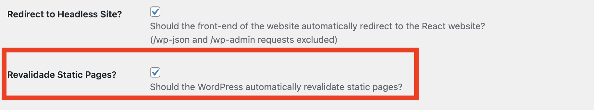

import Tabs from '@theme/Tabs';
import TabItem from '@theme/TabItem';

# Setting up the framework from scratch

The recommended way to get started with the framework is by installing the official starter project. See [Quick Setup](/learn/getting-started/quick-setup/) for more information.

This guide will help you set up the framework in a clean Next.js project.

## Bootstrap the Next.js project

Start by bootstrapping your next.js project.

```bash
npx create-next-app@latest --use-npm
```

and install the following packages

```
npm install --save @headstartwp/core @headstartwp/next
```

### headstartwp.config.js

Create a `headstartwp.config.js` file at the root of your Next.js project.

```js title="headstartwp.config.js"
/**
 * Headless Config
 *
 * @type {import('@headstartwp/core').HeadlessConfig}
 */
module.exports = {
	sourceUrl: process.env.NEXT_PUBLIC_HEADLESS_WP_URL,

	useWordPressPlugin: true,
};
```

### Env variables

Then create a `.env` (or `.env.local`) with the following contents:

```
NEXT_PUBLIC_HEADLESS_WP_URL=https://my-wordpress.test
```

You can call the env variable anything you want, just make sure to update `headstartwp.config.js` accordingly.

If you're developing locally and your WordPress instance uses https but does not have a valid cert, add `NODE_TLS_REJECT_UNAUTHORIZED=0` to your env variables.

### next.config.js

Create a `next.config.js` file with the following contents:

```js title=next.config.js
const { withHeadstartWPConfig } = require('@headstartwp/next/config');

/**
 * Update whatever you need within the nextConfig object.
 *
 * @type {import('next').NextConfig}
 */
const nextConfig = {};

module.exports = withHeadstartWPConfig(nextConfig);
```

### pages/_app.js

Create a custom `_app.js` to wrap the application with `HeadlessApp` component.

<Tabs>
<TabItem value="ts" label="TypeScript">

```ts title=src/pages/_app.tsx
type MyAppProps = {
	themeJson: Record<string, unknown>;
	fallback: Record<string, unknown>;
};

const MyApp = ({ Component, pageProps }: AppProps<MyAppProps>) => {
	// eslint-disable-next-line @typescript-eslint/no-unused-vars
	const { fallback = {}, themeJson = {}, ...props } = pageProps;

	return (
		<HeadlessApp
			pageProps={pageProps}
			settings={{
				// instruct the framework to use Next.js link component
				// or your own version
				linkComponent: Link,
			}}
			useYoastHtml
		>
			<Layout>
				<Component {...props} />
			</Layout>
		</HeadlessApp>
	);
};
```

</TabItem>
<TabItem value="js" label="JavaScript">

```js title=src/pages/_app.js
import { HeadlessApp } from '@headstartwp/next';
import Link from 'next/link';
import Router from 'next/router';

import '../styles.css';

const MyApp = ({ Component, pageProps }) => {
    // only HeadlessApp needs fallback and themeJson, so we remove them from the props we pass down to the pages

	// eslint-disable-next-line react/prop-types, no-unused-vars
	const { fallback = {}, themeJson = {}, ...props } = pageProps;

	return (
		<HeadlessApp
			pageProps={pageProps}
			settings={{
				// instruct the framework to use Next.js link component
				// or your own version
				linkComponent: Link,
			}}
			useYoastHtml
		>
			<Component {...props} />
		</HeadlessApp>
	);
};

export default MyApp;
```

</TabItem>
</Tabs>


### Setting up the preview endpoint

The WordPress plugin expects the preview endpoint to be located at `/api/preview`.

To enable support for previews, create a `src/pages/api/preview.js` with the following contents:

<Tabs>
<TabItem value="ts" label="TypeScript">

```js title=src/pages/api/preview.ts
import { previewHandler } from '@headstartwp/next';
import type { NextApiRequest, NextApiResponse } from 'next';

/**
 * The Preview endpoint just needs to proxy the default preview handler
 *
 * @param req Next.js request
 * @param res Next.js response
 *
 * @returns the preview handler
 */
export default async function handler(req: NextApiRequest, res: NextApiResponse) {
	return previewHandler(req, res);
}

```

</TabItem>

<TabItem value="js" label="JavaScript">

```js title=src/pages/api/preview.js
import { previewHandler } from '@headstartwp/next';

/**
 * The Preview endpoint just needs to proxy the default preview handler
 *
 * @param {*} req Next.js request object
 * @param {*} res  Next.js response object
 *
 * @returns
 */
export default async function handler(req, res) {
	return previewHandler(req, res);
}
```

</TabItem>
</Tabs>

### Setting up the revalidate endpoint

The framework supports ISR revalidation triggered by WordPress. To enable ISR revalidate, make sure you have the WordPress plugin enabled and activate the option in WordPress settings.



Then add the `revalidateHandler` to `src/pages/api/revalidate.js`

<Tabs>
<TabItem value="ts" label="TypeScript">

```ts title=src/pages/api/revalidate.ts
import { revalidateHandler } from '@headstartwp/next';
import type { NextApiRequest, NextApiResponse } from 'next';

/**
 * The revalidate endpoint just needs to proxy the default revalidate handler
 *
 * @param req Next.js request
 * @param res Next.js response
 *
 * @returns the revalidate handler
 */
export default async function handler(req: NextApiRequest, res: NextApiResponse) {
	return revalidateHandler(req, res);
}

```

</TabItem>

<TabItem value="js" label="JavaScript">

```js title=src/pages/api/revalidate.js
import { revalidateHandler } from '@headstartwp/next';

/**
 * The revalidate endpoint just needs to proxy the default revalidate handler
 *
 * @param {*} req Next.js request object
 * @param {*} res  Next.js response object
 *
 * @returns
 */
export default async function handler(req, res) {
	return revalidateHandler(req, res);
}
```

</TabItem>
</Tabs>

### Creating your first route

To make sure everything is working as expected create a catch-all route called `pages/[...path].js`. This route will be responsible for rendering single post and pages.

By creating a `[...path].js` route, the framework will automatically detect and extract URL parameters from the `path` argument.

<Tabs>
<TabItem value="ts" label="TypeScript">

```js title=src/pages/[...path].tsx
import type { PostParams } from '@headstartwp/core';
import {
	usePost,
	fetchHookData,
	addHookData,
	handleError,
	usePosts
} from '@headstartwp/next';
import { BlocksRenderer } from '@headstartwp/core/react';

const params: PostParams = { postType: ['post', 'page' ] };

const SinglePostsPage = () => {
	const { loading, error, data } = usePost(params);

	if (loading) {
		return 'Loading...';
	}

	if (error) {
		return 'error...';
	}

	return (
		<div>
			<h1>{data.post.title.rendered}</h1>
            <BlocksRenderer html={data.post.content.rendered} />
		</div>
	);
};

export default SinglePostsPage;
```

</TabItem>

<TabItem value="js" label="JavaScript">

```js title=src/pages/[...path].js
import {
	usePost,
	fetchHookData,
	addHookData,
	handleError,
	usePosts
} from '@headstartwp/next';
import { BlocksRenderer } from '@headstartwp/core/react';

const params = { postType: ['post', 'page' ] };

const SinglePostsPage = () => {
	const { loading, error, data } = usePost(params);

	if (loading) {
		return 'Loading...';
	}

	if (error) {
		return 'error...';
	}

	return (
		<div>
			<h1>{data.post.title.rendered}</h1>
            <BlocksRenderer html={data.post.content.rendered} />
		</div>
	);
};

export default SinglePostsPage;
```

</TabItem>

</Tabs>

Then, visit any single post or page, e.g: `http://localhost:3000/hello-world` and you should see both the title and the content of that post/page.

Date URLs will also work: e.g: `http://localhost:3000/2022/10/2/hello-world`

### Add SSR/SSG

With the example above, you might have noticed that the data is only being fetched on the client. You must use one of the Next.js data fetching methods to enable SSR/SSG.

Add this to the `pages/[...path].js` file

<Tabs>
<TabItem value="ts" label="TypeScript">

```ts title="src/pages/[...path].tsx"
import type { HeadlessGetStaticProps } from '@headstartwp/next';

export const getStaticProps = (async (context) => {
	try {
		const settledPromises = await resolveBatch([
			{
				func: fetchHookData(usePost.fetcher(), context, { params: singleParams }),
			},
			{ func: fetchHookData(useAppSettings.fetcher(), context) },
		]);

		return addHookData(settledPromises, { revalidate: 5 * 60 });
	} catch (e) {
		return handleError(e, context);
	}
}) satisfies HeadlessGetStaticProps;

// `satisfies` allow TS to infer the correct types for context as well as makes it
// possible to correctly infer the page props
```

</TabItem>

<TabItem value="js" label="JavaScript">

```js title="src/pages/[...path].js"
// or export async function getServerSideProps(context)
export async function getStaticProps(context) {
	try {
        // make sure to pass the same params to fetchHookData and usePost
        const usePostData = await fetchHookData(usePost.fetcher(), context, { params });

		return addHookData([usePostData], {});
	} catch (e) {
		return handleError(e, context);
	}
}
```

</TabItem>
</Tabs>

Then refresh the page and voilá! Data is now being fetched on the server.
