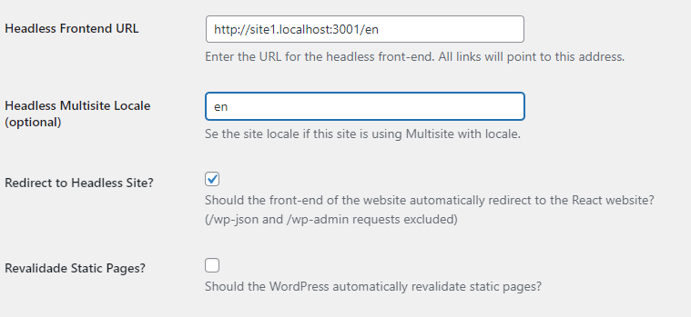

# Multisite

HeadstartWP has built-in support for WordPress multisite via the `sites` property in the `headstartwp.config.js` file. This transforms the Next.js app into a multi-tenant app.

The `sites` option allows specifying as many sites you want to connect to your app. Each site must have a `sourceUrl` and a `hostUrl`. The `hostUrl` will be used to match the current site and `sourceUrl` indicates where content should be sourced from.

This feature does not require that all sites belong to the same multisite, you're free to connect the Next.js app to a completely separate WordPress instance, as long as that instance implements what your Next.js app needs.

Take a look at the [multisite demo project](https://github.com/10up/headstartwp/tree/develop/projects/wp-multisite-nextjs) to familiarize yourself with the set-up.

## Usage

### Config

The first step is to declare all of your sites in `headstartwp.config.js`. In the example below we're declaring two sites.

```javascript
/**
 * Headless Config
 *
 * @type {import('@headstartwp/core').HeadlessConfig}
 */
module.exports = {
    redirectStrategy: '404',
    useWordPressPlugin: true,

	sites: [
		{
			hostUrl: 'http://site1.localhost:3001',
			sourceUrl: process.env.NEXT_PUBLIC_HEADLESS_WP_URL,

		},
		{
			hostUrl: 'http://site2.localhost:3001',
			sourceUrl: process.env.NEXT_PUBLIC_HEADLESS_WP_URL_2,
		},
	],
};
```

In the example above we specify that all sites must use the WordPress plugin and that the redirect strategy should be `404`. Then we're declaring two sites that will respond via the http://site1.localhost:3001 and http://site2.localhost:3001 URLs. The `sourceUrl` for each comes from an env variable.

This means that when we visit http://site1.localhost:3001, the source URL specified by `NEXT_PUBLIC_HEADLESS_WP_URL` will be used.

#### Internationalized routing

If you're using [Next.js i18n](https://nextjs.org/docs/advanced-features/i18n-routing) feature you can specify the locale in the site's config object and the locale will also be used when matching a site.

```javascript
/**
 * Headless Config
 *
 * @type {import('@headstartwp/core').HeadlessConfig}
 */
module.exports = {
    redirectStrategy: '404',
    useWordPressPlugin: true,

	sites: [
		{
			hostUrl: 'http://site1.localhost:3001',
			sourceUrl: process.env.NEXT_PUBLIC_HEADLESS_WP_URL,
			locale: 'en'
		},
		{
			hostUrl: 'http://site1.localhost:3001',
			sourceUrl: process.env.NEXT_PUBLIC_HEADLESS_WP_URL_2,
			locale: 'es'
		},
	],
};
```

The above config means that `http://site1.localhost:3001/en` will match the first site config and `http://site1.localhost:3001/es` will match the second site config.

**Note**: You must declare those locales in Next.js config. See [Next.js documentation](https://nextjs.org/learn/advanced-features/i18n-routing) for more information.

When using locales make sure to add the locale to `Settings -> General -> Headless Multisite Locale (optional)`. This is required for previews and the revalidate handler to work properly since API routes are not localized in Next.js.

As an example, the first site config in the example above would need the following settings in WordPress.




### Middleware

Make sure you have the framework's middleware setup at `src/middleware.js`.

```javascript
import { AppMiddleware } from '@headstartwp/next/middlewares';

export const config = {
	matcher: [
		/*
		 * Match all paths except for:
		 * 1. /api routes
		 * 2. /_next (Next.js internals)
		 * 3. /fonts (inside /public)
		 * 4. all root files inside /public (e.g. /favicon.ico)
		 */
		'/((?!api|_next|fonts[\\w-]+\\.\\w+).*)',
	],
};

export async function middleware(...args) {
	return AppMiddleware(...args);
}
```

### Folder structure

Put all of your page routes in `_sites/[site]/` folder with the exception of the following files
 - _app.js
 - _document.js
 - 404.js
 - 500.js
 - api/


 This should give you a structure similar to

 ```
 _sites/
├─ [site]/
│  ├─ [...path].js
│  ├─ index.js
_app.js
_document.js
404.js
500.js
api/
```

With this setup, the framework's middleware will rewrite all requests to `_sites/hostName`. All of the data-fetching hooks will fetch data to the appropriate WordPress instance.

This allows you to power all of your sites with the same codebase. This is very useful if you're building sites that support internationalization or if the only thing that changes across sites is the content.

### Creating Routes that target a specific site

It is possible to create routes specific to each site. To do this simply create a folder for that particular site eg: `src/pages/_sites/mysite.com/index.js`. Then when a user visits `mysite.com` the `index.js` route file will be used instead of the one in `[site]/index.js`.

This provides a powerful way of powering complex multi-tenant apps that shares a codebase but render completely different pages and layouts.

## Known Issues

**404.js and 500.js are unable to know the current site**

At the moment, there's a limitation in Next.js that doesn't allow the `404.js` and `500.js` pages to know the current site. These two files **must** be in the root of the pages directory and we can't rewrite them. Additionally, they only support `getStaticProps` which means there's no way to know which site you're on in case you need to fetch data specific for that site.

If you need to fetch data in `404.js` or `500.js` there's one workaround but it relies on client-side data-fetching. In `_app.js` do the following:

```javascript
import { getSiteByHost } from '@headstartwp/core';

//grab the current site
const currentSite = useMemo(() => {
    if (router.query?.site && !Array.isArray(router.query.site)) {
        return getSiteByHost(router.query.site, router.locale);
    }

    // 404.js and 500.js do not have a site query param.
    if (typeof window !== 'undefined') {
        return getSiteByHost(window.location.host, router.locale);
    }
    return {};
}, [router]);

// pass it to HeadlessApp to override the current site settings defined by the framework
// once react hydrates and window is defined, the currentSite will be set for 404 and 500 poages.
<HeadlessApp settings={currentSite} />
```

