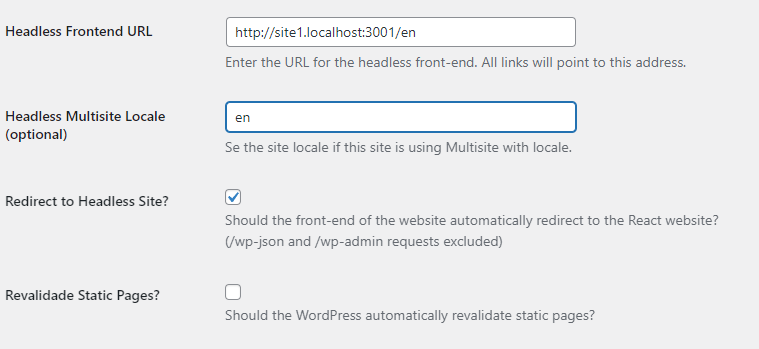

# Multisite

HeadstartWP has built-in support for WordPress multisite via the `sites` property in the `headstartwp.config.js` file. This transforms the Next.js app into a multi-tenant app.

The `sites` option allows specifying as many sites you want to connect to your app. Each site must have a `sourceUrl` and a `hostUrl`. The `hostUrl` will be used to match the current site and `sourceUrl` indicates where content should be sourced from.

This feature does not require that all sites belong to the same multisite, you're free to connect the Next.js app to a completely separate WordPress instance, as long as that instance implements what your Next.js app needs.

Take a look at the [App Router multisite demo project](https://github.com/10up/headstartwp/tree/develop/projects/wp-multisite-nextjs-app) to familiarize yourself with the set-up.

## Usage

### Config

The first step is to declare all of your sites in `headstartwp.config.js`. In the example below we're declaring two sites.

```javascript
/**
 * Headless Config
 *
 * @type {import('@headstartwp/core').HeadlessConfig}
 */
module.exports = {
    redirectStrategy: '404',
    useWordPressPlugin: true,

	sites: [
		{
			hostUrl: 'http://site1.localhost:3001',
			sourceUrl: process.env.NEXT_PUBLIC_HEADLESS_WP_URL,

		},
		{
			hostUrl: 'http://site2.localhost:3001',
			sourceUrl: process.env.NEXT_PUBLIC_HEADLESS_WP_URL_2,
		},
	],
};
```

In the example above we specify that all sites must use the WordPress plugin and that the redirect strategy should be `404`. Then we're declaring two sites that will respond via the http://site1.localhost:3001 and http://site2.localhost:3001 URLs. The `sourceUrl` for each comes from an env variable.

This means that when we visit http://site1.localhost:3001, the source URL specified by `NEXT_PUBLIC_HEADLESS_WP_URL` will be used.

#### Internationalized routing

Since Next.js App Router doesn't provide built-in i18n routing, HeadstartWP provides its own i18n implementation. You can configure internationalization in your `headstartwp.config.js` file using the `i18n` option and specify locales for individual sites.

```javascript
/**
 * Headless Config
 *
 * @type {import('@headstartwp/core').HeadlessConfig}
 */
module.exports = {
    redirectStrategy: '404',
    useWordPressPlugin: true,

	// Configure i18n globally
	i18n: {
		locales: ['en', 'es'],
		defaultLocale: 'en',
		localeDetection: true, // optional, defaults to true
	},

	sites: [
		{
			hostUrl: 'http://site1.localhost:3001',
			sourceUrl: process.env.NEXT_PUBLIC_HEADLESS_WP_URL,
			locale: 'en'
		},
		{
			hostUrl: 'http://site1.localhost:3001',
			sourceUrl: process.env.NEXT_PUBLIC_HEADLESS_WP_URL_2,
			locale: 'es'
		},
	],
};
```

The above config means that `http://site1.localhost:3001/en` will match the first site config and `http://site1.localhost:3001/es` will match the second site config.

**Note**: Unlike Pages Router, you configure i18n in the HeadstartWP config file, not in `next.config.js`. HeadstartWP's middleware handles locale detection and routing automatically.

When using locales make sure to add the locale to `Settings -> General -> Headless Multisite Locale (optional)`. This is required for previews and the revalidate handler to work properly since API routes are not localized in Next.js.

As an example, the first site config in the example above would need the following settings in WordPress.




### Middleware

Make sure you have the framework's middleware setup at `src/middleware.ts` (or `src/middleware.js`).

```typescript
import { AppMiddleware } from '@headstartwp/next/middlewares';
import { NextRequest } from 'next/server';

export const config = {
	matcher: [
		/*
		 * Match all paths except for:
		 * 1. /api routes
		 * 2. /_next (Next.js internals)
		 * 3. /fonts (inside /public)
		 * 4. all root files inside /public (e.g. /favicon.ico)
		 */
		'/((?!api|_next|fonts[\\w-]+\\.\\w+).*)',
	],
};

export async function middleware(req: NextRequest) {
	return AppMiddleware(req, { appRouter: true });
}
```

### Folder structure

Put all of your page routes in `app/[site]/` folder with the exception of the following files:
 - `layout.tsx` (root layout)
 - `not-found.tsx` (root not found page)
 - `api/` (API routes)

This should give you a structure similar to:

```
src/
├─ app/
│  ├─ layout.tsx           # Root layout
│  ├─ not-found.tsx        # Root not found page  
│  ├─ api/                 # API routes
│  │  ├─ preview/
│  │  └─ revalidate/
│  └─ [site]/              # Dynamic site routes
│     ├─ layout.tsx        # Site-specific layout
│     ├─ page.tsx          # Site home page
│     ├─ not-found.tsx     # Site not found page
│     ├─ blog/
│     │  └─ page.tsx       # Blog archive
│     ├─ category/
│     │  └─ [slug]/
│     │     └─ page.tsx    # Category archive
│     └─ (single)/
│        └─ [...path]/
│           └─ page.tsx    # Posts and pages
└─ middleware.ts           # Middleware
```

With this setup, the framework's middleware will rewrite all requests to `[site]/route`. All of the data-fetching hooks will fetch data to the appropriate WordPress instance.

This allows you to power all of your sites with the same codebase. This is very useful if you're building sites that support internationalization or if the only thing that changes across sites is the content.

### Creating Routes that target a specific site

It is possible to create routes specific to each site. To do this simply create a folder using the site's `slug` property from your configuration. For example, if you have a site with `slug: 'site1'`, create `src/app/site1/page.tsx`. Then when a user visits that site, the `page.tsx` route file will be used instead of the one in `[site]/page.tsx`.

```javascript
// In your headstartwp.config.js
sites: [
    {
        slug: 'site1',
        sourceUrl: process.env.NEXT_PUBLIC_HEADLESS_WP_URL,
        hostUrl: 'http://site1.localhost:3000',
    },
    {
        slug: 'js1',
        sourceUrl: 'https://js1.10up.com/',
        hostUrl: 'http://js1.localhost:3000',
    },
],
```

With this configuration, you can create site-specific routes like:
- `src/app/site1/page.tsx` - specific to the first site
- `src/app/js1/page.tsx` - specific to the second site

This provides a powerful way of powering complex multi-tenant apps that shares a codebase but render completely different pages and layouts.

## Demo Project

Take a look at the [App Router multisite demo project](https://github.com/10up/headstartwp/tree/develop/projects/wp-multisite-nextjs-app) to see a complete implementation of multisite with App Router.

