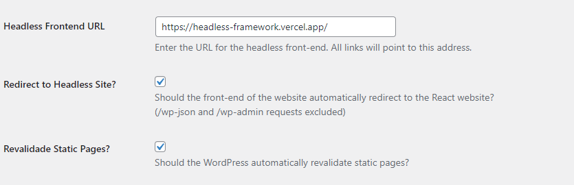
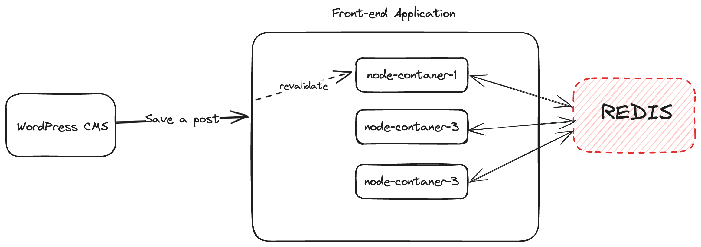

# On-demand ISR revalidation

[On-demand Revalidation](https://nextjs.org/docs/app/building-your-application/caching#revalidating-data) is the ability to revalidate static pages programmatically from the CMS using Next.js App Router.

Without On-demand ISR revalidation users will need to wait until the time set in the `revalidate` prop has passed before they can see an updated version of that page. This means that if a `revalidate` is set to 5min, users would potentially have to wait up to 5min before they can see new content.

It is preferred to have the CMS ask the Next.js app to revalidate those pages when possible. This can be done via "On-Demand Revalidation".

HeadstartWP supports Next.js ISR via the WordPress plugin and via `@10up/next-redis-cache-provider` for hosts that do not natively support Next.js ISR (e.g. VIP, WPEngine etc).

## Usage

### Plugin setup

HeadstartWP supports On-Demand Revalidation and it requires installing the WordPress Plugin. On-Demand Revalidation is opt-in and must be manually enabled in the plugin's settings (Settings -> General).


The plugin expects the revalidate endpoint to live at  `/api/revalidate`. It is possible to customize this endpoint via the `tenup_headless_isr_revalidate_endpoint`.

```php
/**
 * Filters the revalidate endpoint.
 *
 * @param string $revalidate_endpoint The revalidate endpoint
 */
$revalidate_endpoint = apply_filters( 
    'tenup_headless_isr_revalidate_endpoint', 
    trailingslashit( Plugin::get_react_url() ) . 'api/revalidate' 
);
```

### Revalidate Endpoint

Simply create a Next.js App Router API endpoint that uses the `revalidateRouteHandler` provided by the framework. 

:::caution
If you changed the default value of the endpoint path via the `tenup_headless_isr_revalidate_endpoint` filter, make sure you change it in the Next.js app as well. 
:::

```typescript title="app/api/revalidate/route.ts"
import { revalidateRouteHandler } from '@headstartwp/next/app';
import type { NextRequest } from 'next/server';

/**
 * The revalidate endpoint handles revalidation requests from WordPress
 */
export async function GET(request: NextRequest) {
	return revalidateRouteHandler(request);
}
```

### Parameters

The `revalidateRouteHandler` expects the following query parameters:

| Parameter | Type | Description |
|-----------|------|-------------|
| `post_id` | `number` | The ID of the post to revalidate |
| `path` | `string` | The path to revalidate |
| `token` | `string` | JWT token for verification |
| `locale` | `string` | (Optional) Locale for multi-language sites |

These parameters are automatically sent by the WordPress plugin when a post is saved.

### Advanced Usage with Callback

You can provide a custom callback function to perform additional actions after revalidation:

```typescript title="app/api/revalidate/route.ts"
import { revalidateRouteHandler } from '@headstartwp/next/app';
import type { NextRequest } from 'next/server';

export async function GET(request: NextRequest) {
	return revalidateRouteHandler(request, async ({ verifiedPath, slug, locale, isMultisiteRequest }) => {
		// Custom logic after revalidation
		console.log(`Revalidated path: ${verifiedPath}`);
		
		// Clear additional caches
		if (verifiedPath.includes('/blog/')) {
			// Also revalidate the blog index
			await fetch('/api/custom-cache-clear', {
				method: 'POST',
				body: JSON.stringify({ path: '/blog' }),
			});
		}
		
		// Send webhook notifications
		await fetch('https://my-webhook-service.com/revalidated', {
			method: 'POST',
			headers: { 'Content-Type': 'application/json' },
			body: JSON.stringify({
				path: verifiedPath,
				locale,
				timestamp: new Date().toISOString(),
			}),
		});
	});
}
```

### Multi-site Support

The handler automatically supports WordPress multi-site setups. For multi-site installations, the path construction includes the site slug:

```typescript
// Single site: /blog/my-post
// Multi-site: /site-slug/blog/my-post
// Multi-site with locale: /en/site-slug/blog/my-post
```

## How does it work?

The default implementation will revalidate any post or page upon saving in WordPress. You can see the logic [here](https://github.com/10up/headstartwp/blob/develop/wp/headless-wp/includes/classes/CacheFlush/CacheFlush.php#L40).

The revalidation process follows these steps:

1. **WordPress saves a post** - User saves/publishes a post in WordPress
2. **Plugin generates token** - WordPress plugin generates a secure JWT token
3. **Plugin calls Next.js** - Plugin makes HTTP request to `/api/revalidate` endpoint
4. **Token verification** - Next.js verifies the token using `VerifyTokenFetchStrategy`
5. **Path revalidation** - Next.js calls `revalidatePath()` on the verified path
6. **Response** - Success/error response sent back to WordPress

## Error Handling

The handler provides detailed error responses:

```typescript title="app/api/revalidate/route.ts"
import { revalidateRouteHandler } from '@headstartwp/next/app';
import type { NextRequest } from 'next/server';

export async function GET(request: NextRequest) {
	try {
		return await revalidateRouteHandler(request);
	} catch (error) {
		console.error('Revalidation failed:', error);
		
		// The handler already returns appropriate error responses,
		// but you can add custom error logging here
		
		// Re-throw to let the handler manage the response
		throw error;
	}
}
```

Common error responses:

- `401 - Missing required params`: Missing `post_id`, `path`, or `token`
- `401 - Invalid params`: Parameters are not the correct type
- `500 - Token mismatch`: Token verification failed or path/post_id mismatch
- `500 - Error verifying the token`: General token verification error

## Supporting Next.js ISR outside of Vercel

If your host does not support Next.js ISR natively (e.g. WordPress VIP, WPEngine etc), ISR won't work well. If your hosting is serving your app via a traditional non-serverless setup using docker/kubernetes you most likely will run into issues trying to leverage Next.js ISR.

First off, if multiple containers are running to serve the requests to your website, a call to revalidate a particular page will only ever hit one of the containers that are running. This will lead to users being served by the containers that weren't hit by the WP call to still serve the old page. Even worse, the same user might be served by different containers and get both old and new responses for a page (e.g. the initial HTML is updated but the JSON associated with the page isn't).

Officially, Next.js [recommends](https://nextjs.org/docs/pages/building-your-application/data-fetching/incremental-static-regeneration#self-hosting-isr) sharing a writable volume across all the containers but that has some performance implications and some hosts simply don't support this setup.

### @10up/next-redis-cache-provider

:::caution
If you are hosting on Vercel you do not need this package.
:::

Our solution to this problem has been to replace the filesystem cache with a redis cache provider. So whenever Next.js revalidates a page instead of storing the static page in disk, it will write to a shared redis instance that all of the containers would be talking to. The diagram below exemplifies how it works.



To set up `@10up/next-redis-cache-provider` first install it via npm:

```bash
npm install --save @10up/next-redis-cache-provider
```

Then add it in `next.config.js`:

```javascript title="next.config.js"
const { withHeadstartWPConfig } = require('@headstartwp/next/config');

/**
 * Update whatever you need within the nextConfig object.
 *
 * @type {import('next').NextConfig}
 */
const nextConfig = {
	eslint: {
		ignoreDuringBuilds: true,
	},
};

if (process.env.NEXT_REDIS_URL || process.env.VIP_REDIS_PRIMARY) {
	// eslint-disable-next-line global-require
	const { initRedisClient } = require('@10up/next-redis-cache-provider');
	initRedisClient();
	nextConfig.cacheHandler = require.resolve('@10up/next-redis-cache-provider');
}

module.exports = withHeadstartWPConfig(nextConfig);
```

:::info
The HeadstartWP [scaffold](https://github.com/10up/headstartwp/tree/develop/projects/wp-nextjs-app) already includes the code above
:::

The code above checks for `NEXT_REDIS_URL` and `VIP_REDIS_PRIMARY` (which is specific for WordPress VIP hosting), however there are several other env variables you can use to configure your redis connection.

- `NEXT_REDIS_URL`: It's the simplest way to set up your redis connection, simply pass the full redis connection string.
- `VIP_REDIS_PRIMARY` and `VIP_REDIS_PASSWORD`: this is specific to WordPress VIP hosting, if Redis is enabled on VIP hosting these env variables will be automatically set for you so you do not need to add them yourself.
- `NEXT_REDIS_HOST`, `NEXT_REDIS_PORT` and `NEXT_REDIS_PASS`: Instead of a full redis connection string you can specify the host, port and password separately.
- `NEXT_REDIS_SENTINEL_NAME`, `NEXT_REDIS_SENTINEL_PASSWORD`, `NEXT_REDIS_PASS`: This is only needed if you want to connect to a redis sentinel cluster. If you do so, you also need to set the `NEXT_REDIS_HOST`, `NEXT_REDIS_PORT` and `NEXT_REDIS_PASS` variables.

### Purging the CDN Cache

Another thing you want to consider is flushing the CDN cache **after** you revalidate the page in Next.js. This can be done on the WordPress side by hooking up to the `tenup_headless_wp_revalidate` action. This action is fired off after Next.js has finished revalidating the page.

```php
add_filter( 'tenup_headless_wp_revalidate', function( $post, $front_end_post_url ) {
    // $front_end_post_url is the URL for the post with the front-end/headless url.
    function_to_clear_my_favorite_cdn_cache( $front_end_post_url );
}, 10, 2 );
```

You can also handle CDN cache clearing in your App Router callback:

```typescript title="app/api/revalidate/route.ts"
import { revalidateRouteHandler } from '@headstartwp/next/app';
import type { NextRequest } from 'next/server';

export async function GET(request: NextRequest) {
	return revalidateRouteHandler(request, async ({ verifiedPath, slug, locale, isMultisiteRequest }) => {
		// Clear CDN cache for the revalidated path
		await fetch(`https://api.cloudflare.com/client/v4/zones/${process.env.CLOUDFLARE_ZONE_ID}/purge_cache`, {
			method: 'POST',
			headers: {
				'Authorization': `Bearer ${process.env.CLOUDFLARE_API_TOKEN}`,
				'Content-Type': 'application/json',
			},
			body: JSON.stringify({
				files: [`https://mysite.com${verifiedPath}`],
			}),
		});
	});
}
```

#### A note about WordPress VIP

If you are hosting on WordPress VIP the plugin already clears the VIP CDN cache, so you don't need to handle this yourself. The [following code](https://github.com/10up/headstartwp/blob/develop/wp/headless-wp/includes/classes/CacheFlush/CacheFlush.php#L122C6-L122C6) is included in the plugin:

```php
if ( 200 === (int) $status_code && function_exists( 'wpcom_vip_purge_edge_cache_for_url' ) ) {
    wpcom_vip_purge_edge_cache_for_url( $headless_post_url );
}
```

### Revalidating in a Cron Job

If you prefer to run the revalidation logic in the background, you can tell the plugin to schedule a one-off cron job for immediate execution every time a post is saved. This can be enabled with the `tenup_headless_wp_revalidate_on_cron` filter (it defaults to false).

```php
add_filter( 'tenup_headless_wp_revalidate_on_cron', '__return_true' );
```

This can be useful when the revalidation or the CDN cache purge is slow so this can be used to speed up the post saving process.

## Testing Revalidation

You can test the revalidation endpoint manually:

```bash
# Test the revalidation endpoint
curl "https://your-nextjs-app.com/api/revalidate?post_id=123&path=/blog/my-post&token=your-jwt-token"
```

Or create a test endpoint for development:

```typescript title="app/api/test-revalidate/route.ts"
import { revalidatePath } from 'next/cache';
import type { NextRequest } from 'next/server';

export async function GET(request: NextRequest) {
	const { searchParams } = request.nextUrl;
	const path = searchParams.get('path');
	
	if (!path) {
		return new Response('Missing path parameter', { status: 400 });
	}
	
	try {
		revalidatePath(path);
		return new Response(JSON.stringify({ 
			message: 'Revalidated successfully', 
			path 
		}), {
			status: 200,
			headers: { 'Content-Type': 'application/json' },
		});
	} catch (error) {
		return new Response('Revalidation failed', { status: 500 });
	}
}
```

## Best Practices

### 1. Monitor Revalidation

Add logging to track revalidation requests:

```typescript title="app/api/revalidate/route.ts"
import { revalidateRouteHandler } from '@headstartwp/next/app';
import type { NextRequest } from 'next/server';

export async function GET(request: NextRequest) {
	const { searchParams } = request.nextUrl;
	const post_id = searchParams.get('post_id');
	const path = searchParams.get('path');
	
	console.log(`Revalidation request: post_id=${post_id}, path=${path}`);
	
	return revalidateRouteHandler(request, async ({ verifiedPath }) => {
		console.log(`Successfully revalidated: ${verifiedPath}`);
	});
}
```

### 2. Handle Rate Limiting

For high-traffic sites, consider implementing rate limiting:

```typescript
// You might want to implement rate limiting for revalidation requests
// to prevent abuse or too many concurrent revalidations
```

### 3. Graceful Degradation

Ensure your site works even if revalidation fails:

```typescript
export async function GET(request: NextRequest) {
	try {
		return await revalidateRouteHandler(request);
	} catch (error) {
		// Log the error but don't crash the site
		console.error('Revalidation failed, but continuing:', error);
		
		// Return success to prevent WordPress from retrying immediately
		return new Response(JSON.stringify({ 
			message: 'Revalidation queued for later',
			error: error.message 
		}), {
			status: 202, // Accepted
			headers: { 'Content-Type': 'application/json' },
		});
	}
}
```
