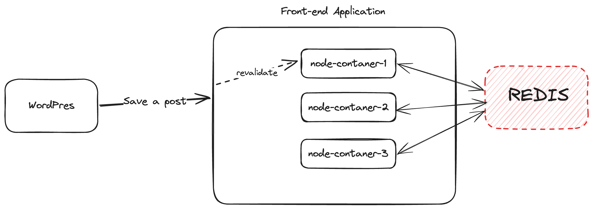

# On-demand ISR revalidation

[On-demand Revalidation](https://nextjs.org/docs/basic-features/data-fetching/incremental-static-regeneration#on-demand-revalidation) is the ability to revalidate static pages programmatically from the CMS.

Without On-demand ISR revalidation users will need to wait until the time set in the `revalidate` prop has passed before they can see an updated version of that page. This means that if a `revalidate` is set to 5min, users would potentially have to wait up to 5min before they can see new content.

It is preferred to have the CMS ask the Next.js app to revalidate those pages when possible. This can be done via "On-Demand Revalidation".

HeadstartWP supports Next.js ISR via the WordPress plugin and via `@10up/next-redis-cache-provider` for hosts that do not natively support Next.js ISR (e.g. VIP, WPEngine etc).

## Usage

### Plugin setup

HeadstartWP supports On-Demand Revalidation and it requires installing the WordPress Plugin. On-Demand Revalidation is opt-in and must be manually enabled in the plugin's settings (Settings -> General).


The plugin expects the revalidate endpoint to live at  `/api/revalidate`. It is possible to customize this endpoint via the `tenup_headless_isr_revalidate_endpoint`.

```php
/**
 * Filters the revalidate endpoint.
 *
 * @param string $revalidate_endpoint The revalidate endpoint
 */
$revalidate_endpoint = apply_filters( 
    'tenup_headless_isr_revalidate_endpoint', 
    trailingslashit( Plugin::get_react_url() ) . 'api/revalidate' 
);
```

### Revalidate Endpoint

Simply create a Next.js API endpoint that uses the `revalidateHandler` provided by the framework. 

:::caution
If you changed the default value of the endpoint path via the `tenup_headless_isr_revalidate_endpoint` filter, make sure you change it in the Next.js app as well. 
:::caution


```javascript title="src/pages/api/revalidate"
import { revalidateHandler } from '@headstartwp/next';

/**
 * The revalidate endpoint just needs to proxy the default revalidate handler
 *
 * @param {*} req Next.js request object
 * @param {*} res  Next.js response object
 *
 * @returns
 */
export default async function handler(req, res) {
	return revalidateHandler(req, res);
}
```

## How does it work?

The default implementation will revalidate any post or page upon saving in WordPress. You can see the logic [here](https://github.com/10up/headstartwp/blob/develop/wp/headless-wp/includes/classes/CacheFlush/CacheFlush.php#L40).

## Supporting Next.js ISR outside of Vercel

If your host does not support Next.js ISR natively (e.g. VIP, WPEngine etc), ISR won't work well. If your hosting is serving your app via a traditional non-serverless setup using docker/Kubernetis you most likely will run into issues trying to leverage Next.js ISR.

First off, if multiple docker containers are running to serve the requests to your website, a call to revalidate a particular page will only ever hit one of the docker containers that are running. This will lead to users being served by the docker containers that weren't hit by the WP call to still serve the old page. Even worse, the same user might be served by different containers and get both old and new responses for a page (e.g. the initial HTML is updated but the JSON associated with the page isn't).

Officially, Next.js [recommends](https://nextjs.org/docs/pages/building-your-application/data-fetching/incremental-static-regeneration#self-hosting-isr) sharing a writable volume across all the containers but that has some performance implications and some hosts simply don't support this setup.

### @10up/next-redis-cache-provider

:::caution
If you are hosting on Vercel you do not need this package.
:::caution

Our solution to this problem has been to replace the filesystem cache with a redis cache provider. So whenever Next.js revalidates a page instead of storing the static page in disk, it will write to a shared redis instance that all of the containers would be talking to. The diagram below exemplifies how it works.



To set `@10up/next-redis-cache-provider` first install it via npm:

```bash
npm install --save @10up/next-redis-cache-provider
```

Then add it in `next.config.js`:

```js title="next.config.js"
const { withHeadstartWPConfig } = require('@headstartwp/next/config');

/**
 * Update whatever you need within the nextConfig object.
 *
 * @type {import('next').NextConfig}
 */
const nextConfig = {
	eslint: {
		ignoreDuringBuilds: true,
	},
};


if (process.env.NEXT_REDIS_URL || process.env.VIP_REDIS_PRIMARY) {
	// eslint-disable-next-line global-require
	const { initRedisClient } = require('@10up/next-redis-cache-provider');
	initRedisClient();
	nextConfig.experimental = {
		incrementalCacheHandlerPath: require.resolve('@10up/next-redis-cache-provider'),
	};
}

module.exports = withHeadstartWPConfig(nextConfig);
```

:::info
The HeadstartWP scaffold already includes the code above, so if you want to use this package you only need to set the environment variables.
:::info

The code above checks for `NEXT_REDIS_URL` and `VIP_REDIS_PRIMARY` (which is specific for WordPress VIP hosting), however there are several other env variables you can use to configure your redis connection.

- `NEXT_REDIS_URL`: It's the simplest way to set up your redis connection, simply pass the full redis connection string.
- `VIP_REDIS_PRIMARY` and `VIP_REDIS_PASSWORD`: this is specific to WordPress VIP hosting, if Redis is enabled on VIP hosting these env variables will be automatically set for you so you do not need to add them yourself.
- `NEXT_REDIS_HOST`, `NEXT_REDIS_PORT` and `NEXT_REDIS_PASS`: Instead of a full redis connection string you can specify the host, port and password separately.
- `NEXT_REDIS_SENTINEL_NAME`, `NEXT_REDIS_SENTINEL_PASSWORD`, `NEXT_REDIS_PASS`: This is only needed if you want to connect to a redis sentinel cluster. If you do so, you also need to set the `NEXT_REDIS_HOST`, `NEXT_REDIS_PORT` and `NEXT_REDIS_PASS` variables.

### Purging the CDN Cache

Another thing you want to consider is flushing the CDN cache AFTER you revalidate the page in Next.js. This can be done on the WordPress side by hooking up to the `tenup_headless_wp_revalidate` action. This action is fired off after Next.js has finished revalidating the page.

```php
add_filter( 'tenup_headless_wp_revalidate', function( $post, $front_end_post_url ) {
    // $front_end_psot_url is the URL for the post with the front-end/headless url.
    function_to_clear_my_favorite_cdn_cache( $front_end_post_url );
}, 10, 2 );
```

#### A note about WordPress VIP

If you are hosting on WordPress VIP the plugin already clears the VIP CDN cache, so you don't need to handle this yourself. The [following code](https://github.com/10up/headstartwp/blob/develop/wp/headless-wp/includes/classes/CacheFlush/CacheFlush.php#L122C6-L122C6) is included in the plugin:
```php
if ( 200 === (int) $status_code && function_exists( 'wpcom_vip_purge_edge_cache_for_url' ) ) {
    wpcom_vip_purge_edge_cache_for_url( $headless_post_url );
}
```

### Revalidating in a Cron Job

If you prefer to run the revalidation logic in the background, you can tell the plugin to schedule a one-off cron job for immediate execution every time a post is saved. This can be enabled with the `tenup_headless_wp_revalidate_on_cron` filter (it defaults to false).

```php
add_filter( 'tenup_headless_wp_revalidate_on_cron', '___return_true' );
```

This can be useful when the revalidation or the CDN cache purge is slow and it can speed up the post saving process.