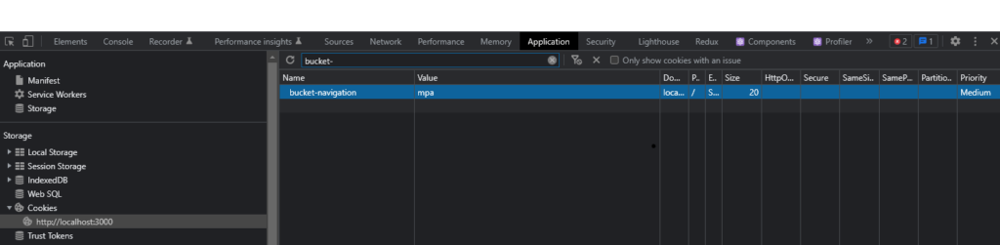
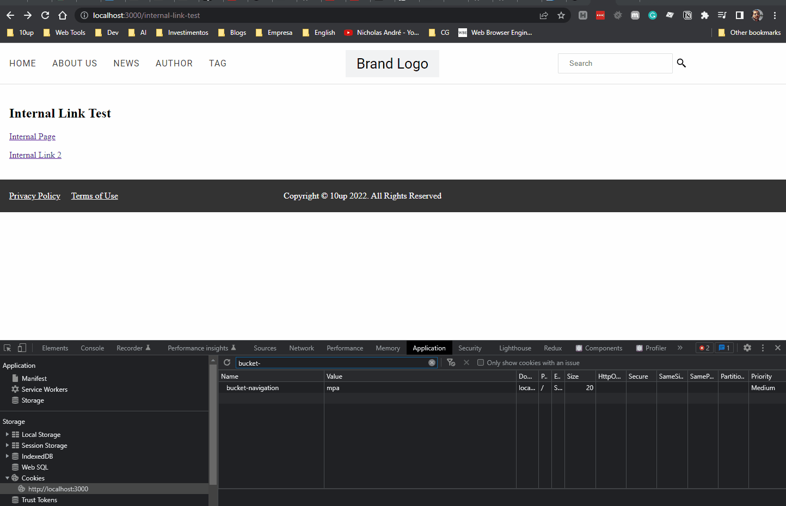

# A/B Testing SPA vs MPA navigation

In this guide, we'll implement a custom Link component that will replace every Link in the post content with a custom React component that will implement SPA or MPA navigation based on an A/B test. By "SPA navigation" I mean navigating to other pages via client-side rendering instead of a full-page reload. MPA navigation is the opposite and traditional way of navigation.

This is an interesting use case since there are some claims that [MPA might perform better in web vitals compared to SPA](https://web.dev/vitals-spa-faq/) (not because it's necessarily better but because of difficulties to capture some metrics in SPA).

First off, let's create a custom LinkBlock. We'll replace the default LinkBlock component with a custom one. Note that the default LinkBlock is a special block implementation that handles internal links for Next.js.

The HeadstartWP provider in App Router already supports dependency injection for Link components through the settings prop. This is essentially telling the framework to use that component whenever rendering a Link.

So the next step here is creating our own "LinkBlock" implementation to use that custom link component.

```tsx title="src/components/LinkBlock.tsx"
import { getAttributes } from '@headstartwp/core/react';
import { Link } from './Link';
import type { ReactNode } from 'react';

interface LinkBlockProps {
	domNode: {
		attribs: Record<string, string>;
	};
	children: ReactNode;
}

const LinkBlock = ({ domNode, children }: LinkBlockProps) => {
	const { href, rel } = getAttributes(domNode.attribs);

	return (
		<Link href={href} rel={rel}>
			{children}
		</Link>
	);
};

export default LinkBlock;
```

Our custom LinkBlock component leverages the getAttributes utility that receives the domNode attributes and returns an object with available node attributes. You could access attributes directly but this function does some normalization especially around returning className instead of class.

We'll leverage Next.js middleware for A/B testing. If you're unfamiliar with Next.js middleware, go read their [documentation](https://nextjs.org/docs/app/building-your-application/routing/middleware).

The next step is to open `src/middleware.ts` and make the following changes:

```ts title="src/middleware.ts"
import { AppMiddleware } from '@headstartwp/next/middlewares';
import { NextRequest, NextResponse } from 'next/server';

const COOKIE_NAME = 'bucket-navigation';
const BUCKETS = ['spa', 'mpa'] as const;
type NavigationBucket = typeof BUCKETS[number];

const getBucket = (): NavigationBucket => BUCKETS[Math.floor(Math.random() * BUCKETS.length)];

export const config = {
	matcher: [
		/*
		 * Match all paths except for:
		 * 1. /api routes
		 * 2. /_next (Next.js internals)
		 * 3. /fonts (inside /public)
		 * 4. all root files inside /public (e.g. /favicon.ico)
		 */
		'/((?!api|cache-healthcheck|_next|fonts|.*\\.\\w+).*)',
	],
};

export async function middleware(req: NextRequest) {
	const response = await AppMiddleware(req, { appRouter: true });

	if (!response.redirected) {
		const url = req.nextUrl.clone();
		const existingBucket = req.cookies.get(COOKIE_NAME)?.value as NavigationBucket;
		const bucket = existingBucket || getBucket();

		// Set the cookie for future requests
		response.cookies.set(COOKIE_NAME, bucket, {
			httpOnly: false, // Allow client-side access
			secure: process.env.NODE_ENV === 'production',
			sameSite: 'lax',
		});

		// Add navigation bucket to search params for rewrite
		url.searchParams.set('navigation', bucket);

		return NextResponse.rewrite(url, response);
	}

	return response;
}
```

Here, we're simply simulating an A/B test, but you could, in theory, replace getBucket with a call to an A/B testing service. This middleware is essentially adding ?navigation=type to every URL using rewrite which means users won't actually see that query param in the URL. That provides us with an easy way to check if the current request should be using SPA or MPA for navigation which we'll do directly in the Link component.

Now let's create the custom Link component that will handle the A/B test logic:

```tsx title="src/components/Link.tsx"
'use client';

import { useSearchParams } from 'next/navigation';
import NextLink from 'next/link';
import { useSettings } from '@headstartwp/core/react';
import { removeSourceUrl } from '@headstartwp/core';
import type { ReactNode } from 'react';

interface LinkProps {
	href: string;
	rel?: string;
	children: ReactNode;
	className?: string;
}

export const Link = ({ href, rel, children, className }: LinkProps) => {
	const searchParams = useSearchParams();
	const settings = useSettings();
	
	const navigationBucket = searchParams?.get('navigation');
	const link = removeSourceUrl({ link: href, backendUrl: settings.sourceUrl || '' });

	const isSpaNavigation = navigationBucket === 'spa' || navigationBucket === null;

	if (isSpaNavigation) {
		return (
			<NextLink href={link} className={className} rel={rel}>
				{children}
			</NextLink>
		);
	}

	return (
		<a href={link} rel={rel} className={className}>
			{children}
		</a>
	);
};
```

The changes to this component limit to checking the search params and if the navigation param is equal to "spa" or null, in which case it will default to use the Next.js Link component. Otherwise, it defaults to an MPA by simply rendering a regular anchor tag.

Note that the link is converted to a relative link to remove the WordPress domain.

## Setting up the Link Component in Your Layout

To use your custom Link component throughout your app, you need to configure it in your root layout or HeadstartWP provider:

```tsx title="src/app/layout.tsx"
import { HeadstartWPProvider } from '@headstartwp/next/app';
import { Link } from '../components/Link';

export default function RootLayout({
	children,
}: {
	children: React.ReactNode;
}) {
	return (
		<html lang="en">
			<body>
				<HeadstartWPProvider
					settings={{
						linkComponent: Link,
					}}
				>
					{children}
				</HeadstartWPProvider>
			</body>
		</html>
	);
}
```

## Using the Custom LinkBlock

Now you can use your custom LinkBlock in your BlocksRenderer:

```tsx title="src/components/PostContent.tsx"
import { BlocksRenderer } from '@headstartwp/core/react';
import LinkBlock from './LinkBlock';

interface PostContentProps {
	html: string;
}

export function PostContent({ html }: PostContentProps) {
	return (
		<BlocksRenderer html={html}>
			<LinkBlock />
		</BlocksRenderer>
	);
}
```

## Testing Your A/B Test

To test this, open a page in your browser. Then, check which bucket you're in by opening the developer tools and looking at the cookies:



In the example above, if you were assigned the "mpa" bucket you should see a full page reload when navigating to internal links inside the post content. You can change to the "spa" bucket by modifying the cookie in your browser's developer tools.

## Advanced: Reading the Bucket on the Server

If you need to access the navigation bucket in Server Components, you can read it from cookies:

```tsx title="src/app/[...path]/page.tsx"
import { cookies } from 'next/headers';
import type { HeadstartWPRoute } from '@headstartwp/next/app';

export default async function PostPage() {
	const cookieStore = await cookies();
	const navigationBucket = cookieStore.get('bucket-navigation')?.value || 'spa';
	
	// Use the bucket value in your server component logic
	console.log('Current navigation bucket:', navigationBucket);
	
	// ... rest of your component
}
```

## Analytics Integration

You can also track which bucket users are in for analytics purposes:

```tsx title="src/components/AnalyticsTracker.tsx"
'use client';

import { useSearchParams } from 'next/navigation';
import { useEffect } from 'react';

export function AnalyticsTracker() {
	const searchParams = useSearchParams();
	
	useEffect(() => {
		const navigationBucket = searchParams?.get('navigation') || 'spa';
		
		// Track the bucket assignment
		if (typeof window !== 'undefined' && window.gtag) {
			window.gtag('event', 'ab_test_assignment', {
				custom_parameter: `navigation_${navigationBucket}`,
			});
		}
	}, [searchParams]);
	
	return null;
}
```

Then include this tracker in your layout:

```tsx title="src/app/layout.tsx"
import { AnalyticsTracker } from '../components/AnalyticsTracker';

export default function RootLayout({ children }: { children: React.ReactNode }) {
	return (
		<html lang="en">
			<body>
				<HeadstartWPProvider>
					{children}
					<AnalyticsTracker />
				</HeadstartWPProvider>
			</body>
		</html>
	);
}
```



This App Router implementation provides a clean, type-safe way to A/B test navigation patterns while maintaining good performance and user experience.