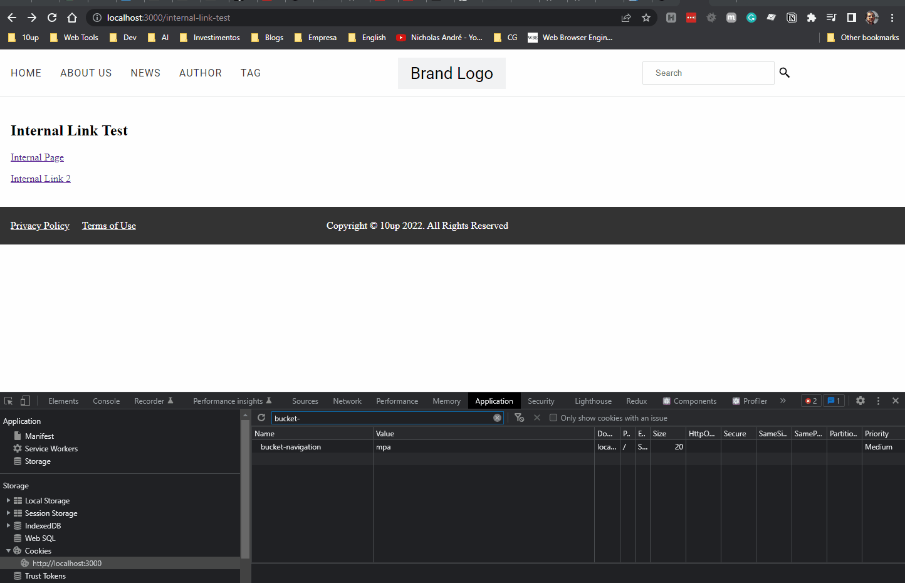

# A/B Testing SPA vs MPA navigation

 In this guide, we’ll implement a custom Link component that will replace every Link in the post content with a custom React component that will implement SPA or MPA navigation based on an A/B test. By “SPA navigation” I mean navigating to other pages via client-side rendering instead of a full-page reload. MPA navigation is the opposite and traditional way of navigation.

 This is an interesting use case since there are some claims that [MPA might perform better in web vitals compared to SPA](https://web.dev/vitals-spa-faq/) (not because it’s necessarily better but because of difficulties to capture some metrics in SPA).

 First off, let’s create a custom LinkBlock. We’ll replace the default LinkBlock component with a custom one. Note that the default LinkBlock is a special block implementation that handles internal links for Next.js.

 The starter project already has a custom [Link](https://github.com/nicholasio/headless-tutorial/blob/trunk/src/components/Link.js) component that is passed via dependency injection to the Framework Provider in [_app.js](https://github.com/nicholasio/headless-tutorial/blob/trunk/src/pages/_app.js#L38). This is essentially telling the framework to use that component whenever rendering a Link.

So the next step here is creating our own “LinkBlock” implementation to use that custom link component.

```js
import { Link } from './Link';

const LinkBlock = ({ domNode, children }) => {
	const { href, rel } = getAttributes(domNode.attribs);

	return (
		<Link href={href} rel={rel}>
			{children}
		</Link>
	);
};

LinkBlock.propTypes = {
	domNode: PropTypes.shape({
		attribs: PropTypes.shape({}).isRequired,
	}).isRequired,
	children: PropTypes.node.isRequired,
};
```

Our custom LinkBlock component leverages the getAttributes utility that receives the domNode attributes and returns an object with available node attributes. You could access attributes directly but this function does some normalization especially around returning className instead of class.

We’ll leverage Next.js middleware for A/B testing. If you’re unfamiliar with Next.js middleware, go read their [documentation](https://nextjs.org/docs/advanced-features/middleware).

The next step is to open `src/middleware.js` and make the following changes:

```js
import { AppMiddleware } from '@headstartwp/next/middlewares';
import { NextResponse } from 'next/server';

const COOKIE_NAME = 'bucket-navigation';
const BUCKETS = ['spa', 'mpa'];
const getBucket = () => BUCKETS[Math.floor(Math.random() * BUCKETS.length)];

export async function middleware(req) {
	const response = await AppMiddleware(req);

	if (!response.redirected) {
		const url = req.nextUrl;
		const bucket = req.cookies.get(COOKIE_NAME) || getBucket();

		response.cookies.set(COOKIE_NAME, bucket);
		url.searchParams.set('navigation', bucket);

		req.nextUrl.searchParams.set('navigation', bucket);
		return NextResponse.rewrite(req.nextUrl, response);
	}

	return response;
}
```

Here, we’re simply simulating an A/B test, but you could, in theory, replace getBucket with a call to an A/B testing service. This middleware is essentially adding ?navigation=type to every URL using rewrite which means users won’t actually see that query param in the URL. That provides us with an easy way to check if the current request should be using SPA or MPA for navigation which we’ll do directly in the Link component.

```js
// src/components/Link.js
export const Link = ({ href, rel, children }) => {
	const { query } = useRouter();

	const settings = useSettings();
	const link = removeSourceUrl({ link: href, backendUrl: settings.sourceUrl || '' });

	const isSpaNavigation = query?.navigation === 'spa' || typeof query.navigation === 'undefined';

	if (isSpaNavigation) {
		return (
			<NextLink href={link}>
				{/* eslint-disable-next-line jsx-a11y/anchor-is-valid */}
				<a rel={rel}>{children}</a>
			</NextLink>
		);
	}

	return (
		<a href={link} rel={rel}>
			{children}
		</a>
	);
};
```

The changes to this component limit to checking the query object from the router and if the navigation param is equal to “spa” or undefined, in which case it will default to use the Next.js Link component. Otherwise, it defaults to an MPA by simply rendering a regular anchor tag.

Note that the link is converted to a relative link to remove the WordPress domain.

To test this, open a page. Then, check which bucket you’re in


In the example above, I was assigned the “mpa” bucket I should see a full page reload when navigating to internal links inside the post content. You can change to the “spa” bucket by modifying the cookie.


