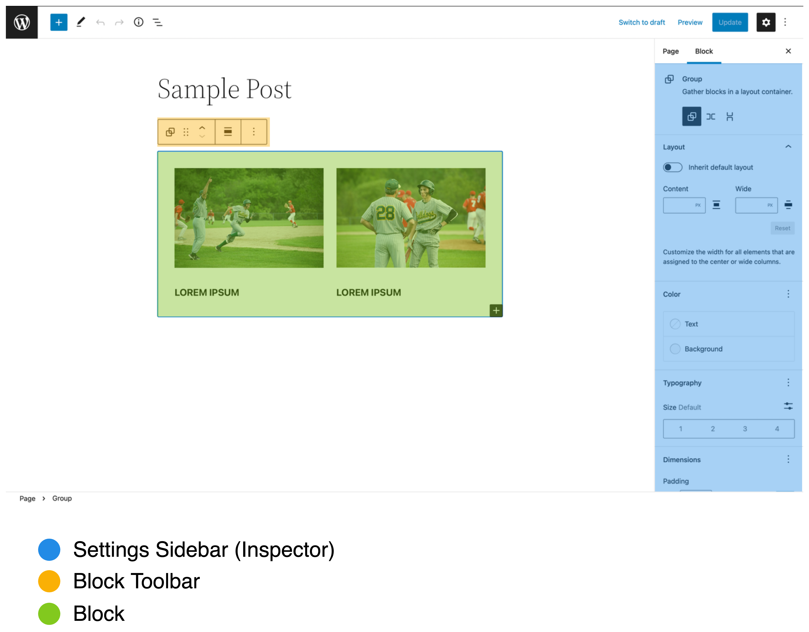
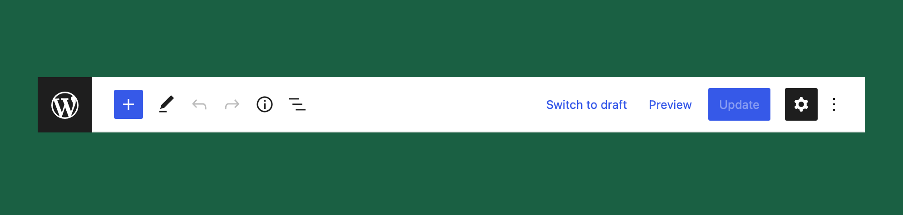
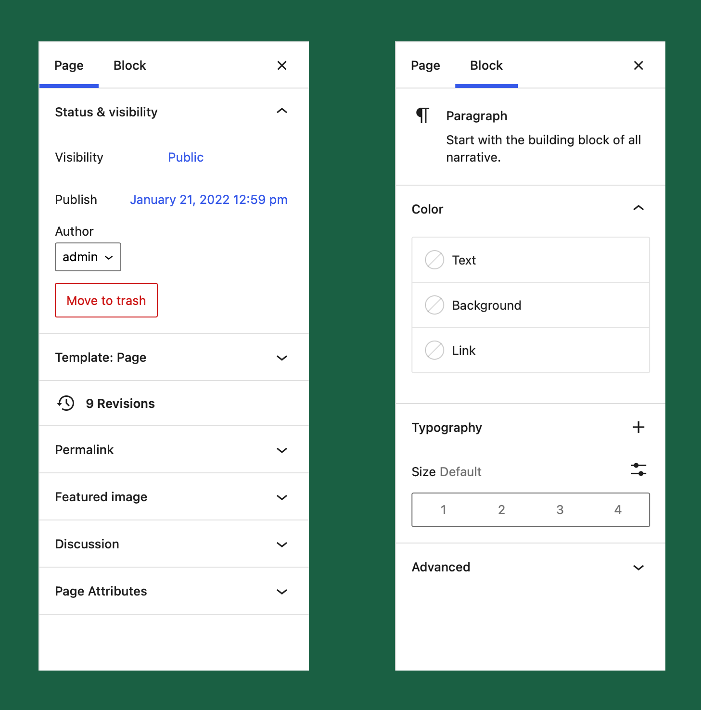
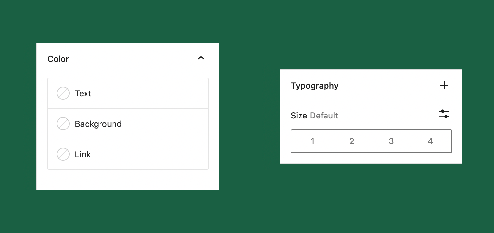

# A Recap of the WordPress Block Editor

The editor is the main interface through which one interacts with their website. It is the gateway through which you can share your message with the world. So the editorial experience is essential in creating a pleasant supportive experience that allows you to focus just on what you want to share.

There are several different instances of the editor throughout the WordPress admin interface. The most common one being the **post editor**. it is what you are probably thinking of straight away. The post editor is where you create new or edit posts/pages or any other custom post type.

But there are also other instances of the block editor being used throughout the admin interface. There is the site editor also referred to as the template editor which was introduced in WordPress 5.8 as the first piece of the full-site-editing project. Finally, for now, there is the widget editor which now also runs powered by the block editor.

## Anatomy of the Block Editor

No matter which instance of the editor you are working with the fundamental anatomy always stays the same. There always is the main editing canvas, a top toolbar and a settings sidebar on the side.

### Top Toolbar

The top toolbar is a place for page level tools and interface related toggles. On the left side you can open the block inserter, switch between different tools, get an overview of the structure of your post, and open the list view. On the right side you can save, publish, update or preview the post and toggle the main settings sidebar. Plugins can also register their own plugin panels to show up here. Finally through the kebab-menu in the right corner you can access additional options & settings panels.

### Sidebar

The settings sidebar has two tabs. The first one is for page level controls. This is where any settings that impact the overall page are placed.

The second tab is for the currently selected block. It houses advanced controls that allow you to control the appearance of the selected block.

In either sidebar type there are two different types of Panels. Ones that are collapsible and ones that allow you to toggle on/off the controls within that section.
