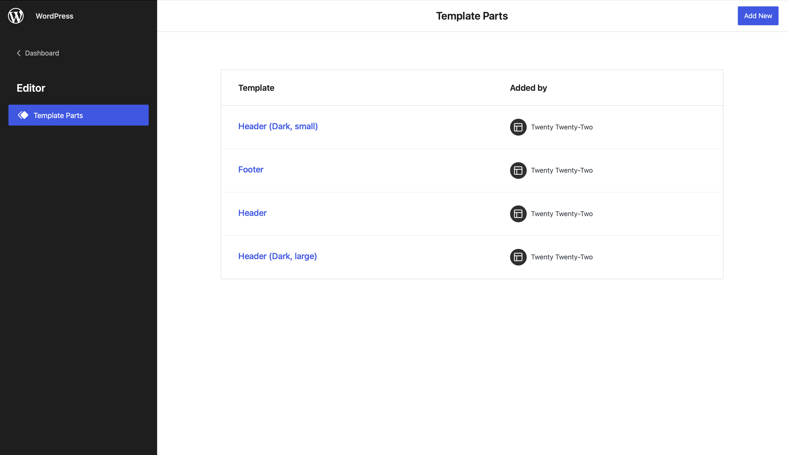
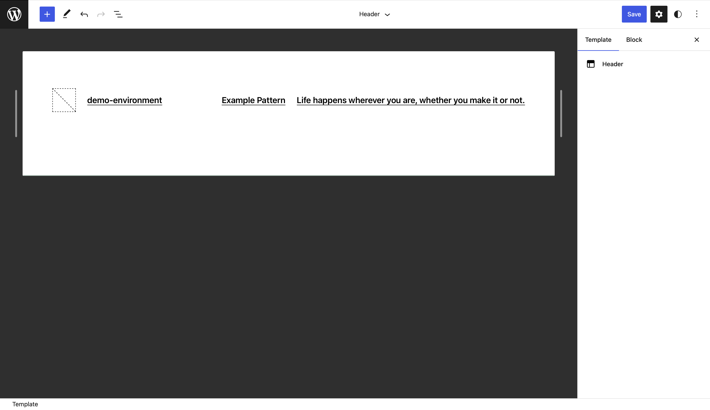

# Block Template Parts

Block based template parts are a big part of block based themes. But starting in WordPress 6.1 they can also be used by traditional WordPress themes. This reference will primarily focus on the utility of block based template parts in traditional themes. But many of the concepts do still apply in both contexts.



## What should block template parts be used for?

Block template parts can be used to make any part of a website that isn't located within the content area of a post/page editable by blocks. Obvious examples of this are the site header or site footer are. But also any other elements such as the post author bio, a cta that should get displayed site wide at the bottom of any page, or even thinks like modals and notifications can be build using this feature.

All existing block template parts can be edited in the template part editor. This instance of the editor features a resizable canvas that makes easy to quickly verify that the template part works across breakpoints.



:::info
The block template part editor also features an iframed editor. So the preview is actually accurate for what will happen on the frontend of the site.

If you are building custom blocks that utilize JavaScript DOM manipulations you can use this guide to learn more about how to work with this iframed context: <https://make.wordpress.org/core/2021/06/29/blocks-in-an-iframed-template-editor/>
:::

## How to enable block template parts

In order to enable block template parts in a traditional theme, the theme needs to opt in using the `block-template-parts` theme support.

```php title="function.php"
function add_block_template_part_support() {
	// highlight-next-line
    add_theme_support( 'block-template-parts' );
}
 
add_action( 'after_setup_theme', 'add_block_template_part_support' );
```

## Creating block template parts

With that theme support added individual template parts can now be added by creating `html` files containing the block markup that should be used by default for the pattern.

```html title="/parts/footer.html"
<!-- wp:group {"layout":{"inherit":true}} -->
<div class="wp-block-group">
    <!-- wp:group {"style":{"spacing":{"padding":{"top":"80px","bottom":"30px"}}}} -->
    <div class="wp-block-group" style="padding-top:80px;padding-bottom:30px">
        <!-- wp:paragraph {"align":"center"} -->
        <p class="has-text-align-center">Proudly Powered by <a href="https://wordpress.org" rel="nofollow">WordPress</a></p>
        <!-- /wp:paragraph -->
    </div>
    <!-- /wp:group -->
</div>
<!-- /wp:group -->
```

This `html` file just contains the same markup a block pattern would.

:::tip
It is easiest to create the template part in the editor itself and then use the copy feature to copy the markup of the block and paste it into the `html` file.
:::

By default the template part will use the name of the html file as its label in the Block Template Part overview. This label can be customized via the `theme.json` file.

```json title="theme.json"
{
	"version": 2,
	"templateParts": [
		{
			"name": "footer",
			"title": "Site Footer",
			"area": "footer"
		}
  ]
}
```

:::note
The available `areas` are `header`, `footer`, and `uncategorized`.
:::

## Using block template parts inside of traditional themes

To actually use this template part the theme author then needs to call the `block_template_part` function and pass the name of the template part as the first and only parameter.

```php title="footer.php"
// highlight-next-line
<?php block_template_part( 'footer' ); ?>
<?php wp_footer(); ?>
```

## Caveats with using block template parts

Block template parts feature wise are very similar to block based widget areas. Because the block based template parts feature has been build for the editor from the ground up it provides a better user experience and therefore should be pfeffererd in most instances.

Ideally both features shouldn't be used at the same time.

There is an issue in WordPress 6.1 that [prevents shortcodes from getting used inside block based template areas](https://core.trac.wordpress.org/ticket/56780).

## Links

- [Block-based “template parts” in traditional themes](https://make.wordpress.org/core/2022/10/04/block-based-template-parts-in-traditional-themes/)
- [Adding block template parts in classic themes](https://developer.wordpress.org/themes/block-themes/converting-a-classic-theme-to-a-block-theme/#adding-block-template-parts-in-classic-themes)
