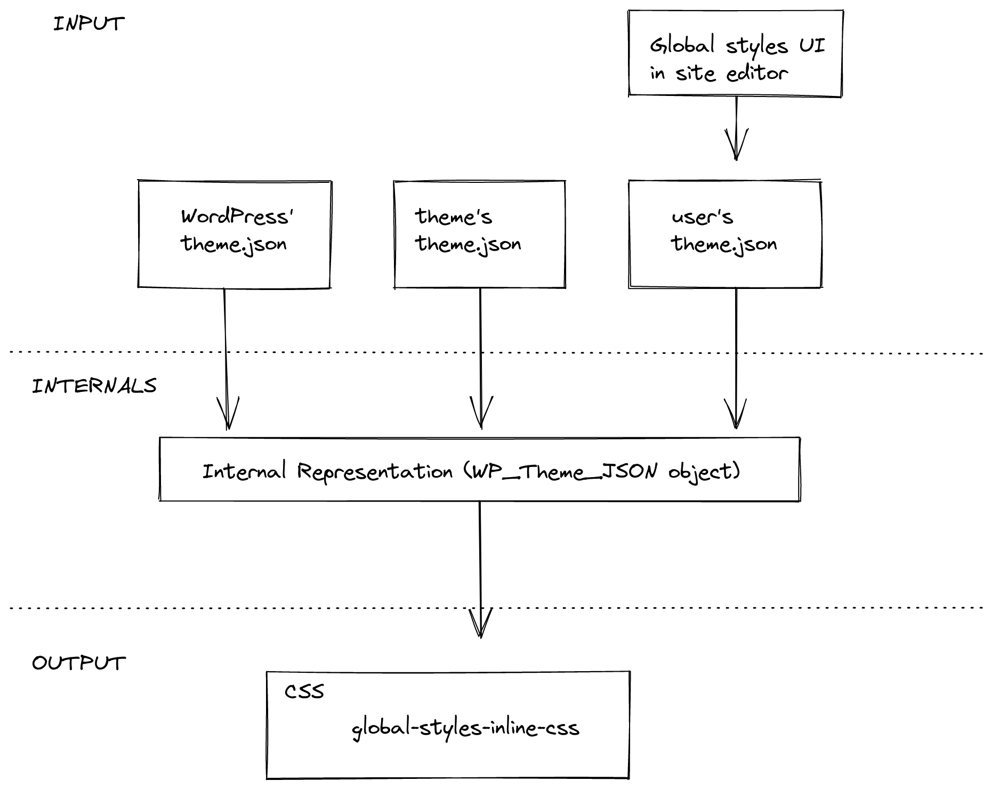

# Global Settings & Styles (`theme.json`)

Theme.json has been introduced in WordPress 5.8 as the way to control the overall appearance and settings of blocks. These settings and style presets get applied both in the editor and on the frontend of the site.

## When to use `theme.json`

By default any new WordPress Theme at 10up includes a `theme.json` file with some minimal configuration. It is recommended to keep this file and use it to control which settings should be exposed on each block in the editor. Theme.json is the easiest mechanism of controlling what options should be exposed.

## How to use `theme.json`

The `theme.json` file gets added to the root directory of a Theme. There are two main areas that you can control with the `theme.json` file: settings and styles. Both of these can have properties defined on the global level, meaning applying to the entire site with all its blocks, or on the block level where you can target individual block types.

```json
{
    "settings": {
        // Global settings get defined here...

        "blocks": {
            // Block specific settings get defined here...
        }
    },

    "styles" : {
        // Global styles get defined here...

        "blocks": {
            // Block specific styles get defined here...
        }
    }

}
```

:::tip
Add the `$schema` key to your `theme.json` files:

```json
{
    "$schema": "https://schemas.wp.org/trunk/theme.json"
}
```

This will give you autocomplete and inline documentation while working on `theme.json` files.

_You can interchange `trunk` with a specific WordPress version like so: `https://schemas.wp.org/wp/5.9/theme.json`_
:::

As mentioned earlier the `theme.json` file has two main purposes. It allows you to control which settings get displayed, and also define certain default values for styles. This styling mechanism is build on CSS custom properties.

So when you define a custom color palette like so:

```json title="theme.json"
{
    "$schema": "https://schemas.wp.org/trunk/theme.json",
    "version": 2,
    "settings": {
        "color": {
            "palette": [
                {
                    "name": "Black",
                    "slug": "black",
                    "color": "#000000"
                },
                {
                    "name": "White",
                    "slug": "white",
                    "color": "#ffffff"
                }
            ]
        },
        "blocks": {
            "core/paragraph": {
                "color": {
                    "palette": [
                        {
                            "name": "Red",
                            "slug": "red",
                            "color": "#ff0000"
                        }
                    ]
                }
            }
        }
    }
}
```

WordPress automatically generates and includes the following custom properties get added to the page:

```css title="generated custom properties"
body {
    --wp--preset--color--black: #000000;
    --wp--preset--color--white: #ffffff;
}

.wp-block-paragraph {
    --wp--preset--color--red: #ff0000;
}
```

:::tip
By default WordPress [cashes the Stylesheet](https://github.com/WordPress/wordpress-develop/blob/9b105d92a4b769f396ba798db1f106abab75001f/src/wp-includes/global-styles-and-settings.php#L91-L97) that gets generated out of `theme.json`. For development purposes you can bypass that cashing by enabling [debug mode](https://wordpress.org/support/article/debugging-in-wordpress) via the `WP_DEBUG` global in your `wp-config.php`. (`SCRIPT_DEBUG` also achieves the same thing)
:::

## Understanding the cascade

These settings and styles exist at three levels, each overwriting the specificity of the previous layer. At the root there is the default core `theme.json` file which houses all the default values for everything. All the properties in this core `theme.json` file can be overwritten via the `theme.json` file of a theme. Finally there also is the third layer which is the user generated `theme.json` that comes out of the global styles panel in the site editor. This only impacts "Block Based Themes" which allow users to define colors, fonts, etc. manually using the Site Editor.



## Using the values from `theme.json` custom blocks

You can access the settings & values defined in `theme.json` via the `useSetting` hook. This hook accepts a `string` as its parameter which is used as the path for a setting. This means that it checks through the different specificity levels whether a value has been defined for this key.

It first checks whether the user has defined something, then whether the block has defined something in its settings, following the global settings in `theme.json`. Of none of these palaces have any value it will use the default value specified in core.

```js
import { useSetting } from '@wordpress/block-editor';

export function BlockEdit() {
    const isEnabled = useSetting( 'typography.dropCap' );

    // ...
}
```

<details>
    <summary>Example:</summary>
<p>

 Lets say we have this `theme.json` file:

```json title="theme.json"
{
    "settings": {
        "typography": {
            "dropCap": false
        }
    },
    "blocks": [
        "core/paragraph": {
            "settings": {
                "typography": {
                    "dropCap": true
                }
            }
        }
    ]
}
```

Using `useSetting('typography.dropCap')` would only return `true` if it is being called from within the `core/paragraph` block.

</p>
</details>

## Filtering `theme.json` data

Starting in WordPress 6.1 it is possible to filter the values of `theme.json` on the server. There are 4 different hooks for the 4 different layers or `theme.json`. Default, Blocks, Theme, and User.

- `wp_theme_json_data_default`: hooks into the default data provided by WordPress
- `wp_theme_json_data_blocks`: hooks into the data provided by the blocks
- `wp_theme_json_data_theme`: hooks into the data provided by the theme
- `wp_theme_json_data_user`: hooks into the data provided by the user

Each of these filters receives an instance of the `WP_Theme_JSON_Data` class with the data for the respective layer. To provide new data, the filter callback needs to use the `update_with( $new_data )` method, where `$new_data` is a valid `theme.json`-like structure.

As with any `theme.json`, the new data needs to declare which `version` of the `theme.json` is using, so it can correctly be migrated.

```php
function filter_theme_json_theme( $theme_json ){
	$new_data = array(
		'version'  => 2,
		'settings' => array(
			'color' => array(
				'text'       => false,
				'palette'    => array(
					array(
						'slug'  => 'foreground',
						'color' => 'black',
						'name'  => __( 'Foreground', 'theme-domain' ),
					),
					array(
						'slug'  => 'background',
						'color' => 'white',
						'name'  => __( 'Background', 'theme-domain' ),
					),
				),
			),
		),
	);

	return $theme_json->update_with( $new_data );
}
add_filter( 'wp_theme_json_data_theme', 'filter_theme_json_theme' );
```

## Links

- [Block Editor Handbook - Global Settings & Styles (theme.json)](https://developer.wordpress.org/block-editor/how-to-guides/themes/theme-json/)
- [Block Editor Handbook - Theme JSON API Reference](https://developer.wordpress.org/block-editor/reference-guides/theme-json-reference/theme-json-living/)
- [Filters for theme.json data - WordPress 6.1 Dev Note](https://make.wordpress.org/core/2022/10/10/filters-for-theme-json-data/)
