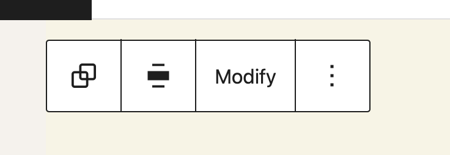

# Block Patterns

Block Patterns are a great way to get up and running quickly when editing a page in WordPress. They allow you to insert entire predefined templates so that you don't have to start from scratch. As an editor you get a really nice visual preview of what the pattern looks like.


## What should patterns be used for?

Patterns are best suited for commonly used sections within a design system. If you for example have a Pricing table that should normally be used with a heading above and a full width colored background that would make a perfect pattern.

You can also put entire Page layouts into block patterns to really get someone up and running quickly which might be useful for projects where the editors commonly need to create similar types of landing pages for example.

In general they are best suited for predefined sections in a page.

## How to create block Patterns

Adding patterns also is very easy from a development perspective. Since WordPress 6.0 you can create patterns by placing a php file into the `patterns` directory of your theme. This file needs to have a header comment with some required metadata in order to load.

```php title="patterns/hello-world.php"
<?php
/**
 * Title: Hello World
 * Slug: tenup-theme/hello-world
 * Categories: text
 * Description: example description
 * Keywords: example, test
 */

?>

<!-- wp:paragraph -->
<p>Hello World!</p>
<!-- /wp:paragraph -->
```

### Available Options

These options are available via either the metadata header when registering the pattern via the `patterns` folder in the root of the theme or via parameters of the [`register_block_pattern`](https://developer.wordpress.org/block-editor/reference-guides/block-api/block-patterns/#register_block_pattern) function.

| Name             | Description |
|------------------|-------------|
| `Title`          | Title of the pattern *(required)* |
| `Slug`           | Unique slug under which the pattern gets registered *(required)* |
| `Description`    | Description of the pattern |
| `Viewport Width` | Width of the iframe viewport when the pattern gets previewed |
| `Categories`     | Comma separated pattern categories under which the pattern should get listed |
| `Keywords`       | Comma separated keywords under which the pattern can be found |
| `Block Types`    | Comma separated block types the pattern contains. gets used for contextual patterns. But also page level patterns / assigning patterns to template parts in block based themes use this setting. |
| `Post Types`     | Comma separated post types the pattern should be limited to. *(defaults to all)* |
| `Inserter`       | Whether or not the pattern should be shown in the inserter *(defaults to `true`)* |

<details>
<summary>

Manually register block patterns. *(Also works for plugins)*
</summary>

Patterns don't need to get registered using the `patterns` directory. There also is a manual PHP api to achieve the same thing which can also be used from within plugins.

```php title="includes/blocks.php"
register_block_pattern(
    'my-plugin/my-awesome-pattern',
    array(
        'title'       => __( 'Two buttons', 'my-plugin' ),
        'description' => _x( 'Two horizontal buttons, the left button is filled in, and the right button is outlined.', 'Block pattern description', 'my-plugin' ),
        'content'     => "<!-- wp:buttons {\"align\":\"center\"} -->\n<div class=\"wp-block-buttons aligncenter\"><!-- wp:button {\"backgroundColor\":\"very-dark-gray\",\"borderRadius\":0} -->\n<div class=\"wp-block-button\"><a class=\"wp-block-button__link has-background has-very-dark-gray-background-color no-border-radius\">" . esc_html__( 'Button One', 'my-plugin' ) . "</a></div>\n<!-- /wp:button -->\n\n<!-- wp:button {\"textColor\":\"very-dark-gray\",\"borderRadius\":0,\"className\":\"is-style-outline\"} -->\n<div class=\"wp-block-button is-style-outline\"><a class=\"wp-block-button__link has-text-color has-very-dark-gray-color no-border-radius\">" . esc_html__( 'Button Two', 'my-plugin' ) . "</a></div>\n<!-- /wp:button --></div>\n<!-- /wp:buttons -->",
    )
); 
```

To improve the developer experience it makes sense to move the actual `content` out into a separate php file that we include here. This makes it much more maintainable.

```php title="block-patterns/buttons.php"
<!-- wp:buttons { "align": "center" } -->
<div class="wp-block-buttons aligncenter">
 <!-- wp:button { "backgroundColor": "very-dark-gray", "borderRadius": 0 } -->
 <div class="wp-block-button">
  <a class="wp-block-button__link has-background has-very-dark-gray-background-color no-border-radius">
   <?php echo esc_html__( 'Button One', 'my-plugin' ); ?>
  </a>
 </div>
 <!-- /wp:button -->
 <!-- wp:button { "textColor": "very-dark-gray", "borderRadius": 0, "className": "is-style-outline" } -->
 <div class="wp-block-button is-style-outline">
  <a class="wp-block-button__link has-text-color has-very-dark-gray-color no-border-radius">
   <?php echo esc_html__( 'Button Two', 'my-plugin' ); ?>
  </a>
 </div>
 <!-- /wp:button -->
</div>
<!-- /wp:buttons -->
```

```php title="blocks/register-patterns.php"

/**
 * Get Pattern Content.
 *
 * @param string $name Pattern name.
 * @return string
 */
function get_pattern_content( $name ) {
     $path    = "block-patterns/{$name}.php";
     if ( file_exists( $path ) ) {
         ob_start();
         require $path;
         return ob_get_clean();
     }
}

register_block_pattern(
    'my-plugin/my-awesome-pattern',
    array(
        'title'       => __( 'Two buttons', 'my-plugin' ),
        'description' => _x( 'Two horizontal buttons, the left button is filled in, and the right button is outlined.', 'Block pattern description', 'my-plugin' ),
        'content'     => get_pattern_content( 'buttons' );
    )
); 
```

</details>

## Page Level Patterns

Patterns can get marked as page level patterns. If a theme includes two or more page level patterns a modal will get shown to editors whenever they create a new page allowing them to choose one of the page level patterns as a starting point for the content they are entering.

Editors can of course always dismiss this modal and start from scratch.

A pattern can be marked as a page level pattern by adding `core/post-content` to the `Block Types` of the pattern.

```php title="patterns/example.php"
<?php
 /**
  * Title: Hello
  * Slug: my-theme/hello
  // highlight-next-line
  * Block Types: core/post-content
  * Categories: featured, text
  */
?>
<!-- wp:heading -->
  <h2>Hello</h2>
<!-- /wp:heading -->
```

<details>
<summary>

You can completely disable this feature by manually removing the `core/post-content` option from the block types of each registered pattern
</summary>

```php title="functions.php"
$patterns = WP_Block_Patterns_Registry::get_instance()->get_all_registered();
foreach ( $patterns as $pattern ) {
    if (
        ! empty($pattern['blockTypes'] ) &&
        in_array('core/post-content', $pattern['blockTypes'] )
    ) {
        unregister_block_pattern( $pattern['name'] );
        $pattern['blockTypes'] = array_diff( $pattern['blockTypes'], array( 'core/post-content' ) );
        register_block_pattern( $pattern['name'], $pattern );
    }
}
```

</details>

## Post Type specific patterns

Starting in WordPress 6.1, Block patterns can also be specific to any post type. This becomes especially useful when you have blocks that are also specific to certain post types. For example if you have a products custom post type with special blocks to display the price etc. you may want to also create various patterns that are specific to that post type. This is possible via the `Post Type` metadata.

```php title="patterns/example.php"
<?php
 /**
  * Title: Hello
  * Slug: my-theme/hello
  // highlight-next-line
  * Post Types: products
  * Categories: featured, text
  */
?>
<!-- wp:heading -->
  <h2>Hello</h2>
<!-- /wp:heading -->
```

:::tip
The ability to limit a pattern per post type ties in nicely with the option for page level patterns. When you **combine** the two you can present users with **different page level patterns** for **different post types**.
:::tip

## Contextual Patterns

Patterns show up in a few places throughout the editor. One very powerful place is the block transforms menu. When a pattern declares that it contains a certain block type, it appears in the block transforms options for that block type and allows editors to quickly transform their block instance into the block pattern.

The powerful thing about this is, that the content of the block gets preserved and automatically replaces the content of that block type inside the pattern.

```php title="patterns/example.php"
<?php
 /**
  * Title: Hello
  * Slug: my-theme/hello
  // highlight-next-line
  * Block Types: core/heading
  * Categories: featured, text
  */
?>
<!-- wp:heading -->
  <h2>Hello</h2>
<!-- /wp:heading -->
```

:::info
The WPEngine Blog has published a [great article about Contextual Patterns](https://wpengine.com/builders/wordpress-contextual-patterns/) that goes into more details.

<iframe width="560" height="315" src="https://www.youtube.com/embed/fW4xhwjfyeY" title="YouTube video player" frameborder="0" allow="accelerometer; autoplay; clipboard-write; encrypted-media; gyroscope; picture-in-picture" allowfullscreen></iframe>

:::info

## Content Only locked Patterns


Locking block patterns allows us to share complex patterns with clients whilst only allowing them to edit certain parts of the pattern. This is super useful and can make the editing experience much less frustrating. Content only locking takes this concept to the next level.

When a pattern enabled content only locking all the various options from the blocks within the pattern get removed and editors only get to interact with the actual content within the pattern.

This goes so far as to hide any irrelevant nested blocks in the list view. And only presenting a streamlined block toolbar / sidebar to the editor. Editors to have the option to modify the underlying blocks by clicking on the "Modify" button in the blocks toolbar.



You can enable this content only mode for a pattern by setting the `templateLock` attribute of the outermost block to `contentOnly`.

```php title="patterns/example.php"
<?php
 /**
  * Title: Hello
  * Slug: my-theme/hello
  * Block Types: core/heading
  * Categories: featured, text
  */
?>

// highlight-next-line
<!-- wp:group {"templateLock":"contentOnly"} -->
<div class="wp-block-group">
	<!-- wp:heading -->
	<h2>Hello</h2>
	<!-- /wp:heading -->
</div>
<!-- /wp:group -->
```

### Updating Custom Blocks to work with in Content Only locked patterns

Out of the box all settings of any block become inert when the content only locking gets applied. Only settings that are specifically tagged as content become active.

This is achieved by adding `"__experimentalRole": "content"` to the attribute definition of any attribute that should remain editable.

```json
{
	"attributes": {
		"title": {
			"type": "string",
			"default": "",
			// highlight-next-line
			"__experimentalRole": "content"
		}
	}
}
```

## Caveats with using Block Patterns

:::caution
There is one item that you need to be aware about in regards to Block Patterns. Once they are inserted they have no link to the original block pattern that they were created by. On insertion they become regular blocks. Therefore it is not possible to adjust all occurrences of a block pattern after it has been used.
:::caution

If you find an issue with the markup of a pattern that you want to fix it is only going to impact new instances of the pattern that are created after you updated it. And you will have to manually go into every instance that was created using the pattern and make the update manually, or create an update script to update it in the database directly.

If you want to get around this limitation you can of course also build block patterns made up of [custom-blocks](./custom-blocks) that don't actually store their markup in the database. That way you can get the benefits of both worlds.

## Links

- [New features for working with patterns and themes in WordPress 6.0](https://make.wordpress.org/core/2022/05/02/new-features-for-working-with-patterns-and-themes-in-wordpress-6-0/)
- [Block Locking - 10up Gutenberg Reference](./block-locking.md)
- [Patterns - Block Editor Handbook](https://developer.wordpress.org/block-editor/reference-guides/block-api/block-patterns/)
- [New features for working with patterns and themes in WordPress 6.0](https://make.wordpress.org/core/2022/05/02/new-features-for-working-with-patterns-and-themes-in-wordpress-6-0/)
- [What are Contextual Patterns in WordPress?](https://wpengine.com/builders/wordpress-contextual-patterns/)
- [How to simplify WordPress patterns with content-only block editing](https://richtabor.com/content-only-editing/)
