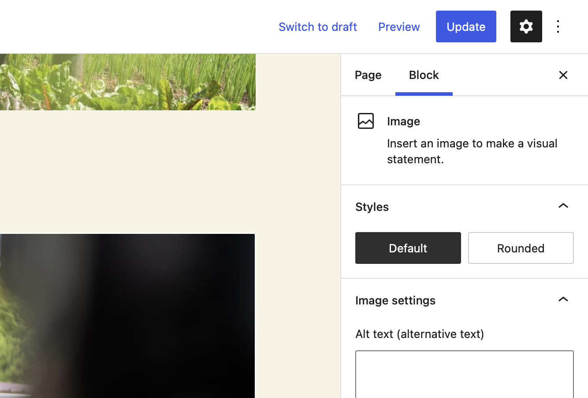

# Block Styles

Block styles are a relatively simple API that allows you to add different visual styles to a block. In Core, the image block, for example allows you to select a rounded style to round the corners of the image.



:::caution
Block Styles come with many caveats though and should be used very sparingly. Instead [block extensions](block-extensions) should be used in most cases because of the increased flexibility.
:::caution

## User Experience

In the editor, styles are the first thing a user sees in the blocks setting sidebar. They are shown very prominently. So initially it seems like a great spot to put controls. This is only true as long as there are no more than 4 styles present. After that point the experience becomes too cluttered and overwhelming.

:::warning
Additionally the style options have one fatal flaw. Only one of them can be active at a time. And most things that end up becoming styles are things that you down the line would love to combine. And that is a downfall that happens very quickly.

At the beginning of a project 2-4 styles get added to a block. And after using it for a moment the client comes back now wanting to combine the options from Style A and Style B. And at that point you would need to create a separate new style for the combination of A & B. And then someone else wants to use B & C and so on. Styles lead you into a corner very quickly.
:::warning

## Developer Experience

The DX of block styles initially is very simple. You can register a block style both in JS and in PHP with just one simple function call. The [`register_block_style`](https://developer.wordpress.org/reference/functions/register_block_style/) / [`registerBlockStyle`](https://developer.wordpress.org/block-editor/reference-guides/block-api/block-styles/) function allows you to register a new style to any block.

```php title="In PHP:"
register_block_style(
    'core/image',
    [
        'name'  => 'rounded',
        'label' => 'Rounded',
    ]
);
```

```js title="In JavaScript:"
import { registerBlockStyle } from '@wordpress/blocks';

registerBlockStyle( 'core/image', {
    name: 'rounded',
    label: 'Rounded',
} );
```

Once the style is registered it automatically adds a class name to the wrapping element of the block following the convention `is-style-${style-name}`.

You can also unregister block styles. Again this is possible both in JS and in PHP via the [`unregister_block_style`](https://developer.wordpress.org/reference/functions/unregister_block_style/) & `unregisterBlockStyle` functions:

```php title="In PHP:"
unregister_block_style( 'core/image', 'rounded' );
```

```js title="In JavaScript:"
import { unregisterBlockStyle } from '@wordpress/blocks';

unregisterBlockStyle( 'core/image', 'rounded' );
```

:::caution
Important: The PHP function `unregister_block_style` only unregisters styles that were registered on the server using `register_block_style`. The function does not unregister a style registered using client-side code.
:::caution

There is no actual API for checking which style is currently selected and there is no listener to subscribe to changes in the selected style.

## Alternative

:::tip
Most use-cases of Block Styles would be better suited as [block extensions](block-extensions).
:::tip
