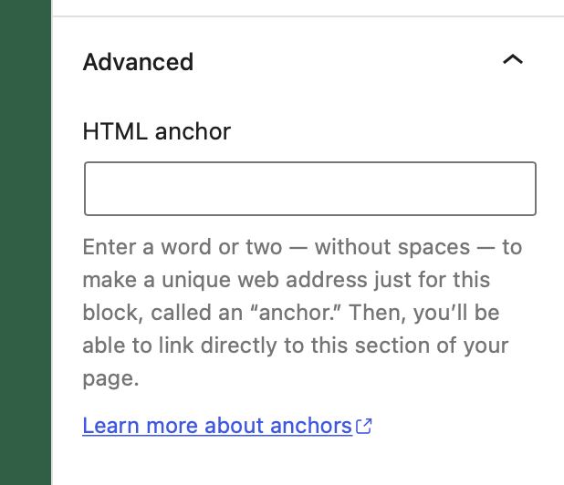
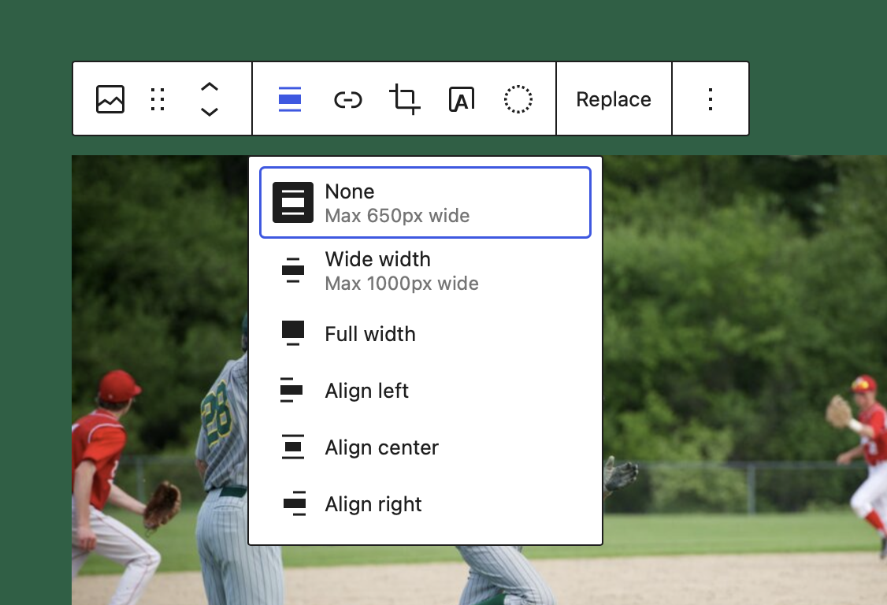
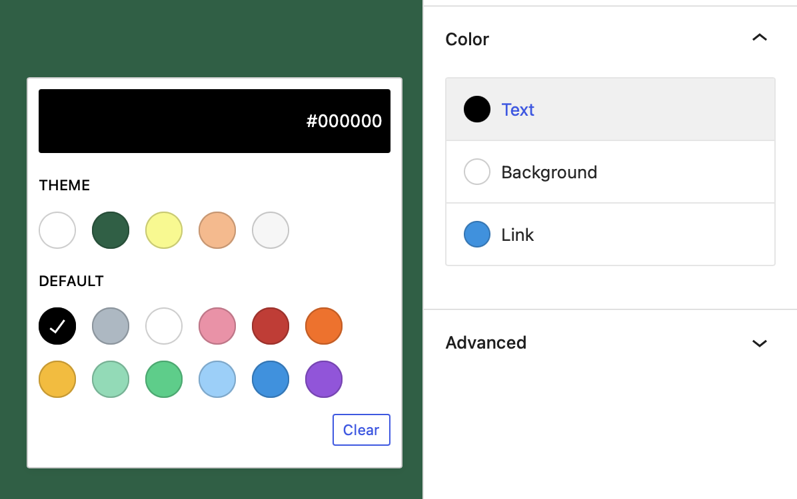
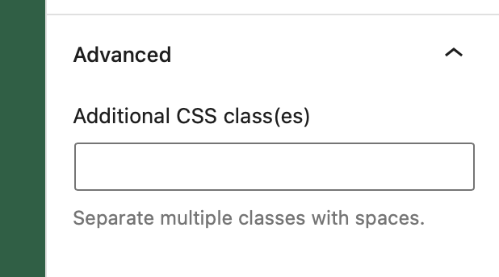
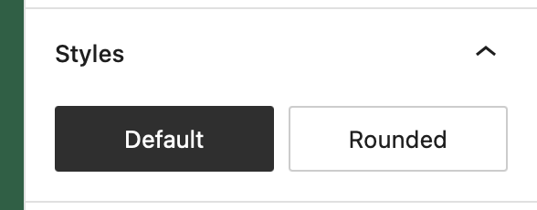
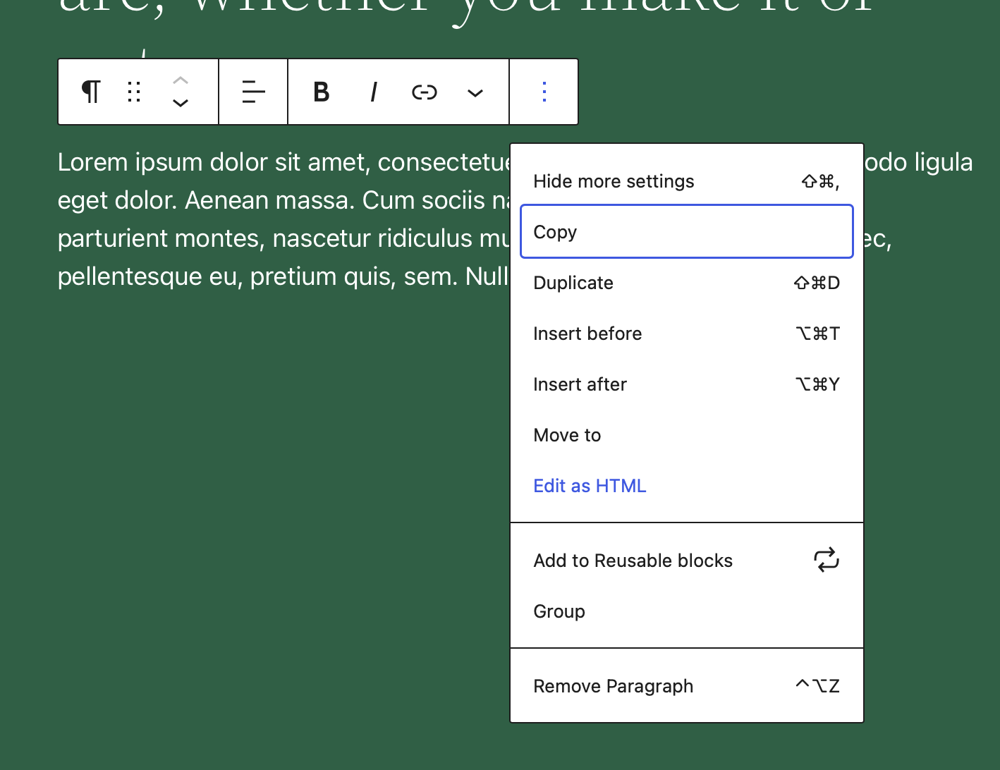
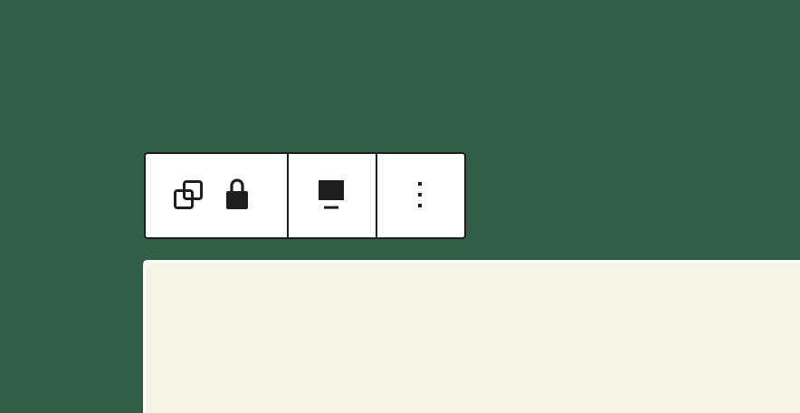
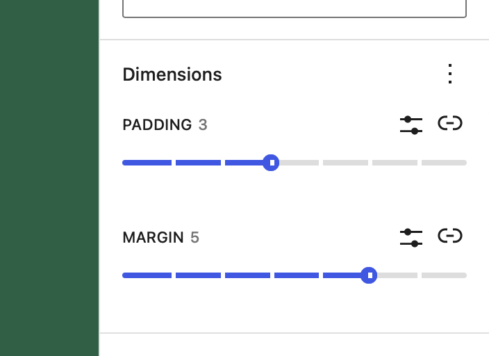
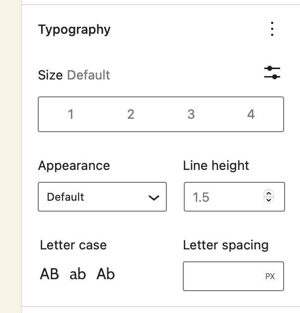

# Block Supports

The Block Supports API allows a block to opt in or out of certain core features.

Opting into any of these features will register additional attributes on the block and provide the UI to manipulate that attribute.

## anchor



- Type: `boolean`
- Default value: `false`

Anchors let you link directly to a specific block on a page. This property adds a field to define an id for the block and a button to copy the direct link.
:::warning
This doesn't work with dynamic blocks yet. If you need to add Anchor support to a block that uses PHP rendering you need to manually add the attribute and UI for it.
:::

```json
// Declare support for anchor links.
"supports": {
    "anchor": true
}
```

## align



- Type: `boolean` or `array`
- Default value: `false`

This property adds block controls which allow to change block's alignment.

```json
"supports": {
    // Declare support for block's alignment.
    // This adds support for all the options:
    // left, center, right, wide, and full.
    "align": true
}
```

```json
"supports": {
    // Declare support for specific alignment options.
    "align": [ "left", "right", "full" ]
}
```

When the block declares support for `align`, the attributes definition is extended to include an align attribute with a `string` type. By default, no alignment is assigned. The block can apply a default alignment by specifying its own `align` attribute with a default e.g.:

```json
"attributes": {
    "align": {
        "type": "string",
        "default": "right"
    }
}
```

## alignWide

- Type: `boolean`
- Default value: `true`

This property allows to enable [wide alignment](https://developer.wordpress.org/block-editor/how-to-guides/themes/theme-support.md#wide-alignment) for your theme. To disable this behavior for a single block, set this flag to `false`.

```json
"supports": {
    // Remove the support for wide alignment.
    "alignWide": false
}
```

## ariaLabel

- Type: `boolean`
- Default value: `false`

 ARIA-labels let you define an accessible label for elements. This property allows enabling the definition of an aria-label for the block.

 :::caution
 This option does not add any UI to the block editor. It is purely there for developers to add aria-label definitions to patterns, variations etc.
 :::

 ```js
 supports: {
 	// Add the support for aria label attribute
 	ariaLabel: true
 }
 ```

## className

- Type: `boolean`
- Default value: `true`

By default, the class `.wp-block-your-block-name` is added to the root element of your saved markup. This helps having a consistent mechanism for styling blocks that themes and plugins can rely on. If, for whatever reason, a class is not desired on the markup, this functionality can be disabled.

:::note
In general it is recommended for consistency sake to stick with the core generated `className`
:::

```json
"supports": {
    // Remove the support for the generated className.
    "className": false
}
```

## color



- Type: `Object`
- Default value: null
- Subproperties:
  - `background`: type `boolean`, default value `true`
  - `gradients`: type `boolean`, default value `false`
  - `link`: type `boolean`, default value `false`
  - `text`: type `boolean`, default value `true`

This value signals that a block supports some of the properties related to color. When it does, the block editor will show UI controls for the user to set their values.

Note that the `background` and `text` keys have a default value of `true`, so if the `color` property is present they'll also be considered enabled:

```json
"supports": {
    "color": {
        // This also enables text and background UI controls.
        "gradients": true // Enable gradients UI control.
 }
}
```

It's possible to disable them individually:

```json
"supports": {
    "color": { // Text UI control is enabled.
        "background": false, // Disable background UI control.
        "gradients": true // Enable gradients UI control.
    }
}
```

### color.background

This property adds UI controls which allow the user to apply a solid background color to a block.

When color support is declared, this property is enabled by default (along with text), so simply setting color will enable background color.

```json
"supports": {
    "color": true // Enables background and text
}
```

To disable background support while keeping other color supports enabled, set to `false`.

```json
"supports": {
    "color": {
        // Disable background support. Text color support is still enabled.
        "background": false
    }
}
```

When the block declares support for `color.background`, the attributes definition is extended to include two new attributes: `backgroundColor` and `style`:

- `backgroundColor`: attribute of `string` type with no default assigned.

  When a user chooses from the list of preset background colors, the preset slug is stored in the `backgroundColor` attribute.

  Background color presets are sourced from the `editor-color-palette` [theme support](https://developer.wordpress.org/block-editor/how-to-guides/themes/theme-support.md#block-color-palettes).

  The block can apply a default preset background color by specifying its own attribute with a default e.g.:

  ```json
  attributes: {
      "backgroundColor": {
          "type": "string",
          "default": "some-preset-background-slug",
      }
  }
  ```

- `style`: attribute of `object` type with no default assigned.

  When a custom background color is selected (i.e. using the custom color picker), the custom color value is stored in the `style.color.background` attribute.

  The block can apply a default custom background color by specifying its own attribute with a default e.g.:

  ```json
  "attributes": {
      "style": {
          "type": "object",
          "default": {
              "color": {
                  "background": "#aabbcc",
              }
          }
      }
  }
  ```

### color.gradients

This property adds UI controls which allow the user to apply a gradient background to a block.

```json
"supports": {
    "color": {
        "gradients": true,

        // Default values must be disabled if you don't want to use them with gradient.
        "background": false,
        "text": false
    }
}
```

Gradient presets are sourced from `editor-gradient-presets` [theme support](https://developer.wordpress.org/block-editor/how-to-guides/themes/theme-support.md#block-gradient-presets).

When the block declares support for `color.gradient`, the attributes definition is extended to include two new attributes: `gradient` and `style`:

- `gradient`: attribute of `string` type with no default assigned.

  When a user chooses from the list of preset gradients, the preset slug is stored in the `gradient` attribute.

  The block can apply a default preset gradient by specifying its own attribute with a default e.g.:

  ```json
  "attributes": {
      "gradient": {
          "type": "string",
          "default": "some-preset-gradient-slug",
      }
  }
  ```

- `style`: attribute of `object` type with no default assigned.

  When a custom gradient is selected (i.e. using the custom gradient picker), the custom gradient value is stored in the `style.color.gradient` attribute.

  The block can apply a default custom gradient by specifying its own attribute with a default e.g.:

  ```json
  attributes: {
      "style": {
          "type": "object",
          "default": {
              "color": {
                  "gradient": "linear-gradient(135deg,rgb(170,187,204) 0%,rgb(17,34,51) 100%)",
              }
          }
      }
  }
  ```

### color.link

This property adds block controls which allow the user to set link color in a block, link color is disabled by default.

```json
"supports": {
    "color": true // Enables only background and text
}
```

To enable link color support, set to `true`.

```json
"supports": {
    "color": {
        "link": true
    }
}
```

Link color presets are sourced from the `editor-color-palette` [theme support](https://developer.wordpress.org/block-editor/how-to-guides/themes/theme-support.md#block-color-palettes).

When the block declares support for `color.link`, the attributes definition is extended to include two new attributes: `linkColor` and `style`:

- `linkColor`: attribute of `string` type with no default assigned.

  When a user chooses from the list of preset link colors, the preset slug is stored in the `linkColor` attribute.

  The block can apply a default preset text color by specifying its own attribute with a default e.g.:

  ```json
  attributes: {
      "linkColor": {
          "type": "string",
          "default": "some-preset-link-color-slug",
      }
  }
  ```

- `style`: attribute of `object` type with no default assigned.

  When a custom link color is selected (i.e. using the custom color picker), the custom color value is stored in the `style.color.link` attribute.

  The block can apply a default custom link color by specifying its own attribute with a default e.g.:

  ```json
  attributes: {
      "style": {
          "type": "object",
          "default": {
              "color": {
                  "link": "#ff0000",
              }
          }
      }
  }
  ```

### color.text

This property adds block controls which allow the user to set text color in a block.

When color support is declared, this property is enabled by default (along with background), so simply setting color will enable text color.

```json
"supports": {
    "color": true // Enables background and text, but not link.
}
```

To disable text color support while keeping other color supports enabled, set to `false`.

```json
"supports": {
    "color": {
        // Disable text color support.
        "text": false
    }
}
```

Text color presets are sourced from the `editor-color-palette` [theme support](https://developer.wordpress.org/block-editor/how-to-guides/themes/theme-support.md#block-color-palettes).

When the block declares support for `color.text`, the attributes definition is extended to include two new attributes: `textColor` and `style`:

- `textColor`: attribute of `string` type with no default assigned.

  When a user chooses from the list of preset text colors, the preset slug is stored in the `textColor` attribute.

  The block can apply a default preset text color by specifying its own attribute with a default e.g.:

  ```json
  "attributes": {
      "textColor": {
          "type": "string",
          "default": "some-preset-text-color-slug",
      }
  }
  ```

- `style`: attribute of `object` type with no default assigned.

  When a custom text color is selected (i.e. using the custom color picker), the custom color value is stored in the `style.color.text` attribute.

  The block can apply a default custom text color by specifying its own attribute with a default e.g.:

  ```json
  "attributes": {
      "style": {
          "type": "object",
          "default": {
              "color": {
                  "text": "#aabbcc",
              }
          }
      }
  }
  ```

## customClassName



- Type: `boolean`
- Default value: `true`

This property adds a field to define a custom className for the block's wrapper.

```json
"supports": {
    // Remove the support for the custom className.
    "customClassName": false
}
```

## defaultStylePicker



- Type: `boolean`
- Default value: `true`

When the style picker is shown, the user can set a default style for a block type based on the block's currently active style. If you prefer not to make this option available, set this property to `false`.

```json
"supports": {
    // Remove the Default Style picker.
    "defaultStylePicker": false
}
```

## html



- Type: `boolean`
- Default value: `true`

By default, a block's markup can be edited individually. To disable this behavior, set `html` to `false`.

```json
"supports": {
    // Remove support for an HTML mode.
    "html": false
}
```

## inserter

- Type: `boolean`
- Default value: `true`

By default, all blocks will appear in the inserter. To hide a block so that it can only be inserted programmatically, set `inserter` to `false`.

```json
"supports": {
    // Hide this block from the inserter.
    "inserter": false
}
```

## multiple

- Type: `boolean`
- Default value: `true`

A non-multiple block can be inserted into each post, one time only. For example, the built-in 'More' block cannot be inserted again if it already exists in the post being edited. A non-multiple block's icon is automatically dimmed (disabled) to prevent multiple instances.

```json
"supports": {
    // Use the block just once per post
    "multiple": false
}
```

## reusable

- Type: `boolean`
- Default value: `true`

A block may want to disable the ability of being converted into a reusable block. By default all blocks can be converted to a reusable block. If supports reusable is set to false, the option to convert the block into a reusable block will not appear.

```json
"supports": {
    // Don't allow the block to be converted into a reusable block.
    "reusable": false,
}
```

## lock



- Type: `boolean`
- Default value: `true`

A block may want to disable the ability to toggle the lock state. It can be locked/unlocked by a user from the block "Options" dropdown by default. To disable this behavior, set `lock` to `false`.

```js
supports: {
	// Remove support for locking UI.
	lock: false
}
```

## spacing



- Type: `Object`
- Default value: null
- Subproperties:
  - `margin`: type `boolean` or `array`, default value `false`
  - `padding`: type `boolean` or `array`, default value `false`
  - `blockGap`: type `boolean` or `array`, default value `false`

This value signals that a block supports some of the CSS style properties related to spacing. When it does, the block editor will show UI controls for the user to set their values, if [the theme declares support](https://developer.wordpress.org/block-editor/how-to-guides/themes/theme-support.md#cover-block-padding).

```json
"supports": {
    "spacing": {
        "margin": true,  // Enable margin UI control.
        "padding": true, // Enable padding UI control.
		"blockGap": true,  // Enables block spacing UI control.
    }
}
```

When the block declares support for a specific spacing property, the attributes definition is extended to include the `style` attribute.

- `style`: attribute of `object` type with no default assigned. This is added when `margin` or `padding` support is declared. It stores the custom values set by the user.

```json
"supports": {
    "spacing": {
        "margin": [ "top", "bottom" ], // Enable margin for arbitrary sides.
        "padding": true,               // Enable padding for all sides.
		"blockGap": [ "horizontal", "vertical" ],  // Enables axial (column/row) block spacing controls
    }
}
```

A spacing property may define an array of allowable sides that can be configured. When arbitrary sides are defined only UI controls for those sides are displayed. Axial sides are defined with the `vertical` and `horizontal` terms, and display a single UI control for each axial pair (for example, `vertical` controls both the top and bottom sides). A spacing property may support arbitrary individual sides **or** axial sides, but not a mix of both.

## typography



- Type: `Object`
- Default value: `null`
- Subproperties:
  - `fontSize`: type `boolean`, default value `false`
  - `lineHeight`: type `boolean`, default value `false`

The presence of this object signals that a block supports some typography related properties. When it does, the block editor will show a typography UI allowing the user to control their values.

```json
"supports": {
    "typography": {
        // Enable support and UI control for font-size.
        "fontSize": true,
        // Enable support and UI control for line-height.
        "lineHeight": true,
    },
}
```

### typography.fontSize

- Type: `boolean`
- Default value: `false`

This value signals that a block supports the font-size CSS style property. When it does, the block editor will show an UI control for the user to set its value.

The values shown in this control are the ones declared by the theme via the `editor-font-sizes` [theme support](https://developer.wordpress.org/block-editor/how-to-guides/themes/theme-support.md#block-font-sizes), or the default ones if none are provided.

```json
"supports": {
    "typography": {
        // Enable support and UI control for font-size.
        "fontSize": true,
    },
}
```

When the block declares support for `fontSize`, the attributes definition is extended to include two new attributes: `fontSize` and `style`:

- `fontSize`: attribute of `string` type with no default assigned. It stores any preset value selected by the user. The block can apply a default fontSize by specifying its own `fontSize` attribute with a default e.g.:

```json
attributes: {
    "fontSize": {
        "type": "string",
        "default": "some-value",
    }
}
```

- `style`: attribute of `object` type with no default assigned. It stores the custom values set by the user and is shared with other block supports such as color. The block can apply a default style by specifying its own `style` attribute with a default e.g.:

```json
"attributes": {
    "style": {
        "type": "object",
        "default": {
            "typography": {
                "fontSize": "value"
            }
        }
    }
}
```

### typography.lineHeight

- Type: `boolean`
- Default value: `false`

This value signals that a block supports the line-height CSS style property. When it does, the block editor will show an UI control for the user to set its value if [the theme declares support](https://developer.wordpress.org/block-editor/how-to-guides/themes/theme-support.md#supporting-custom-line-heights).

```json
"supports": {
    "typography": {
        // Enable support and UI control for line-height.
        "lineHeight": true,
    },
}
```

When the block declares support for `lineHeight`, the attributes definition is extended to include a new attribute `style` of `object` type with no default assigned. It stores the custom value set by the user. The block can apply a default style by specifying its own `style` attribute with a default e.g.:

```json
"attributes": {
    "style": {
        "type": "object",
        "default": {
            "typography": {
                "lineHeight": "value"
            }
        }
    }
}
```

## Working with Block Supports

You can specify any of these block supports in your `block.json` file under the `supports` key:

```json title="block.json"
{
    "apiVersion": 2,
    "name": "example/block",
    "supports": {
        ...
    }
}
```

In order for the attribute to get applied to the block the generated properties get added to the wrapping element of the block. They get added to the object you get returned from the `useBlockProps` hook.

```js title="BlockEdit function:"
function BlockEdit() {
    const blockProps = useBlockProps();

    return (
        <div {...blockProps}>Hello World!</div>
    );
}
```

```js title="save function:"
function BlockEdit() {
    const blockProps = useBlockProps.save();

    return (
        <div {...blockProps}>Hello World!</div>
    );
}
```

For dynamic blocks that get rendered via a `render_callback` in PHP you can use the `get_block_wrapper_attributes()` function. It returns a string containing all the generated properties and needs to get output in the opening tag of the wrapping block element.

```php title="render_callback function:"
function render_block() {
    $wrapper_attributes = get_block_wrapper_attributes();

    return sprintf(
        '<div %1$s>%2$s</div>',
        $wrapper_attributes,
        'Hello World!'
    );
}
```

## Creating custom block supports

As you can already see from all the core block supports these are super powerful for sharing functionality across multiple blocks at the same time. Therefore it can be useful to create custom block supports.

Similar to blocks themselves, block supports need to get registered both in PHP and JS in order to apply to both static and dynamic blocks.

### Registering a block support in JS

If we want to register a block support there are a few different things we need to take care of in JavaScript. We need to register any additional attributes for all the blocks that added the block support, we need to create a UI for the additional attributes, add the additional props like `className` and or `style` to the block wrapper element in the editor, and finally add the additional props like `className` and or `style` to the saved markup that gets generated from a static block.

WordPress provides some hooks that allow us to hook into the various places. You can find more detail about these hooks in the [Block Extension](https://gutenberg.10up.com/reference/Blocks/block-extensions#manually-using-the-hooks) reference.

WordPress also exports a helper function to check whether a block has a certain block support.

```js
import { hasBlockSupport } from '@wordpress/blocks';

hasExampleSupport = hasBlockSupport( 'core/paragraph', 'example' );
```

:::info
Essentially [Block Extensions](https://gutenberg.10up.com/reference/Blocks/block-extensions) are very similar to block supports. The only difference being that block supports get controlled via the `supports` options whilst block extensions don't use this additional control step.
:::

### Registering a block support in PHP

In PHP our block support needs to take care of two things, it needs to register any additional attributes for the blocks that opted into the support, and it needs to generate the additional attributes which should get output when the block calls the `get_block_wrapper_attributes` function.

```php
/**
 * Registers the example attribute for block types that support it.
 *
 * @param WP_Block_Type $block_type Block Type.
 */
function namespace_register_example_support( $block_type ) {
	$has_example_support = _wp_array_get( $block_type->supports, [ 'example' ], true );
	if ( ! $has_example_support ) {
		return;
	}

	if ( ! $block_type->attributes ) {
		$block_type->attributes = [];
	}

	if ( ! array_key_exists( 'example', $block_type->attributes ) ) {
		$block_type->attributes['example'] = [
			'type' => 'string',
		];
	}
}

/**
 * Add the example attribute to the output.
 *
 * @param WP_Block_Type $block_type Block Type.
 * @param array         $block_attributes Block attributes.
 *
 * @return array Block example.
 */
function namespace_apply_example_support( $block_type, $block_attributes ) {
	if ( ! $block_attributes ) {
		return [];
	}

	$has_example_support = _wp_array_get( $block_type->supports, [ 'example' ], true );
	if ( ! $has_example_support ) {
		return [];
	}

	$has_example = array_key_exists( 'example', $block_attributes );
	if ( ! $has_example ) {
		return [];
	}

	return [ 'class' => $block_attributes['example'] ];
}

WP_Block_Supports::get_instance()->register(
	'example',
	[
		'register_attribute' => 'namespace_register_example_support',
		'apply'              => 'namespace_apply_example_support',
	]
);
```

:::info
Block supports can only generate additional class names, or inline styles. So in the `apply` function the returned array may only contain the `class` and or `style` properties.
:::
