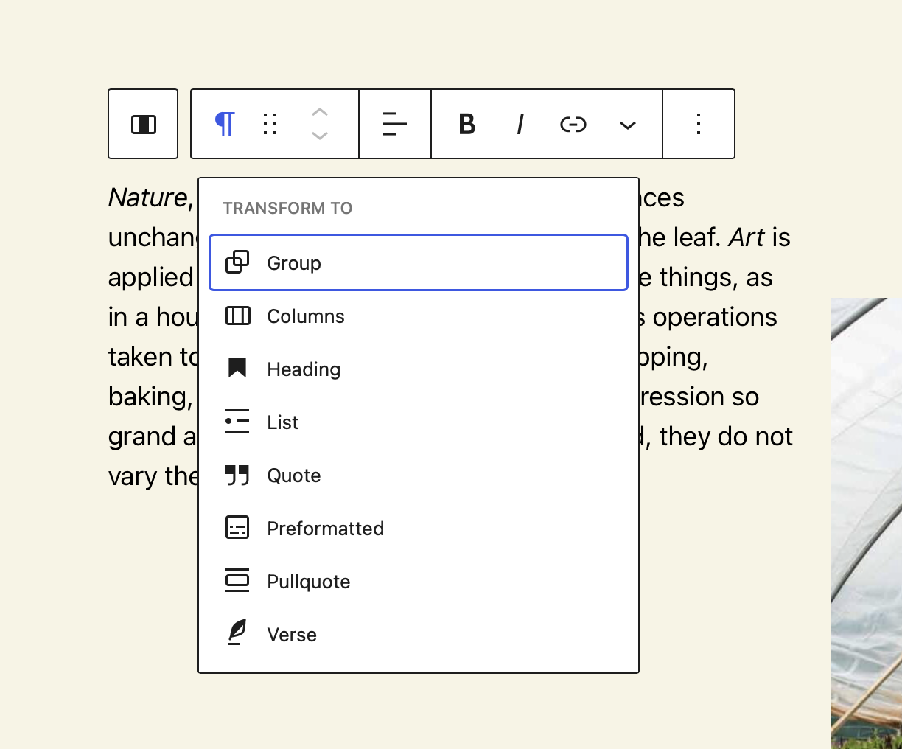

# Block Transforms



Block Transforms is the API that allows a block to be transformed _from_ and _to_ other blocks, as well as _from_ other entities. Existing entities that work with this API include shortcodes, files, regular expressions, and raw DOM nodes.

This is super useful to allow editors to quickly switch between different types of blocks while keeping their content.

## When to use Block Transforms

In theory most blocks should have block transformations defined. They make the live of the editors much easier. With the ability to transform one block into another one this can also be leveraged in order to not build overly complex blocks with too many options. Instead it is often easier and faster to build two separate blocks and allow the user to transform between them.

Finally one more use-case is using the transforms in order to add a controlled update path for users. Let's imagine you have a project where you build a block two different blocks that work in slightly different ways. Further down the line in the project you find that the client now has new requirements that make these two blocks obsolete. Instead they want to replace the two blocks with one that can solve for both use-cases at the same time.

You can solve this problem by essentially deprecating the two old blocks by setting their `supports.inserter` option to `false` in order for them to not show up in the Block Inserter anymore. Then you create the new block and add block transforms from the two old variants to this new block.

:::info
This is great because the old instances don't automatically get updated, but instead allow the editor to either leave them as is, or update them to the new variant whenever they want.
:::info

## Adding Block Transformations

A block declares which transformations it supports via the optional `transforms` key of the block configuration, whose subkeys `to` and `from` hold an array of available transforms for every direction.

```js title="index.js"
import { registerBlockType } from '@wordpress/blocks';
import block from './block.json';
import BlockEdit from './edit';
import BlockSave from './save';

registerBlockType(
    block,
    {
        edit: BlockEdit,
        save: BlockSave,
        transforms: {
            from: [
                /* supported from transforms */
            ],
            to: [
                /* supported to transforms */
            ],
        }
    }
)
```

### Transformations Types

There are several different types of transforms you can create. The most common one being block to block transforms. But you can also transform raw text, shortcodes, and more into blocks. Here is the full list of supported transformation types:

- block
- enter
- files
- prefix
- raw
- shortcode

### Block to Block Transformations

This type of transformations support both _from_ and _to_ directions, allowing blocks to be converted into a different one. It has a corresponding UI control within the block toolbar.

<details>
<summary>
A transformation of type `block` is an object that takes the following parameters:
</summary>
<p>

- **type** _(string)_: the value `block`.
- **blocks** _(array)_: a list of known block types. It also accepts the wildcard value (`"*"`), meaning that the transform is available to _all_ block types (eg: all blocks can transform into `core/group`).
- **transform** _(function)_: a callback that receives the attributes and inner blocks of the block being processed. It should return a block object or an array of block objects.
- **isMatch** _(function, optional)_: a callback that receives the block attributes as the first argument and the block object as the second argument and should return a boolean. Returning `false` from this function will prevent the transform from being available and displayed as an option to the user.
- **isMultiBlock** _(boolean, optional)_: whether the transformation can be applied when multiple blocks are selected. If true, the `transform` function's first parameter will be an array containing each selected block's attributes, and the second an array of each selected block's inner blocks. False by default.
- **priority** _(number, optional)_: controls the priority with which a transformation is applied, where a lower value will take precedence over higher values. This behaves much like a [WordPress hook](https://codex.wordpress.org/Plugin_API#Hook_to_WordPress). Like hooks, the default priority is `10` when not otherwise set.

</p>
</details>

#### Example: from Paragraph block to Heading block

To declare this transformation we add the following code into the heading block configuration, which uses the `createBlock` function from the [`wp-blocks` package](https://developer.wordpress.org/block-editor/reference-guides/packages/packages-blocks/#createblock).

```js
import { createBlock } from '@wordpress/blocks';

transforms: {
    from: [
        {
            type: 'block',
            blocks: [ 'core/paragraph' ],
            transform: ( attributes ) => {
                return createBlock( 'core/heading', {
                    content: attributes.content,
                } );
            },
        },
    ]
},
```

#### Example: blocks that have InnerBlocks

A block with InnerBlocks can also be transformed from and to another block with InnerBlocks.

```js
import { createBlock } from '@wordpress/blocks';

transforms: {
    to: [
        {
            type: 'block',
            blocks: [ 'some/block-with-innerblocks' ],
            transform: ( attributes, innerBlocks ) => {
                return createBlock(
                    'some/other-block-with-innerblocks',
                    attributes,
                    innerBlocks
                );
            },
        },
    ],
},
```

## Links

- [Block Editor Handbook - Block Transforms](https://developer.wordpress.org/block-editor/reference-guides/block-api/block-transforms/)
