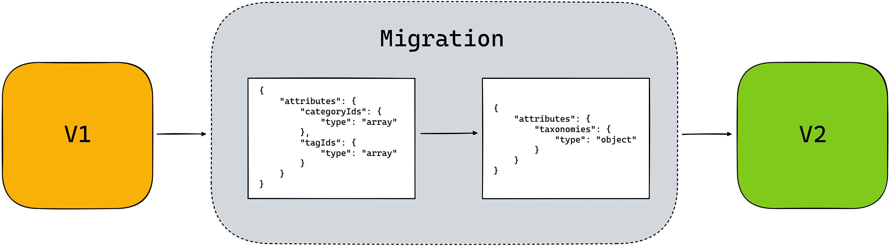

# Block Updates



## How do you handle updates to existing blocks?

Since we at 10up use dynamic blocks (blocks that use php for the frontend rendering) the markup itself is not stored in the database. Instead a HTML comment with all the attributes in a JSON format gets saved to the DB. The HTML comment gets generated by the JS code running in the editor. Therefore we have to be cautious when it comes to making updates to blocks once they are already being used, since any updates we make don't affect already existing instances of the block our there.

<details>
<summary>How do dynamic blocks get stored in the Database?</summary>
If dynamic blocks define their `save` function to return `null` there still is some information that needs to get saved to the database. WordPress handles this automatically in its serialization step. Every attribute that isn't already used within the `save`, which means every attribute for blocks that don't have a `save` method, will get stored in a JSON format within the HTML comment of the block itself.

```html title="Serialized markup stored in the database"
<!-- wp:namespace/carousel -->
<!-- wp:namespace/slide {"headline":"This is a Headline","summary":"And some description text","linkText":"Read More","linkUrl":"https://example.com/","image":{269},"isEditingImage":false} /-->
<!-- wp:namespace/slide {"headline":"This is a Headline","summary":"And some description text","linkText":"Read More","linkUrl":"https://example.com/","image":{269},"isEditingImage":false} /-->
<!-- /wp:namespace/carousel -->
```

</details>

### Updates to markup

As mentioned above, changing the markup of an already existing block isn't a concern. The markup itself is not stored in the database but instead is generated on the fly from our PHP templates. You have to be aware that every single instance of the block will be affected and get the new markup directly. There is no upgrade story here.

### Updates to attributes

When it comes to updating attributes it is not as simple. There are several things to keep in mind when adding new attributes or changing already existing ones.

#### Adding attributes

To add a new setting / a new attribute to a block you need to think about what the default value for that attribute will be. If you want to introduce a new checkbox to enable some new functionality that is off by default, or a toggle to remove something that is already there that is on by default, it isn't a problem, since the default value will apply for all already existing blocks. And editors then can go in and make updates to already existing instances of the block if they wish to use the new feature. So make sure to always choose sensible defaults that will get used by all the instances of the block that are already in production.

#### Updating existing attributes

Updating existing attributes probably is the trickiest thing because you need to worry about the migration and then also that old instances don't automatically get migrated. The way migrations in the editor work is by running the migration once the post is loaded in the editor. Since the attributes are stored in the HTML comment in the database until an editor goes in to edit a page where an old instance of the block is used, the old attributes shape will still get passed into the PHP render_callback. That means that in your PHP template you need to check for all variants of the attribute shape.

If you for example have a block that used to store some category Ids and some tag Ids in two separate attributes like this:

```json
{
	"attributes": {
		"categoryIds": {
			"type": "array"
		},
		"tagIds": {
			"type": "array"
		}
	}
}
```

And now you want to also add support for custom taxonomies and want your attributes to look like this:

```json
{
	"attributes": {
		"taxonomies": {
			"type": "object"
		}
	}
}
```

you can create a migration in your block by adding a `deprecated` property to your blocks `registerBlockType` options.

This `deprecated` array lists all of the deprecations your block has and each of the deprecations allows you to run a `migration` script to transform your attributes.

```js
{

	deprecated: [
		{
			attributes: {
				categoryIds: {
					type: "array"
				},
				tagIds: {
					type: "array"
				}
			},
			migrate( attributes ) {
				// get the old attribute values from the existing attributes
				const { categoryIds, tagIds } = attributes;

				// clone the attributes object
				const newAttributes = { ...attributes };

				// remove the old attributes from the new object
				delete newAttributes.categoryIds;
				delete newAttributes.tagIds;

				// return the new transformed attributes
				return {
					...newAttributes,
					taxonomies: {
						categoryIds: categoryIds,
						tagIds: tagIds,
					},
				};
			},
			// check to see whether the block is eligible to get the migration
			isEligible: (attributes) => attributes.categoryIds || attributes.tagIds
		}
	]
}
```

With this every block that is newly created and also every existing block that gets edited will use the new attributes shape.

:::warning
But be careful. Existing blocks on pages that don't get edited will still have the old attributes shape until they get updated. So your PHP markup will need to account for both instances.
:::warning

:::note
the `isEligible` check is required since the block editor would use the saved markup by default. But since we don't save our markup this is the way we can tell the editor what deprecation needs to run.
:::note

## Further reading

- [WordPress Block Deprecations Reference Guide](https://github.com/WordPress/gutenberg/blob/trunk/docs/reference-guides/block-api/block-deprecation.md)
