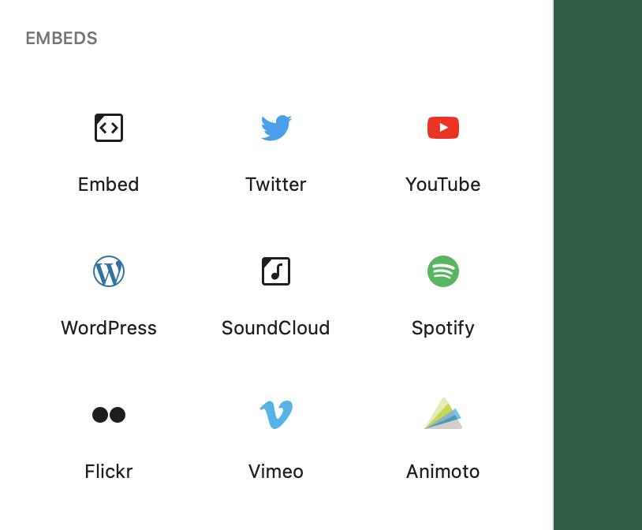
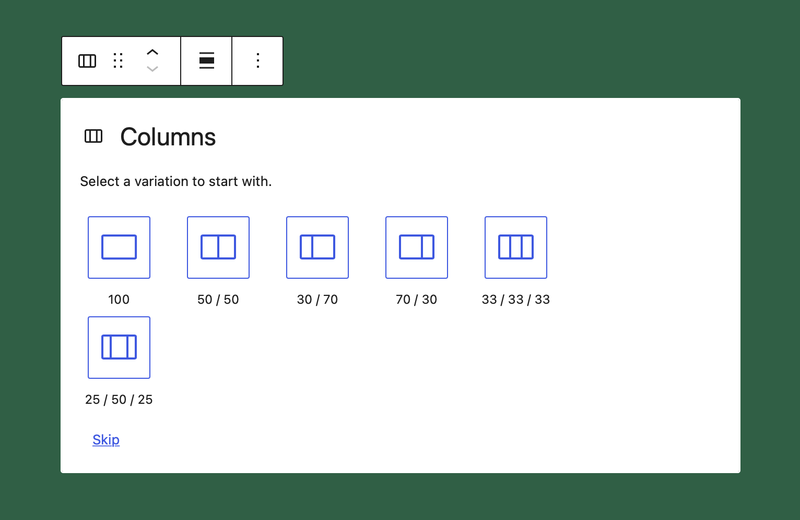

# Block Variations

Block variations are a great way to surface one block in multiple ways. The best example for block variations is the core embed block. There are all these different embed providers like YouTube, Vimeo, and many more. It would be a lot of duplicated code to create them all as individual blocks. Instead the block variations API allows you to define variants of a block. Each variant can set their own icon, title, and default values for its attributes & inner blocks.



Variations can also be used in a variations picker to choose between different predefined setups of a block. This is how the core columns block creates its initial setup state where the editor can choose from a predefined list of different variations.



## Using Block Variations

Variations can be surfaced in three ways. They can be shown in the inserter, the block (like the core columns example), and in block transforms.

:::note
By default they are shown both in the inserter and the block.
:::note

Block variations can be declared during a block's registration by providing the `variations` key with a proper array of variations, as defined below. In addition, there are ways to register and unregister a `block variation` for a block, after its registration.

```js
variations: [
    {
		name: 'wordpress',
		isDefault: true,
		title: __( 'WordPress' ),
		description: __( 'Code is poetry!' ),
		icon: WordPressIcon,
		attributes: { providerNameSlug: 'wordpress' },
	},
	{
		name: 'google',
		title: __( 'Google' ),
		icon: GoogleIcon,
		attributes: { providerNameSlug: 'google' },
	},
	{
		name: 'twitter',
		title: __( 'Twitter' ),
		icon: TwitterIcon,
		attributes: { providerNameSlug: 'twitter' },
		keywords: [ __('tweet') ],
	},
],
```

<details>
<summary>
An object describing a variation defined for the block type can contain the following fields:
</summary>
<p>

- `name` (type `string`) – The unique and machine-readable name.
- `title` (type `string`) – A human-readable variation title.
- `description` (optional, type `string`) – A detailed variation description.
- `category` (optional, type `string`) - A category classification, used in search interfaces to arrange block types by category.
- `icon` (optional, type `string` | `Object`) – An icon helping to visualize the variation. It can have the same shape as the block type.
- `isDefault` (optional, type `boolean`) – Indicates whether the current variation is the default one. Defaults to `false`.
- `attributes` (optional, type `Object`) – Values that override block attributes.
- `innerBlocks` (optional, type `Array[]`) – Initial configuration of nested blocks.
- `example` (optional, type `Object`) – Example provides structured data for the block preview. You can set to `undefined` to disable the preview shown for the block type.
- `scope` (optional, type `WPBlockVariationScope[]`) - the list of scopes where the variation is applicable. When not provided, it defaults to `block` and `inserter`. Available options:
  - `inserter` - Block Variation is shown on the inserter.
  - `block` - Used by blocks to filter specific block variations. `Columns` and `Query Loop` blocks have such variations and are passed to the [experimental BlockVariationPicker](https://github.com/WordPress/gutenberg/blob/HEAD/packages/block-editor/src/components/block-variation-picker/README.md) component, which is handling the displaying of variations and the ability to select one from them.
  - `transform` - Block Variation will be shown in the component for Block Variations transformations.
- `keywords` (optional, type `string[]`) - An array of terms (which can be translated) that help users discover the variation while searching.
- `isActive` (optional, type `Function|string[]`) - This can be a function or an array of block attributes. Function that accepts a block's attributes and the variation's attributes and determines if a variation is active. This function doesn't try to find a match dynamically based on all block's attributes, as in many cases some attributes are irrelevant. An example would be for `embed` block where we only care about `providerNameSlug` attribute's value. We can also use a `string[]` to tell which attributes should be compared as a shorthand. Each attributes will be matched and the variation will be active if all of them are matching.

</p>
</details>

:::info
The main difference between block styles and block variations is that a block style just applies a CSS class to the block, so it can be styled in an alternative way. If we want to apply initial attributes or inner blocks, we fall in block variation territory.
:::info

To add a block variation use `registerBlockVariation()`.

_Example:_

```js
import { registerBlockVariation } from '@wordpress/blocks';

registerBlockVariation( 'core/embed', {
	name: 'custom',
	attributes: { providerNameSlug: 'custom' },
} );
```

To remove a block variation use `unregisterBlockVariation()`.

_Example:_

```js
import { unregisterBlockVariation } from '@wordpress/blocks';

unregisterBlockVariation( 'core/embed', 'youtube' );
```

## Links

- [Block Editor Handbook - Block Variations Reference](https://developer.wordpress.org/block-editor/reference-guides/block-api/block-variations/)
- [Using Gutenberg Block Variations in the WordPress Block Editor](https://richtabor.com/block-variations/)
