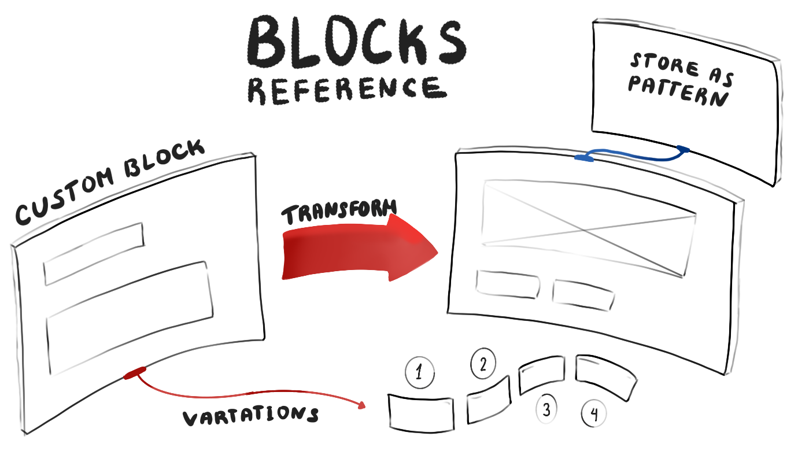

# Block Editor Reference

Welcome to the Block Editor Reference! :wave:

This is where you will find detailed information about how we approach building blocks at 10up. The reference documentation is structured into a few different sections. Its starts with a [Fundamentals](./01-Fundamentals/the-editor.md) section that will go over the general interface and get you familiar with the editor itself. After that there are sections for [Themes](./02-Themes/styles.md), for [Blocks](./03-Blocks/block-patterns.md), and for [Custom Post Types](./04-custom-post-types.md) that each in turn cover everything you need to know to be able to confidently navigate your way around any project.
