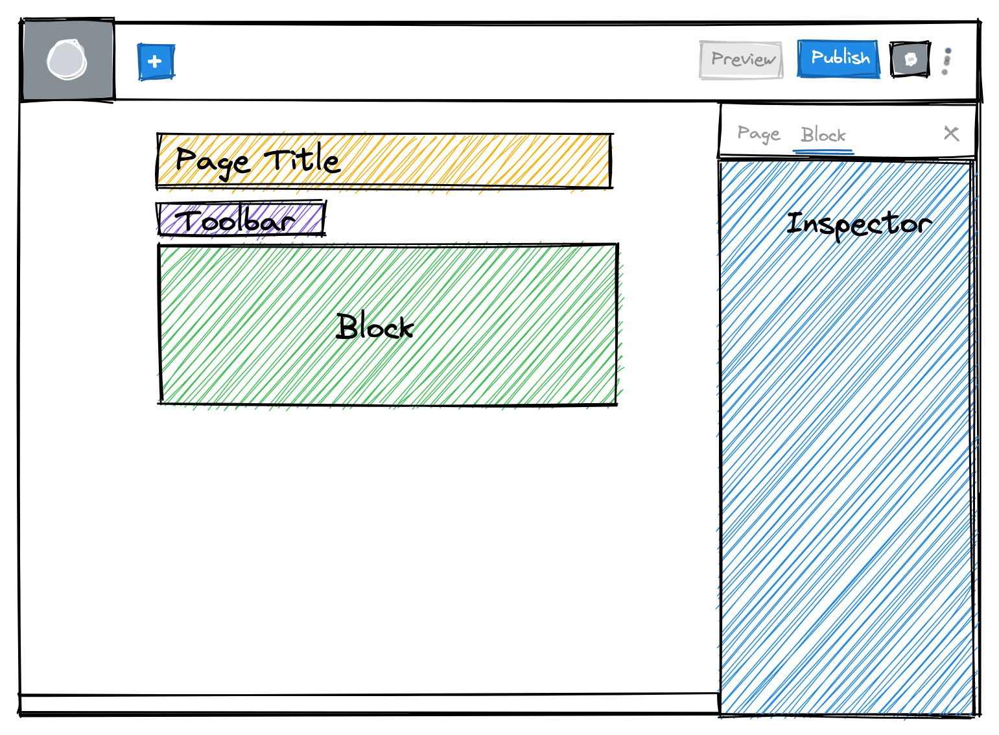

# Lesson 1: Anatomy of a block

Blocks are the foundation of how we build WordPress sites at 10up. As of WordPress 5.0, the Block Editor has become the default editor and replaces TinyMCE in that role. To deliver the best editorial experience to our clients, we will develop custom blocks, block patterns, make customizations to the core blocks and make sure our styles are loaded in both the frontend and the editor.

These lessons will walk you through the process of creating simple custom blocks, as well as show you how to modify core blocks to fit the needs of your project. We will start with the basics and work our way up to building a full-fledged custom block.

The very first thing you need to know about blocks is about the Block Editor itself — let's start there!

## The Block Editor

So that we are all on the same page with block terminology, here is a list of the important components of a block that you will be dealing with:



1. **Block** — The content of posts within WordPress is composed of Blocks. These Blocks are either built and provided by WordPress Core, a 3rd party theme or plugin, or are custom-built blocks. Each Block is a visual representation of the content which allows you to visually edit your content inline.
2. **Toolbar** — Every block has a toolbar that is shown anchored directly above it when the block is selected. This toolbar contains secondary controls that are commonly used such as formatting or alignment controls.
3. **Inspector** - This section is called many different names — "Inspector Panel", "Settings Sidebar", "Block Sidebar", etc. In Gutenberg language, it is simply known as the "Inspector". This is where any additional controls for a block live. These controls should not be _required_ for a block to work. Every option should have sensible defaults that can get overwritten if needed.

To get a full overview of the editor interface and the anatomy of a block you can view the dedicated reference articles here:

- [The Editor](../reference/Fundamentals/the-editor)
- [Anatomy of a Block](../reference/Fundamentals/a-block)

Now that we have a handle on the interface terminology, let's jump into what blocks are made of.

## The Tech Stack

A common point of confusion with the block editor is how it relates to [React.js](https://reactjs.org). The editor itself is built in react and therefore the editor interface of any core or custom blocks is also powered by it. What's saved to the database though is plain HTML that gets rendered on the frontend of the site.

At 10up we are mostly building dynamic blocks. This means that we don't store the markup in the database, but rather use PHP to generate the markup for the frontend rendering dynamically on the server.

<details>
<summary>Learn more about why 10up is building dynamic blocks</summary>
<p>

Most of the core blocks are built as static blocks. That means that they define a `save` method in their block registration which is used to generate the HTML markup that gets saved to the database.

This system cannot be used when you are working with dynamic data like rendering a list of the latest posts. Therefore the editor also allows blocks to define a `render_callback`. This render callback gets invoked every time the block gets rendered and therefore allows you to build the dynamic markup live on the server.

The problem when using static blocks however is, that all the markup is saved to the database. So when new options get added to a block, or when something in the markup needs to get changed this leads to a deprecation issue. When the block editor loads it parses the content and tries to generate the markup which should get saved to the database again. It then compares this newly generated string with what already exists in the database. And when the expected result does not match the actual result an error is thrown and the block shows a deprecation warning.

This can be managed by adding a `deprecation` to the block which allows it to recognize previous versions of itself and migrate them over to the new syntax.

However, these migrations only get applied once a block is re-opened in the editor and saved. This means that it is not possible to make a site-wide change that should affect all instances of a block.

Since managing the deprecations in a client environment where things are changing a lot is a large effort and we often need the ability to roll out changes site-wide without having to manually re-save every post dynamic blocks where the markup gets generated at the time of loading the page get around these issues. All that is saved in the database is an HTML comment containing the block name and a serialized JSON object containing all of the block's attributes.

</p>
</details>

## Block Attributes

Attributes are the heart of Gutenberg blocks. They are how WordPress stores data and are the common thread between the editor and the frontend.

In our custom blocks, we define the attributes we want to use, save them to the database, and output them in our templates.

You can think about attributes as fields or data — a heading, a title, a description, a URL, an array of Post IDs, an image ID, a boolean toggle, etc — are all common examples of attributes. In each of these instances, we want to save the attribute's value in the editor and then output them in our templates.

## File structure of a block

It takes a village (of files) to build a block. Luckily, our 10up scaffold has everything neatly in place for you. The scaffold comes with a [starter block](https://github.com/10up/wp-scaffold/tree/trunk/themes/10up-theme/includes/blocks/example-block)
 that shows everything in place.

### The [10up Starter block](https://github.com/10up/wp-scaffold/tree/trunk/themes/10up-theme/includes/blocks/example-block)

The various pieces of this starter block are:

- [**block.json**](https://github.com/10up/wp-scaffold/blob/trunk/themes/tenup-theme/includes/blocks/example-block/block.json) — This is where all of the configurations for our block happen. The block's name, icon, keywords and everything else is handled here. Most importantly, the block's attributes are listed here. We will cover attributes more in the next section.
- [**edit.js**](https://github.com/10up/wp-scaffold/blob/trunk/themes/tenup-theme/includes/blocks/example-block/edit.js) —  This file controls how the block looks and behaves in the editor. This is where you use interactive elements to manage your block's attributes. Imagine that you want to add a title to your block. In `edit.js`,  you will import the `RichText` component, style it to look like it does on the frontend, and listen for changes. Any time the block changes, the data gets saved in the database! Markup in this file is written in JSX like standard React components.
- [**index.css**](https://github.com/10up/wp-scaffold/blob/trunk/themes/tenup-theme/includes/blocks/example-block/index.css) — Sometimes you want your block to look slightly different in the editor than on the frontend. You can add styles to affect only the editor appearance here.
- [**index.js**](https://github.com/10up/wp-scaffold/blob/trunk/themes/tenup-theme/includes/blocks/example-block/index.js) — This is where everything about the block is brought together. You should not need to do much in this file beyond importing the edit function, the save function and the block.json.
- [**markup.php**](https://github.com/10up/wp-scaffold/blob/trunk/themes/tenup-theme/includes/blocks/example-block/markup.php) — Here is where the frontend markup for your block lives. Have a look at what is in `$attributes` to see what data is available to you. Any attributes that you have saved in the editor should be available here.
- [**save.js**](https://github.com/10up/wp-scaffold/blob/trunk/themes/tenup-theme/includes/blocks/example-block/save.js) — You generally should not need to touch this file. At 10up, we build dynamic blocks which return `null`, but this is not super-important to know at this stage. Dynamic versus static blocks is something you do not need to worry about until much later in these lessons.

## Putting it all Together

There is a lot going on here, but things should make more sense if we follow a single attribute around the codebase.

Let us look at the `customTitle` attribute:

1. It is first defined as an attribute in [block.json](https://github.com/10up/wp-scaffold/blob/trunk/themes/tenup-theme/includes/blocks/example-block/block.json#L15). This is essentially saying "I want to store a field in the database called `customTitle` and use it in my templates. There are two instances below where you can see `customTitle` defined.

The first is the actual definition of the attribute. Here, we define the attribute and set [type validation](https://developer.wordpress.org/block-editor/reference-guides/block-api/block-attributes/#type-validation).

```json title="block.json"
"attributes":{
	// highlight-start
	"customTitle": {
		"type" : "string"
	}
	// highlight-end
},
```

The second, within `example: {}` is not setting or defining the attribute. Instead, it is an optional (but recommended) setting that enables a rich text preview of what the block looks like when you hover over it in the Block Inserter and also in the Block Switcher. If no data is set in `example`, the provided preview just reads "No Preview Available."

```json title="block.json"
"example": {
	"attributes": {
		// highlight-next-line
		"customTitle": "Example Block"
	}
},
```

For this lesson, however, the actual definition of the attribute (first instance) is where we want to focus.

You can see below the "Example Block" `block.json` from our 10up Scaffold that includes both the `customTitle` attribute definition and the `customTitle` "example" content:

```json title="block.json"
{
	"apiVersion": 2,
	"title": "Example Block",
	"description": "An Example Block",
	"textdomain": "tenup-scaffold",
	"name": "tenup/example",
	"icon": "feedback",
	"category": "tenup-scaffold-blocks",
	// highlight-start
	"attributes":{
		"customTitle": {
			"type" : "string"
		}
	},
	"example": {
		"attributes":{
			"customTitle": "Example Block"
		}
	},
	// highlight-end
	...
}
```

1. Then we wrap it in some markup and watch for changes in a `<RichText>` element in [edit.js](https://github.com/10up/wp-scaffold/blob/trunk/themes/tenup-theme/includes/blocks/example-block/edit.js#L28). Pay close attention to the last two lines of the `<RichText>` element. We are telling the RichText component what the current current value it should display is. And then telling it what to do whenever the value it is changed.

```jsx title="edit.js"
import { useBlockProps, RichText } from '@wordpress/block-editor';

function BlockEdit(props) {
	const { attributes } = props;
	const { customTitle } = attributes;
	const blockProps = useBlockProps();

	return (
		<div {...blockProps}>
			<RichText
				className="wp-block-example-block__title"
				tagName="h2"
				placeholder={__('Custom Title')}
				// highlight-start
				value={customTitle}
				onChange={(newValue) => setAttributes({ customTitle: newValue })}
				// highlight-end
			/>
		</div>
	}
}

```

3. Finally, we output our `customTitle` attribute in our frontend markup in [markup.php](https://github.com/10up/wp-scaffold/blob/trunk/themes/tenup-theme/includes/blocks/example-block/markup.php#L31)!

```php title="markup.php" {2}
<h2 <?php echo get_block_wrapper_attributes(); ?>>
	<?php echo wp_kses_post( $args['attributes']['customTitle'] ); ?>
</h2>
```

## Takeaways

That was a quick tour of the block editor, some of the common lingo, and a peek at an existing block. Let us quickly summarize the most important takeaways.

1. Blocks live in the block editor. Most blocks have two places to control their settings: the **Toolbar** above the block and the **Inspector** located in the right sidebar.
2. Blocks use and store **Attributes**. Think of attributes in the same way you would think about custom fields.
3. Our scaffolding has a specific structure for blocks. The example block ships with our [WP Scaffold](https://github.com/10up/wp-scaffold/tree/trunk/themes/10up-theme/includes/blocks/example-block) repository.

## Further Reading

1. [Block Editor Handbook](https://developer.wordpress.org/block-editor/)
