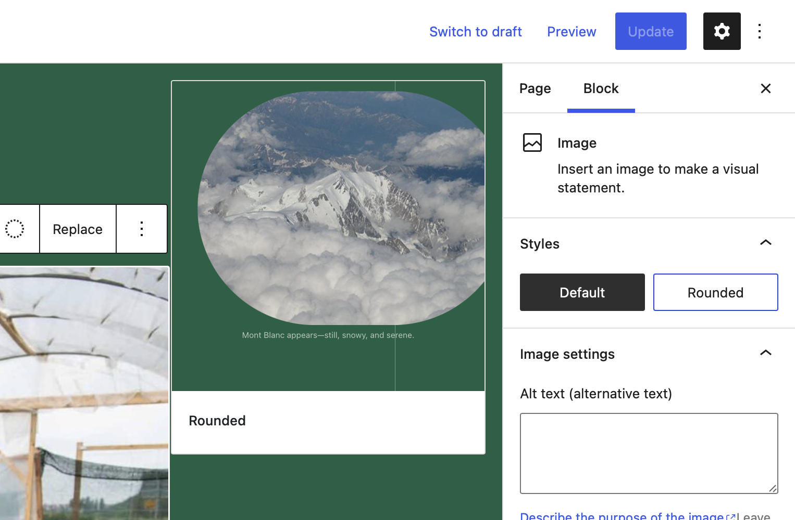
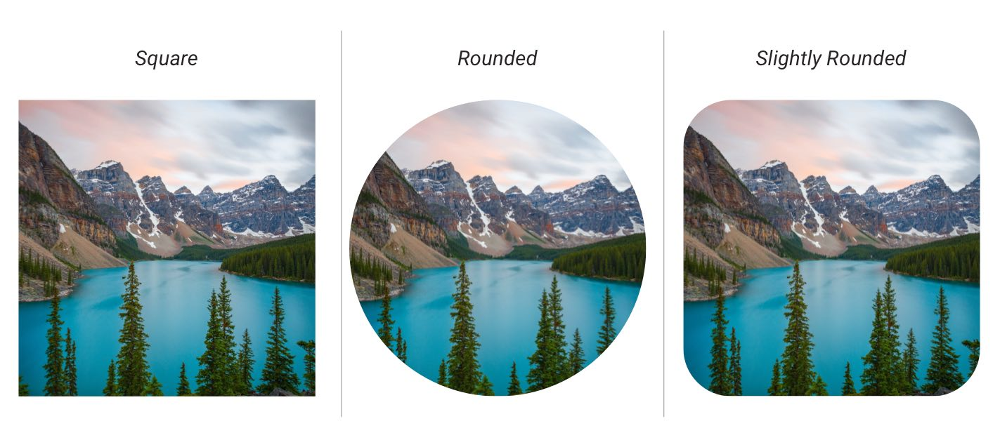
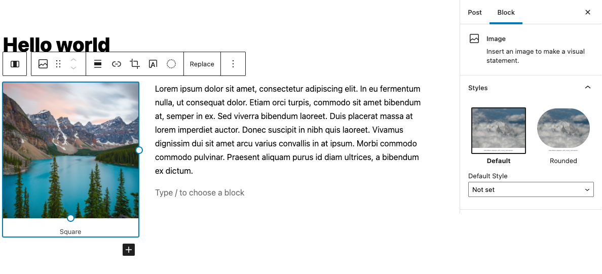
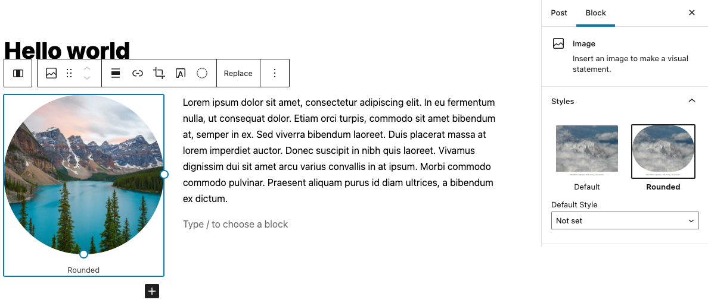
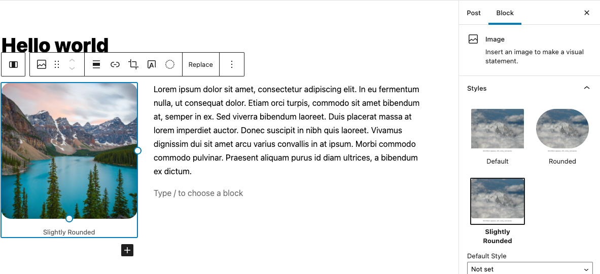
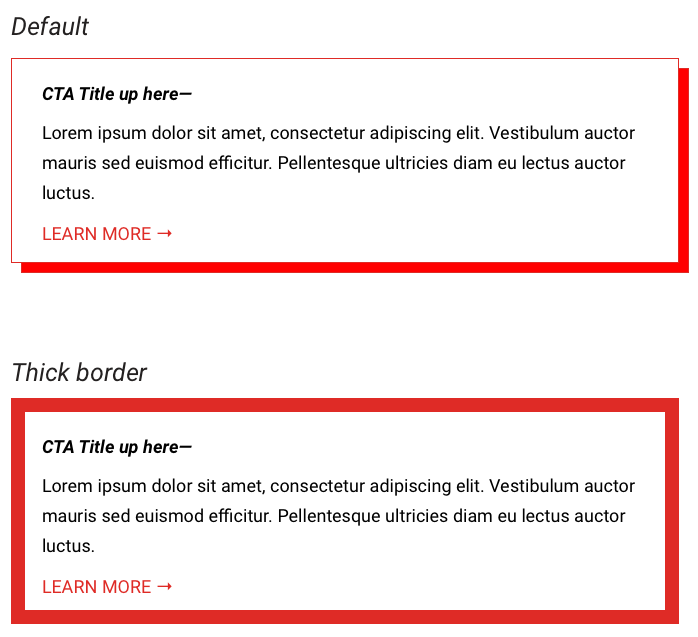
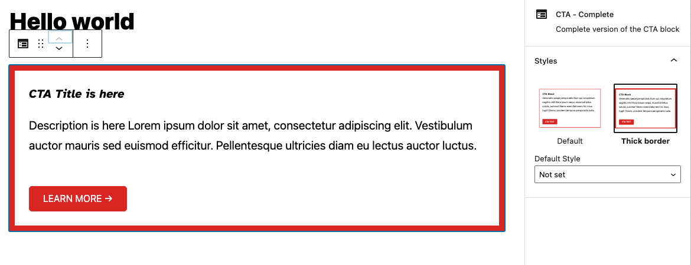
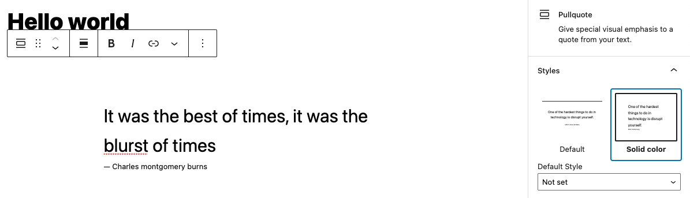
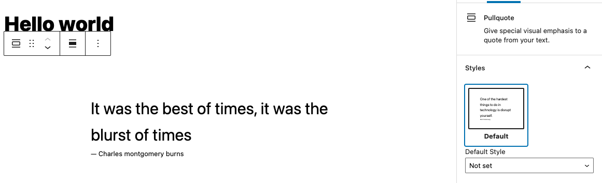

# Lesson 3: Block styles

In many of our projects at 10up, we need to change the style of some of the core blocks that ship with the block editor. Typically, we want to remove block styles that aren't needed, or add ones that help us achieve elements of the project's design. Block Styles have a rather narrow use-case though as other options like [extending a block](/reference/Blocks/block-extensions) often time creates a better user experience.

:::tip
A block should **never** have more than 4 block styles
:::tip

## Learning Outcomes

1. Learn what block styles are and how to use them
2. Learn how to register block styles
3. Learn how to unregister block styles

## What are "block styles"?

You might have noticed that some blocks have a Styles Panel in their Inspector. The core Image block, for example, comes with these two styles: `default` and `rounded`.



Other blocks, like the List block for example, do not ship with any styles.

## Using Styles

Imagine you were working on a project that had three image styles: square, rounded and slightly-rounded. Here's how it looks in the design:



 Out of the box, WordPress gives us two of these styles, but we don't currently have a way to achieve the "slightly rounded" image.

Here's the first two that ship with the editor:

### Square



### Rounded



Let's see how to add a new style — slightly-rounded!

:::caution
This is a fictional example that showcases the pitfalls of Block Styles pretty well. In the real world, this setting should probably be a block extension that allows the editor to change the Border Radius of the image.

Because as soon as the client needs more different steps of rounded corners all you can do is add more and more block styles that all are very similar to one another. Leading to a worse user experience.
:::caution

## Add a New Style

Adding a new Style is pretty simple.

1. Create an `image.js` file in `/includes/block-styles/`. Here's the [completed example](https://github.com/10up/gutenberg-lessons/blob/trunk/themes/tenup-theme/includes/block-styles/image.js).
2. Use the [`registerBlockStyle`](https://developer.wordpress.org/block-editor/reference-guides/block-api/block-styles/) function to add a new custom style to the `core/image` block.
3. Add the corresponding CSS to handle the display of your new `slightly-rounded` Image style. WordPress generates a classname that starts with `is-style-` and ends with whatever you entered for the `name` key (in this case: `slightly-rounded`).

When we've done that, we can now use our new style and see it outputting as the design intended:



## Adding Styles to Custom Blocks

You can also add Styles to custom blocks that you create. Let's add a new style to the CTA block that we built in the previous lesson. Let's say we want to have the option of making the border super thick on our CTA block. Something like this:



It looks a lot like registering a Style for a core block. Follow the steps below to create your own custom block style. If you get stuck, you can reference the same [custom block style registration](https://github.com/10up/gutenberg-lessons/blob/trunk/themes/tenup-theme/includes/block-styles/cta.js) applied to the `cta-complete` block.:

1. Create a new `cta-starter.js` file in `/includes/block-styles/`
2. Import `registerBlockStyle` from WordPress:

   ```js
   import { registerBlockStyle } from '@wordpress/blocks';
   ```

3. Create a new function, `registerCTAStarterStyles()`
4. Within this function, use the `registerBlockStyle` function to target the `gutenberg-lessons/cta-starter` block (the name to reference is found in the block's `block.json` file), and set the style "name" to `thick-border` and the style "label" to `Thick border`.

:::tip
Remember what we did for the core image block:

```js
function registerImageStyles() {
	registerBlockStyle('core/image', {
		name: 'slightly-rounded',
		label: 'Slightly Rounded',
	});
}
```

:::tip

1. Pass the function to the `domReady` function from the `@wordpress/dom-ready` package. Registering our styles only once the DOM is fully loaded avoids race conditions with WordPress Core:

```js
import domReady from '@wordpress/dom-ready';

domReady(() => {
	registerCTAStarterStyles();
});
```

6. Next, we need to be sure this custom style registration is imported. See the [index.js](https://github.com/10up/gutenberg-lessons/blob/trunk/themes/tenup-theme/includes/block-styles/index.js) file found in `block-styles` and add the above file name as an import (`import './cta-starter';`);
7. In the Editor, edit your block and apply the new style. This will add the classname: `is-style-thick-border` to the block output. There are styles associated with this classname created for you here: [`call-to-action.css`](https://github.com/10up/gutenberg-lessons/blob/trunk/themes/tenup-theme/assets/css/frontend/components/blocks/call-to-action.css) file.

And voila! We've added a new style for our custom block!

:::note
For training purposes, this replicates the custom styles already in place for the `cta-complete` block. This type of replication we would typically not do in a real-world environment.
:::note



## Remove an Unwanted Style

Lots of core blocks come with styles. Depending on the client, the design, or the use case, you might want to remove any unnecessary styles. Let's use the core Pullquote block as an example — it comes with a "Solid color" Style, which we don't need.



### Steps (These steps have already been done for you. Please follow along as a reference.)

1. Create a new `pullquote.js` file in `/includes/block-styles/`
2. Use the `unregisterBlockStyle` function to select the `core/pullquote` block, and remove the "Solid color" style.
3. Import your `pullquote.js` into `/includes/block-styles/index.js`

After we've done that, we can see that the "Solid color" Style has now been removed:


## Takeaways

That's a quick tour of block Styles. Let's quickly summarize the most important takeaways:

1. The editor ships with Styles on some core blocks
2. You can remove unwanted Styles, and add new ones
3. You can style core blocks as well as your custom ones

## Next steps

1. Try adding two new styles to the core List block to allow for different list styles
2. Try adding some new styles to the core Separator block
3. Try removing existing styles on the core Button block and adding a new one

## Further reading

* [Block Styles - 10up Gutenberg Best Practices](/reference/Blocks/block-styles)
* [The pitfall of Custom Block Styles in WordPress](/guides/pitfals-style-api)
* [Block Styles - Block Editor Handbook](https://developer.wordpress.org/block-editor/reference-guides/block-api/block-styles/)
