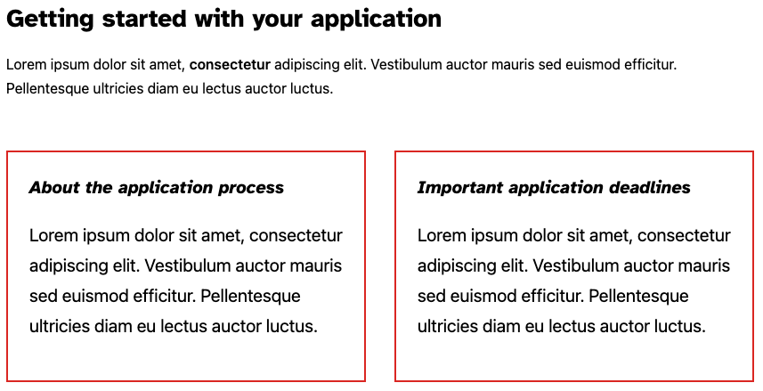
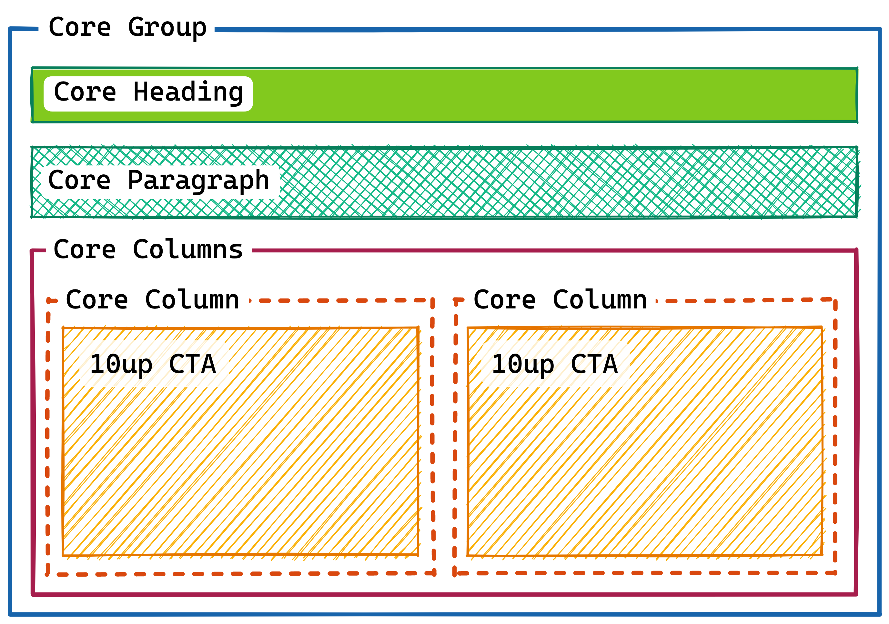
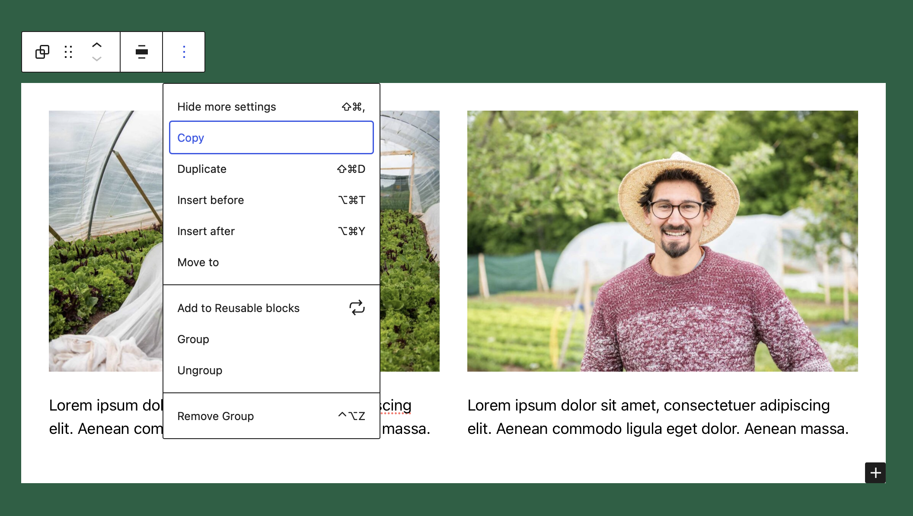

# Lesson 4: Block Patterns

Block Patterns are a great way to get up and running quickly when editing a page in WordPress. They allow you to insert entire predefined templates so that you don't have to start from scratch. As an editor you get a really nice visual preview of what the pattern looks like.

## Learning Outcomes

1. Learn what block patterns are and how to use them
2. Learn how to register block patterns
3. Learn how to manage block patterns

## What are "block patterns"?

Patterns are commonly used sections of a design. If you for example have a Pricing table that should normally be used with a heading above and a full width colored background that would make a perfect pattern.

You can also put entire Page layouts into block patterns to really get someone up and running quickly which might be useful for projects where the editors commonly need to create similar types of landing pages for example.

In general they are best suited for predefined sections in a page.

## Exercise Overview

10up has a lot of clients in higher-ed. These clients obviously devote a lot of attention to the student application process. Imagine you're working with one of these clients and they want to re-purpose the work we did on the CTA block from [Lesson 1](02-cta-lesson.md). On most pages, they want to include this pattern of blocks: a heading, a description and two CTA blocks side by side. Here's what they want:



We need a way to "package up" all those elements so editors can easily insert them whenever they want. Thankfully we can, with block patterns!

:::info
The approach taught in this lesson requires WordPress 6.0. In order to get it working before this, we have [polyfilled the core functionality into the `tenup-theme` of the gutenberg training](https://github.com/10up/gutenberg-lessons/blob/trunk/themes/tenup-theme/includes/blocks.php#L181-L316).

In order to manually register patterns, you need to register each pattern using the [`register_block_pattern`](https://developer.wordpress.org/reference/functions/register_block_pattern/) function.
:::info

## Breaking it Down

For our example, we need to combine these four blocks for easy use in the editor. Let's break down what we're looking at here into actual blocks:



On first glance, it looked like we just needed 4 blocks. But we actually need a couple of more for wrapping. Here's the breakdown:

1. A Group block to contain the whole thing
2. A Heading block
3. A Paragraph block
4. A Columns block
5. Two Column blocks
6. Our two CTA blocks

## Creating our pattern

Creating patterns needs very little code. And it all starts from within the editor. You can get started by building out the structure you want your pattern to have within the editor.

Once you are happy with how the blocks look and feel across breakpoint you can click on the dropdown menu in the blocks toolbar to copy the block.



If you paste that content into your text editor you will find that you actually get the complete block markup including the serialized html comments containing all of the blocks attributes.

<details>
<summary>Learn more about block markup</summary>

When we copy the block we get the serialized html. But what does that even mean? Below you can see an example of some markup that was generated when copying a block from the editor. In fact, this is how blocks get stored in the database.

```html title="Copied Block Markup"
<!-- wp:group {"className":"is-style-application-ctas"} -->
<div class="wp-block-group is-style-application-ctas">
	<!-- wp:heading {"placeholder":"Getting started with your application"} -->
	<h2>This is a Heading</h2>
	<!-- /wp:heading -->

	<!-- wp:paragraph {"placeholder":"Add the description text here...","className":"application-ctas__description"} -->
	<p class="application-ctas__description">And this is a Paragraph</p>
	<!-- /wp:paragraph -->

	<!-- wp:columns -->
	<div class="wp-block-columns">
		<!-- wp:column -->
		<div class="wp-block-column">
			<!-- wp:gutenberg-lessons/cta-complete /-->
		</div>
		<!-- /wp:column -->

		<!-- wp:column -->
		<div class="wp-block-column">
			<!-- wp:gutenberg-lessons/cta-complete /-->
		</div>
		<!-- /wp:column --></div>
	<!-- /wp:columns -->
</div>
<!-- /wp:group -->

```

Each block gets wrapped by an HTML comment. These comments are what we mean when we say serialized content. They start with the name of the block, followed by a JSON object containing all the block's attributes. Well, at least all the ones that are not identifiable by something else in the block markup.

In the paragraph for example the text content within the `p` tag is automatically parsed as the value of the `content` attribute, so there is no need to put it into the JSON object.

The `className` attribute on the other hand is impossible to parse because there may be other classnames coming from the block itself or some extension that only works when the attribute is stored in the JSON object.
</details>

Since WordPress 6.0 patterns can be registered super easily by _just_ creating a PHP file inside the `pattern` folder at the root directory of a theme. This PHP file needs to have a comment header with some metadata and then just the markup of the blocks themselves.

### Pattern document headers

Each Pattern must have a PHP Document comment at the top of the file containing the metadata of the pattern. `Title` and `Slug` are mandatory but you can also specify things like a `Description` etc.

```php title="/patterns/example.php"
<?php
/**
 * Title: Application CTAs - Exercise
 * Slug: tenup-theme/example-pattern
 * Categories: text
 * Description: example description
 * Keywords: example, test
 */

?>
```

With this info try taking the design outlined above and transform that into a new pattern called `Application CTAs - Exercise`.

## Takeaways

Patterns are just a configuration of blocks that are saved for reuse

- You can register patterns by placing a PHP file into the `patterns` directory in the root directory of a theme
- They are great to get clients up and running quickly with a design

## Next steps

As you have seen because the patterns are written in PHP we can break out of the HTML markup and use dynamic data in our patterns. Try to register a block pattern that uses an image block somewhere within.

Because patterns need to work across environments they cannot rely on a piece of content in the Media Library. But we also don't want our clients to have a broken image link in their pattern.

Try to replace the image url with a dynamically generated url of the image file located at `assets/images/10up-screenshot.jpg` in the `tenup-theme`.

## Further reading

- [Block Patterns - 10up Gutenberg Best Practice](../reference/Blocks/block-patterns)
- [Patterns - Block Editor Handbook](https://developer.wordpress.org/block-editor/reference-guides/block-api/block-patterns/)
