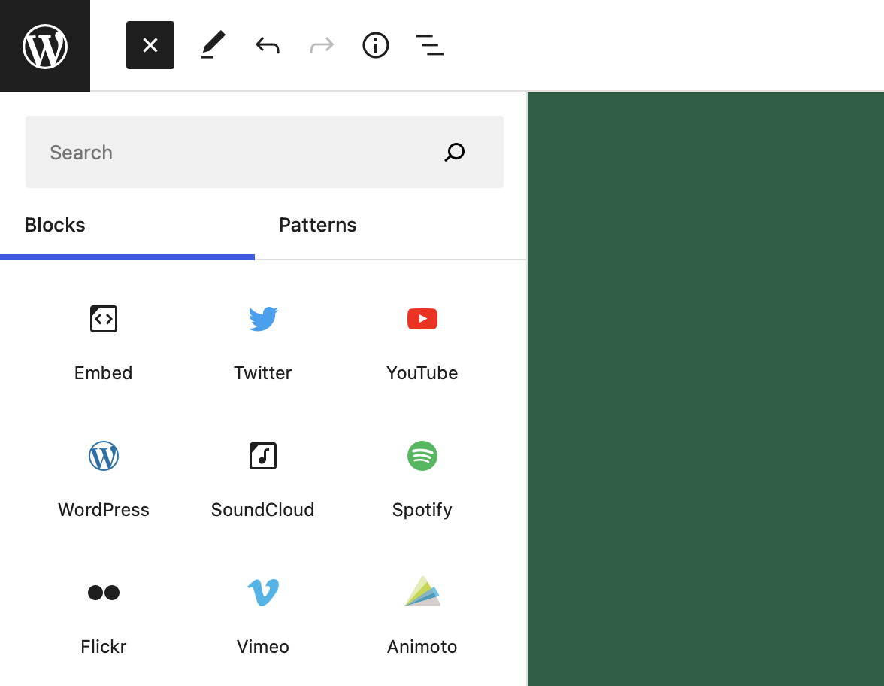
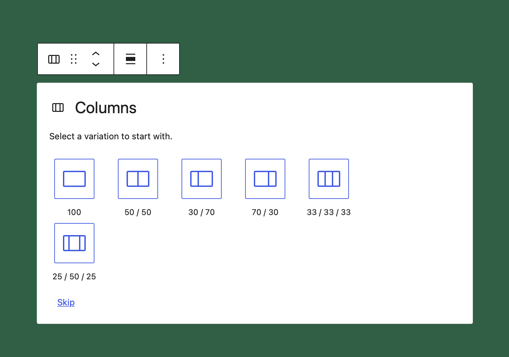

# Lesson 5: Block variations

In the last lessons, we learned how to add styles to blocks, and when to utilize patterns. In this lesson, we're going to learn how to create block variations to help our editors get up and running more quickly.

There is a thin line between when you should use block variations and when you should use block patterns. You often can implement a design as either or with similar effects.

As a rule of thumb, you can think of the pattern as being more about layout & visual representation whilst variations are more about functionality.

## Learning Outcomes

1. Learn what block variations are and how to use them
2. Learn how to register block variations

## What are "block variations"?

[Block Variations](https://developer.wordpress.org/block-editor/reference-guides/block-api/block-variations/) is the API that allows you to create blocks that are _similar_ to existing blocks but have differences that you can define. You could create a variation of the Group block, for example, that has different default values of attributes, pre-defined classnames, and even InnerBlocks.
In WordPress Core, you can find block variations when looking at the embed blocks. Under the hood in the codebase there only is one core embed block. And all the various branded embeds are variations of that one block.

Another example is the core columns block. WordPress uses variations to allow editors to quickly choose from a predefined list of variations when selecting what column layout you want to get started with.

As you can see from these two examples, the API is quite versatile because it allows you to define the scope for where block variations should be shown. In the case of the Embed blocks, the scope is set to `inserter` because you want editors to be able to choose from the different variants when they look at all the available blocks.

The Columns block on the other hand sets the scope to `block` and uses the block's initial setup state to allow the editor to choose which variant they'd like to use.

:::note
The default `scope` is both `block` and `inserter`
:::note

## Exercise Overview

Let's say we have a client that needs to use the columns block in a 4 columns layout very often. By default the block only allows editors to choose between 100, 50/50, 30/70, 70/30, 33/33/33, and 25/50/25 percentage splits for the columns.

Of course, you could skip the setup and manually configure it to have 4 25% wide columns, but our client needs to use it very often and adding a new option for 25/25/25/25 would be a big time saver for them.

:::note
If you get stuck, you can take a look at the completed example located in the [`includes/block-variations`](https://github.com/10up/gutenberg-lessons/blob/trunk/themes/tenup-theme/includes/block-variations/four-columns-variation-completed.js) folder of the tenup theme.
:::note

1. Create a new file in the `includes/block-variations` folder called `four-columns-equal.js`
2. import that new file into the `index.js` file inside the same folder
3. Use the [`registerBlockVariation`](https://developer.wordpress.org/block-editor/reference-guides/block-api/block-variations/) to register a new variant of the core columns block

## Takeaways

Block Variants are a great way to add extensibility to blocks by allowing others to create variants that will show in the initial variant picker. They also allow you to share code between similar blocks like the core embeds ones without having to build many individual blocks.

## Further Reading

* [Block Variations - 10up Gutenberg Best Practices](../reference/Blocks/block-variations)
* [Block Variations - Block Editor Handbook](https://developer.wordpress.org/block-editor/reference-guides/block-api/block-variations/)
* [How to use block variations in WordPress - CSS Tricks](https://css-tricks.com/how-to-use-block-variations-in-wordpress/)
* [Using Gutenberg Block Variations - Rich Tabor](https://richtabor.com/block-variations/)
* [BlockBook](https://youknowriad.github.io/blockbook/block/)
