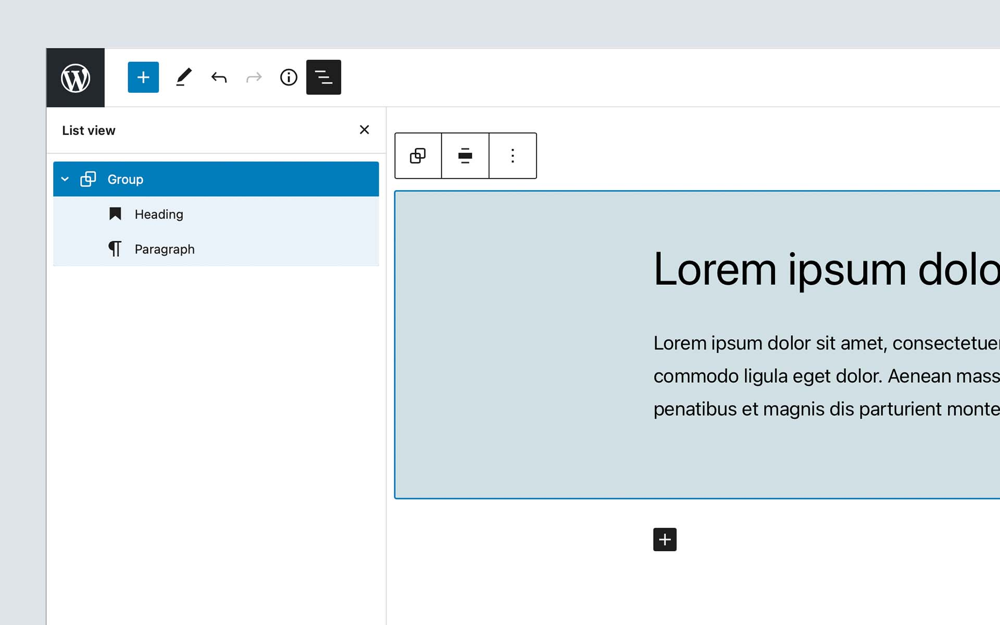
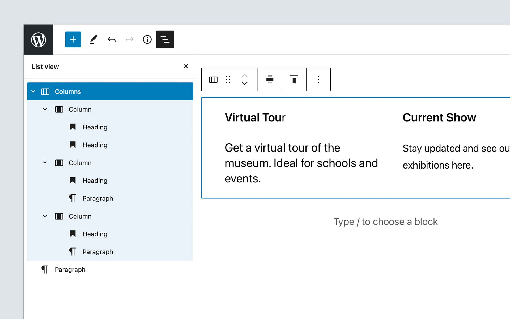
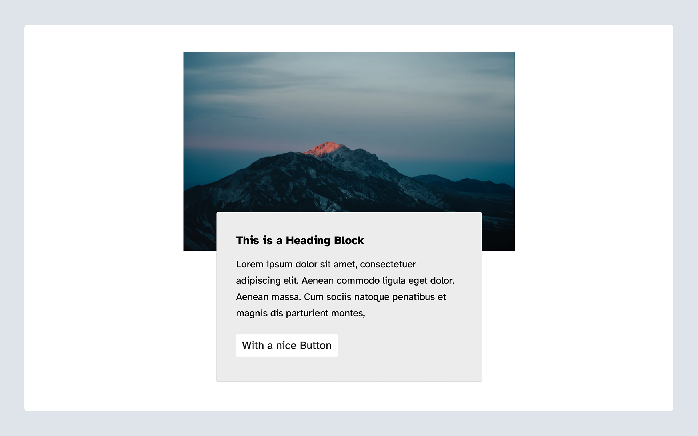
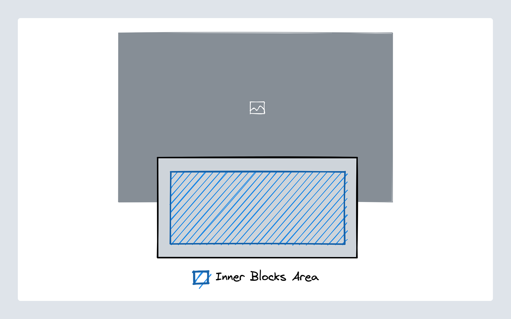
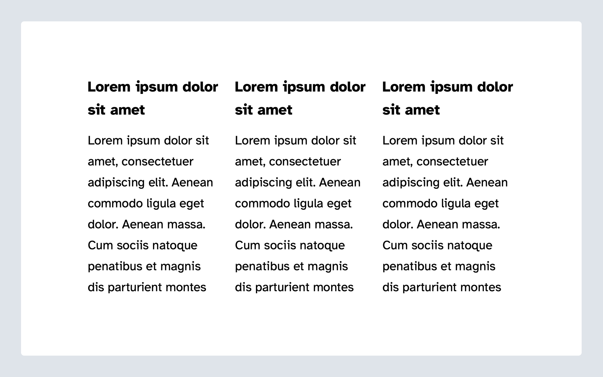
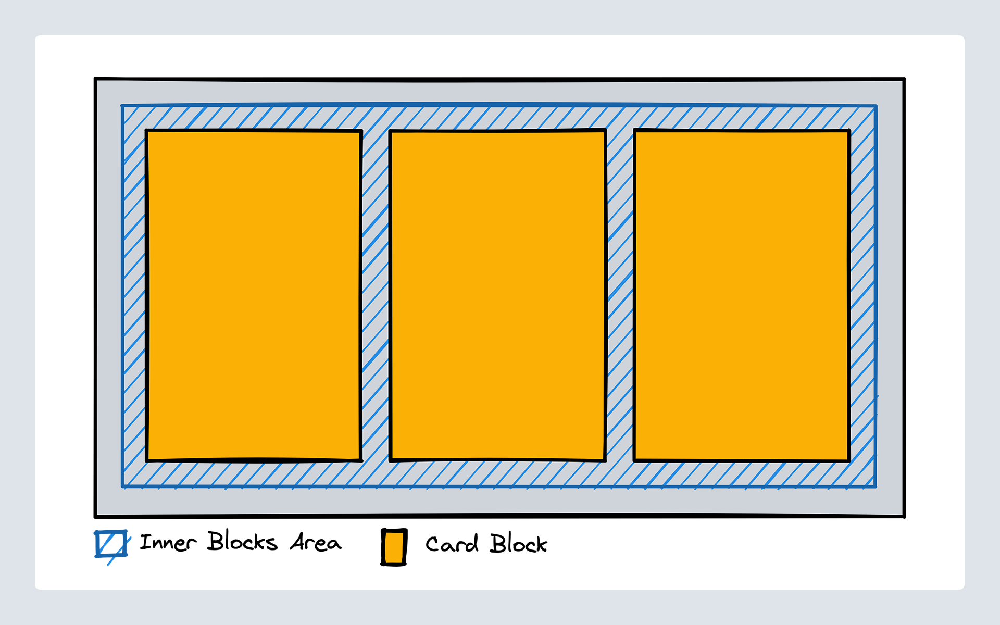

# Lesson 6: Inner Blocks / Nested Blocks

## Learning Outcomes

1. Learn what inner blocks are and how to use them
2. Learn how to decide when to use inner blocks
3. Learn about controlled parent/child relationships in inner blocks

## What are "Inner Blocks"?

Inner Blocks in WordPress let you nest blocks within other blocks. You may have come across this when using the Core Group or Columns Block. This ability is very powerful because it allows you to compose different blocks to build your content. Composition is not the only thing nested blocks are useful for. Nesting also allows you to reduce complexity when you have to create repeatable items in your blocks.

The [Group block](https://developer.wordpress.org/block-editor/reference-guides/core-blocks/#group) for example is meant to be a wrapper for other blocks. It creates a container with some options like a background color for that section and allows you to insert other blocks into that wrapper. Other examples of this kind of nesting can be found in the [Media & Text](https://developer.wordpress.org/block-editor/reference-guides/core-blocks/#media-text) and the [Cover Block](https://developer.wordpress.org/block-editor/reference-guides/core-blocks/#cover). They all allow you to place other blocks within an inner block area.



There is another great use case for inner blocks. We can see that when looking at the core columns block. It may seem very similar at first because it also allows you to place blocks within the columns.

But this is not the case for the columns block. It only allows individual column blocks as its direct decedents. The individual column blocks then allow you to place other blocks in them. The column blocks cannot get used outside the columns block.

Instead of storing a very complicated array of the columns with all their options and building custom logic to add, move or remove columns, all of that gets managed by using inner blocks with a wrapping `columns` block that only allows `column` blocks as its direct children.

Another example of this is the core buttons block. It only allows button blocks as its children and uses inner blocks to allow editors to add, move and remove the individual button blocks.



## Exercise Overview

In this lesson, we are going to build two different blocks ("Hero" Block and "Card Grid" blocks) to take a look at what use-cases inner blocks can solve. Both of these blocks have a `starter` folder that already contains a lot of the skeleton for these blocks. But the actual `InnerBlocks` need to get added to the components to make them work. If you get stuck, you can always take a peek at the `completed` folder for a complete version of the block.

### 1. "Hero" Block

First, we will take a look at how we can use inner blocks to allow an editor to place anything they want into a predefined area of your component. In this example, we have a "simple" design of a "Hero" component that has an image at the top with a content area that overlaps the image.



The client wants to be able to place other blocks into the content area of the "Hero" component to make it as flexible as possible for them.

For the "Hero" Block we need to define an area of our markup where other blocks can get inserted.



To get started there is a starter block scaffolded out located in the blocks folder of the theme with the name [`inner-blocks-one-starter`](https://github.com/10up/gutenberg-lessons/tree/trunk/themes/tenup-theme/includes/blocks/inner-blocks-one-starter). If you are stuck you can take a look at the [`inner-blocks-one-complete`](https://github.com/10up/gutenberg-lessons/tree/trunk/themes/tenup-theme/includes/blocks/inner-blocks-one-complete) folder for a completed version of the block.

Most of the markup and block scaffolding already is in place. What is left to do is wire up the `InnerBlock` area both in the editor and on the frontend. You will find comments outlining where the inner blocks area should go in both the [`edit.js`](https://github.com/10up/gutenberg-lessons/tree/trunk/themes/tenup-theme/includes/blocks/inner-blocks-one-starter/edit.js) and the [`markup.php`](https://github.com/10up/gutenberg-lessons/tree/trunk/themes/tenup-theme/includes/blocks/inner-blocks-one-starter/markup.php) files. We go through these steps below in our [`Using Inner Blocks` section](#using-inner-blocks).

### 2. "Card Grid" Block

The second block we will be building is a "Card Grid" component. This Card grid should allow editors to place as many card components into a grid that automatically reflows based on the screen size of the device they are using.



The "Card Grid" consists of two elements. The actual grid can contain the cards and then the individual cards. This is similar to how core has the Buttons block that contains individual Button blocks.

So we can archive this by creating two different blocks. The "Card Grid" block needs to define an inner block area where only the card block can get inserted. And then we need the card block that cannot get used anywhere outside of the "Card Grid".



To get started there are two starter blocks scaffolded out located in the blocks folder of the theme with the name [`inner-blocks-two-card-grid-starter`](https://github.com/10up/gutenberg-lessons/tree/trunk/themes/tenup-theme/includes/blocks/inner-blocks-two-card-grid-starter) and [`inner-blocks-two-card-starter`](https://github.com/10up/gutenberg-lessons/tree/trunk/themes/tenup-theme/includes/blocks/inner-blocks-two-card-starter). If you are stuck you can take a look at the [`inner-blocks-two-card-grid-complete`](https://github.com/10up/gutenberg-lessons/tree/trunk/themes/tenup-theme/includes/blocks/inner-blocks-two-card-grid-complete) and [`inner-blocks-two-card-complete`](https://github.com/10up/gutenberg-lessons/tree/trunk/themes/tenup-theme/includes/blocks/inner-blocks-two-card-complete) folders for a completed version of the block.

As in the first example, most of the markup and block are already scaffolded out. The inner blocks area needs to get added and configured again and the "Card" block needs to get hidden from the inserter unless it is being used within the "Card Grid" block. We go through these steps below in our [`Using Inner Blocks` section](#using-inner-blocks).

## Using Inner Blocks

Inner Blocks are the name of a react component that is part of the "Block Editor" package. We can import it into our block edit component and use it within the markup of our block.

In the block one starter [`edit.js`](https://github.com/10up/gutenberg-lessons/tree/trunk/themes/tenup-theme/includes/blocks/inner-blocks-one-starter/edit.js) file, do the following:

Update the import to include the `useInnerBlocksProps` hook:

```js
import { useBlockProps, useInnerBlocksProps } from '@wordpress/block-editor';
```

Then, use the example below to add the `useInnerBlocksProps` hook where the inner blocks should be located:

```jsx
const BlockEdit = () => {
	const blockProps = useBlockProps();
	const innerBlocksProps = useInnerBlocksProps();
	return (
		<div {...blockProps}>
			<div {...innerBlocksProps} />
		</div>
	)
}

export default BlockEdit;
```

### Connect block to build scripts

As always, you should have `npm run watch` running in your terminal. Making this change, did it do anything? Let's check the editor. Search the block inserter for `Inner Blocks One - Starter`... is it found? Only see `Inner Blocks One - Complete`? That is because these files are not being targeted by our build scripts. Let's fix that.

In order for 10up-toolkit to correctly pickup the JavaScript code for the block, we need to set the `editorScript` property in [`block.json`](https://github.com/10up/gutenberg-lessons/blob/trunk/themes/tenup-theme/includes/blocks/inner-blocks-one-starter/block.json)

```json
"editorScript": "file:./index.js"
```

:::note
Adding the `file:` prefix lets 10up-toolkit and also WordPress itself know that you are referencing a relative file. You could also pass the handle of an already registered script as the editor script instead.
:::

Let's test that and see if it works. Stop your task runner in the terminal and restart it. Now, go back to the [`edit.js`](https://github.com/10up/gutenberg-lessons/tree/trunk/themes/tenup-theme/includes/blocks/inner-blocks-one-starter/edit.js) file and save. You should see the task runner update in the terminal.

With this done you can already go to the editor and see that there is now a Block Appender rendering inside your block that allows you to insert any blocks you want (you may have to refresh the page).

### Saving the Content of our Inner Blocks Area

If you now try to save the post and view it on the frontend you will find that your changes are not actually saved. The way the editor stores inner blocks is in the actual post content. But right now our blocks just return `null` in their `save` method in the [`index.js`](https://github.com/10up/gutenberg-lessons/tree/trunk/themes/tenup-theme/includes/blocks/inner-blocks-one-starter/index.js) file.

We can fix this by replacing the `null` with the `<InnerBlocks.Content />` component:

```jsx title="index.js"
/**
 * WordPress dependencies
 */
import { registerBlockType } from '@wordpress/blocks';
import { useInnerBlocksProps } from '@wordpress/block-editor';

/**
 * Internal dependencies
 */
import edit from './edit';
import block from './block.json';

/**
 * Register block
 */
registerBlockType(block.name, {
	edit,
	save: () => <InnerBlocks.Content />,
});
```

Now that the content is saved in the database we also need to somehow use this content in our markup in PHP template. Inside our [`markup.php`[(<https://github.com/10up/gutenberg-lessons/tree/trunk/themes/tenup-theme/includes/blocks/inner-blocks-one-starter/markup.php>)] file we have access to a few variables. The `$attributes`, `$content`, `$block`, and `$context`. In this case we are interested in the `$content` variable which stores the saved markup from the editor.

If we look down at the content container, we will see the comment `// The inner blocks content should get rendered here.` Replace this comment with the following:

```php title="markup.php"
/**
 * the $content is the html generated from innerBlocks
 * it is being created from the save method in JS or the render_callback
 * in php and is sanitized.
 *
 * Re sanitizing it through `wp_kses_post` causes
 * embed blocks to break and other core filters don't apply.
 * therefore no additional sanitization is done and it is being output as is
 */
echo $content; // phpcs:disable
```

From here we are most of the way there. You are now able to insert any blocks you want and the content gets saved into the database and shows on the frontend.

There are a few things to keep in mind though to improve the User Experience of our block.

### Use `allowedBlocks` to better control what editors can do

Right now editors are able to insert any block they want into the inner blocks area. This might not always be what we want. In the case of our "Hero" it, for example, doesn't really make sense to allow any layout-related blocks like the "Banner", "Columns" or "Group" block.

We can improve the UX by adding a list of allowed blocks to the inner blocks component.

```jsx {3-8}
const innerBlocksProps = useInnerBlocksProps(
	{},
	{
		allowedBlocks: { [
			'core/heading',
			'core/paragraph',
			'core/buttons',
			'core/button',
		] }
	}
);

return (
	<div {...blockProps}>
		<div {...innerBlocksProps} />
	</div>
)
```

### Defining a `template` to Get Editors Up and Running Quicker

Another thing that isn't great about the UX right now is that the initial state when we insert our "Hero" block is only an empty grey box.

We know that in an ideal case we want our editors to have a title and a paragraph inside the "Hero" so we can make that the default when the block is inserted.

To achieve this we can define a `template` on the inner block area. The template gets defined the same way you already saw in [Lesson 5: Block Variations](/05-variations.md). It is an array with individual items also being represented as an array with the block name as the first element, the attributes of the block as the second and child blocks as the third element.

```jsx
const innerBlocksProps = useInnerBlocksProps(
	{},
	{
		template: {[
			['core/heading', { level: 2, placeholder: 'Insert your heading here...' }],
			['core/paragraph', { placeholder: 'Write some description text here...' }],
		]}
	}
);

return (
	<div {...blockProps}>
		<div {...innerBlocksProps} />
	</div>
)
```

### Parent / Child Relationships of Blocks

:::note
Before continuing, be sure you have done the following for the `inner-blocks-two-card-starter` and the `inner-blocks-two-card-grid-starter.` (per our guidance above):
:::note

1. Add `editorScript` property in [`block.json`](https://github.com/10up/gutenberg-lessons/blob/trunk/themes/tenup-theme/includes/blocks/inner-blocks-two-card-grid-starter/block.json)
2. Add `useInnerBlocksProps` to [`edit.js`](https://github.com/10up/gutenberg-lessons/tree/trunk/themes/tenup-theme/includes/blocks/inner-blocks-two-card-grid-starter/edit.js) (Don't forget to import `useInnerBlocksProps` at the top of the file).
3. Update the `save` method in the [`index.js`](https://github.com/10up/gutenberg-lessons/tree/trunk/themes/tenup-theme/includes/blocks/inner-blocks-two-card-grid-starter/edit.js) file (`save: () => <InnerBlocks.Content />`).
4. Add the markup output in [`markup.php`](https://github.com/10up/gutenberg-lessons/tree/trunk/themes/tenup-theme/includes/blocks/inner-blocks-two-card-grid-starter/markup.php) (`echo $content;`).

```json
  "editorScript": "file:./index.js"
```

If you want to create parent/child relationships between blocks like we need to do for our "Card Grid" and "Card" blocks that consists of two things. For one, you need to define the `allowedBlocks` on the inner blocks area in the parent block to only contain the child block you want to have show up. If the `allowedBlocks` array only contains one item the inserter will no longer show the block picker popover but instead directly insert that one block. Which is a nice little UX improvement we get for free.

So, for the "Card Grid" block, we want to update the [`edit.js`](https://github.com/10up/gutenberg-lessons/tree/trunk/themes/tenup-theme/includes/blocks/inner-blocks-two-card-grid-starter/edit.js) do define `allowedBlocks` for the inner blocks area:

```jsx
const innerBlocksProps = useInnerBlocksProps(
	{},
	{
		allowedBlocks: ['gutenberg-lessons/inner-blocks-two-card-starter']
	}
);
```

**BONUS**: To enhance our UX and better define the editorial output, let's add orientation and a template to the inner blocks area in [`edit.js`](https://github.com/10up/gutenberg-lessons/tree/trunk/themes/tenup-theme/includes/blocks/inner-blocks-two-card-grid-starter/edit.js):

```jsx
const innerBlocksProps = useInnerBlocksProps(
	{},
	{
		allowedBlocks: ['gutenberg-lessons/inner-blocks-two-card-complete']
		orientation: "horizontal"
		template: [
			['gutenberg-lessons/inner-blocks-two-card-starter'],
			['gutenberg-lessons/inner-blocks-two-card-starter'],
		]
	}
);
```

:::tip
For the above, we have already included styles in the [`index.css`](https://github.com/10up/gutenberg-lessons/tree/trunk/themes/tenup-theme/includes/blocks/inner-blocks-two-card-grid-starter/index.css) to assist with our layout - more on this below.
:::tip

The second thing we need to do is make sure our "child" block, in this case, the "Card", doesn't appear in the regular inserter or that it cannot get moved anywhere outside of a "Card Grid". And for that, we can use the [`parent`](https://github.com/WordPress/gutenberg/blob/trunk/docs/reference-guides/block-api/block-registration.md#parent-optional) option in the `block.json` file. When you define a `parent` the block will no longer show up in the inserter and it also cannot get used anywhere outside of the defined parent.

```json {4}
{
	"name": "...",
	"...",
	"parent": [ "namespace/block-name" ]
}
```

So, let's go ahead and update the "Card" [`block.json`](https://github.com/10up/gutenberg-lessons/tree/trunk/themes/tenup-theme/includes/blocks/inner-blocks-two-card-starter/block.json) to include the following:

```json
"parent": [ "gutenberg-lessons/inner-blocks-two-card-grid-starter" ]
```

Now, when using the block inserter, you no longer see reference to the "Card" block, unless adding content to the "Card Grid" block.

## Takeaways

The takeaway you should take from this lesson is that inner blocks are a very powerful concept in the editor that allows us to use different blocks to compose more complex content. They can also allow us to simplify the logic we have to code when it comes to managing repeating elements and have many options to control the user experience.

## Next Steps

Now that you have built two blocks that use `InnerBlocks` take a look at the [Component Reference for the `InnerBlocks`](https://github.com/WordPress/gutenberg/tree/trunk/packages/block-editor/src/components/inner-blocks#innerblocks) component and see whether there are any other things you can to improve the editorial user experience.

## Further Reading

- [Inner Blocks - 10up Gutenberg Best Practices](../reference/Blocks/inner-blocks)
- [Nested Blocks: Using InnerBlocks - Block Editor Handbook](https://developer.wordpress.org/block-editor/how-to-guides/block-tutorial/nested-blocks-inner-blocks/)
- [Inner Blocks - Component Reference](https://github.com/WordPress/gutenberg/tree/trunk/packages/block-editor/src/components/inner-blocks#innerblocks)
- [API Version 2 - useBlockProps & useInnerBlocksProps](https://internal.10up.com/blog/2021/06/23/a-quick-guide-for-gutenberg-api-version-2/)
