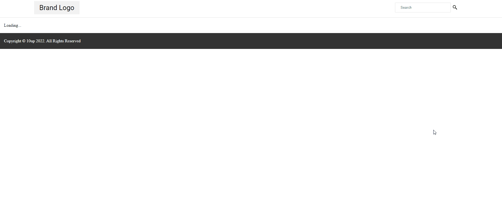
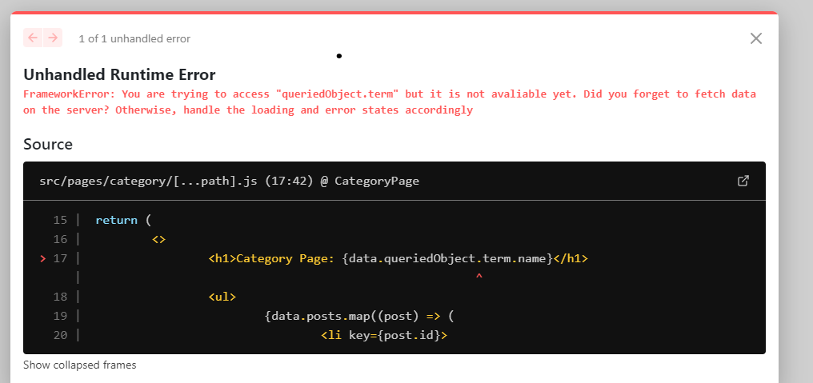

# Quick Introduction to the Framework


## Introduction

If you’re familiar with Next.js you probably already know that it has a file-system-based router. The routes are declared under the `src/pages` folder. To learn more about Next.js routing, read the [official docs](https://nextjs.org/docs/routing/introduction).

> the `app` folder is currently not supported in 10up's headless framework. Support for new Next.js 13 features are underway.

The headless framework takes advantage of Next.js routing by leveraging a feature called “catch-all routes” which allows the framework to automatically map URL segments to WordPress routes and the proper REST API parameters necessary to fetch the appropriate data. It does so by adopting a convention of using a “catch-all” route named `[...path].js` or `[[...path]].js`.

## How Routing Works

To understand how routing works in the headless framework, let’s take a look at the route in the starter project ([src/pages/[...path].js](https://github.com/10up/headless/blob/develop/projects/wp-nextjs/src/pages/%5B...path%5D.js)) that corresponds to a single post/page template (single.php) in WordPress.

First, note that it is using single brackets and not double brackets. That is because we only want to “catch” that route if no other top-level route is matched (such as `index.js`). Therefore, any route in the form of /post-name or /2022/10/1 will match `src/[...path].js`. You can confirm this by opening any post by either the /post-name route or the date route depending on how your permalinks settings are set up in WordPress E.g:

- https://headless-framework.vercel.app/2020/05/07/distinctio-rerum-ratione-maxime-repudiandae-laboriosam-quam
- https://headless-framework.vercel.app/distinctio-rerum-ratione-maxime-repudiandae-laboriosam-quam

The great thing about this is that you don’t need multiple Next.js routes to handle the same resource!

### Basic Data Fetching

Now let’s look at how data fetching for this route works. To make things easier to understand, let’s disregard `getStaticPaths` and `getStaticProps`functions.

```js title="src/params.js"
/**
 * @type {import('@headstartwp/core').PostParams}
 */
export const singleParams = { postType: ['page', 'post'] };
```

```js title="src/pages/[...path].js"
import { usePost } from '@headstartwp/next';

const SinglePostsPage = () => {
	const { loading, error } = usePost(singleParams);

	if (loading) {
		return 'Loading...';
	}

	if (error) {
		return 'error...';
	}

	return (
		<div>
			<PageContent params={singleParams} />
		</div>
	);
};
```

At this point, the page is not rendered on the server (or at build time) at all. Therefore this route is behaving like a single-page application.

The `usePost` hook is one of the framework's data-fetching hooks. As its name suggests it fetches a single post for a given set of params. We’re passing one param called `postType`, which is telling the hook to fetch the current page from either the "page" or "post" post type. Note that we're not passing the slug. Passing the slug is optional and if you don't pass the slug, the framework will automatically extract the post/page slug from the URL, if present.

> Extracting the *slug* from the url **only** works when using the `[...path].js` or `[[...path]].js `catch-all route style.



Without server-side data fetching, the experience gets clunky and web vitals are greatly affected as there will be a high CLS. SEO is also affected since there is no content or SEO meta tags until the browser fetches the data.

The framework data fetching layer is “isomorphic”, you start with client-side data fetching and then opt-in for data that must be pre-fetched on the server. There are a few benefits of this approach:

- It’s possible to easily switch between pre-fetched and non-prefetched data
- You can pre-fetch on the server and re-fetch on the client, for instance, you might want to re-fetch the "most recent posts" block on the homepage.
- Mitigate prop-drilling, no need to pass post props to every component as you can simply call the custom hooks (as long as the params match what's being queried for).

It is important to note that **you should always pre-fetch on the server the “main query” and/or the “core” data for a page in a headless site**. That’s what we’ll do next! Keep the `getStaticPaths` function commented out and uncomment `getStaticProps`.

```js title="src/pages/[...path].js"
export async function getStaticProps(context) {
	try {

		const settledPromises = await resolveBatch([
			{
				func: fetchHookData(usePost.fetcher(), context, { params: singleParams }),
			},
			{ func: fetchHookData(useAppSettings.fetcher(), context), throw: false },
		]);

		return addHookData(settledPromises, { revalidate: 5 * 60 });
	} catch (e) {
		return handleError(e, context);
	}
}
```

`getStaticProps` is a Next.js method used when you want to pre-render a page on the server at build time or [on-demand via ISR](https://nextjs.org/learn/basic-features/data-fetching/incremental-static-regeneration).

To enable pre-rendering of this route all we need to do is pre-fetch all of the data needed for the framework’s custom hooks. There are two hooks we need to pre-fetch data for, `usePost` and `useAppSettings`. The `useAppSettings` hook is responsible for fetching general settings and menu data. The Nav.js component depends on `useAppSettings` and if we don’t pre-fetch data for it, the menu will be fetched on the client side only.

The function responsible for pre-fetching data is `fetchHookData`. It accepts the following params:

- A fetcher strategy that you can get via `usePost.fetcher()`
- The next.js context. It is used to extract parameters from the URL among other things.
- An object containing the params. The params must match the params being used by the hooks, otherwise, there will be a key mismatch and data would be pre-fetched for the wrong set of params.

The `resolveBatch` function is just a utility function that lets you run multiple promises in parallel and select which ones you don’t want to throw errors for. In this case, we’re ignoring the error potentially thrown by `useAppSettings.fetcher()` the reason being that this hook requires the Headless WordPress plugin, and therefore disabling that plugin would cause a crash on the site if we don’t ignore errors thrown by `useAppSettings.fetcher()`. Ultimately, it is up to your to decide how to handle errors, we just give you the tools to make your job easier.

Next, we have the `addHookData` function which expects an array of "hook data" (i.e pre-fetched data for the custom hooks returned by `fetchHookData`). The `addHookData` will simply put the results on the cache and hydrate the custom hook with pre-fetched data. The second param is an object that represents the Next.js props you can return from `getStaticProps` or `getServerSideProps`.

If anything fails, we call the `handleError` function which provides standard error handling such as rendering a 404 page if a page is not found and optionally handling redirects (if the redirect strategy is set to 404 in headless.config.js).

Lastly, the `getStaticPaths` will return an array of paths that should be pre-rendered at build time. This should only be used in conjunction with getStaticProps. Note that the framework doesn’t force getStaticProps you can use getServerSideProps (especially if your hosting doesn’t provide good support for ISR).

One benefit of pre-rendering (a subset of your pages) at build time is that it can catch a lot of runtime issues since undefined/type errors among others would be caught at build time in your CI.

## Main Query, Queried Object, and SEO handling.

At this point, you might be wondering how the framework handles SEO integration. It does so by using the `yoast_head` (or `yoast_head_json` object) added by the Yoast plugin to every resource in the REST API. It works for both single pages and archive pages. The `yoast_head_json` from either the main query or the queried object is used to populate the page’s meta tags.

The "Main Query" is the query that draws parameters from the URL. For example, in `src/pages/[...path].js`, the usePost is the main query since it extracts parameters from the URL. Therefore the yoast_head_json associated with the resource returned by usePost is used to populate the page's SEO meta tags. This allows for additional data to be fetched with other custom hooks without messing with the SEO meta tags for the page.

For instance, you might want to display an array of related posts at the bottom of the single post template, since this doesn’t represent the "main query" of the page it won’t be used to populate the page's SEO meta tags.

There’s also the concept of "queried object" which is very similar to [get_queried_object()](https://developer.wordpress.org/reference/functions/get_queried_object/) function in WP. It returns the resource that is being "queried for". For instance, in a category archive page, the queried object represents the category that's being queried for.

Let's take a look at [src/pages/category/[...path].js](https://github.com/10up/headless/blob/develop/projects/wp-nextjs/src/pages/category/%5B...path%5D.js)

```js title="src/pages/category/[...path].js"
import { usePosts } from '@headstartwp/next';

const CategoryPage = () => {
	const { data } = usePosts({ taxonomy: 'category' });

	return (
		<>
			<h1>Category Page: {data.queriedObject.term.name}</h1>
			<ul>
				{data.posts.map((post) => (
					<li key={post.id}>
						<Link href={post.link}>{post.title.rendered}</Link>
					</li>
				))}
			</ul>
			<Pagination pageInfo={data.pageInfo} />
		</>
	);
};
```

In this route, we're fetching a list of posts that belong to the category taxonomy. Note that again, we're not passing the category slug, it’s automatically inferred by the framework.

Since we’re querying posts that belong to a specific category, `data.queriedObject` is available with a term object representing the queried category. You will note that this route follows the same "pattern" from `src/[...path].js`.

Take some time to review the other routes, did you spot the pattern?

- Fetch data on the client using the framework’s custom hooks
- Pre-fetch the data on the server matching the params object.

## Should you handle loading/error states on the client?

As you might have noticed, the category route is not handling errors and loading states on the client. Therefore it assumes the data will always be pre-fetched on the server. If you remove `getServerSideProps`, you will see the following error.



At 10up, we strongly believe that a great developer experience increases developer productivity! Therefore the framework will try to help you, the developer, as much as it can.

In this case, it "detects" that you’re trying to access something that's returned by the custom hook but is not yet available. As the error message suggests, you need to either handle the loading/error states or pre-fetch the data on the server. We didn't see this error on the single post route because loading/error states are being handled on that route!

So as long as you're pre-fetching data on the server you do not need to handle loading/error states on the client.

One way to make things more consistent and your code more resilient without directly handling loading states is by using Suspense, however, that is not fully supported in Next.js and the framework itself (but it will!).