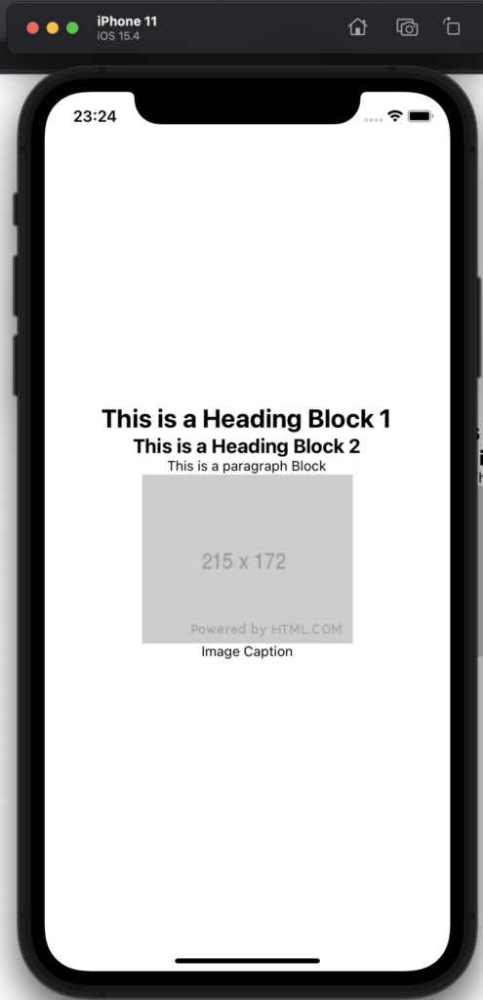

# Rendering Blocks in React Native

## Introduction

The BlocksRenderer component can also be used to render Gutenberg blocks in React Native, by rendering blocks to native components without using a webview.

The examples in this section are part of a demo react native expo hosted on the [headless-expo](https://github.com/nicholasio/headless-expo) repo. This Demo app uses expo and the headless framework to fetch a page and render Gutenberg blocks as react-native components.

All of the code for this demo app lives in [App.js](https://github.com/nicholasio/headless-expo/blob/trunk/App.js). Since the demo app is using the data-fetching hooks from the core headless framework package, we first need to wrap the App with the SettingsProvider component.

```js
export default function App() {
  return (
    <SettingsProvider>
      <View style={styles.container}>
        <StatusBar style="auto" />
        <SinglePostComponent />
      </View>
    </SettingsProvider>
  );
}
```

We also need to inject the headless config. For now, we need to use a workaround to inject the headless config.

```js
import headlessConfig from "./headless.config";

globalThis.__10up__HEADLESS_CONFIG = { ...headlessConfig };
```

## Blocks Rendering

The SinglePostComponent is the one that fetches a page and render its content

```js
function SinglePostComponent() {
  const { loading, data } = useFetchPost({
    postType: "page",
    slug: "react-native-test",
  });

  if (loading) {
    return <Text>Loading...</Text>;
  }

  return (
    <BlocksRenderer html={data.post.content.rendered}>
      <ParagraphBlock component={RNParagraphBlock} />
      <HeadingBlock component={RNHeadingBlock} />
      <ImageBlock component={RNImageBlock} />
      <RawText />
      <EmptyBlock />
    </BlocksRenderer>
  );
}
```

useFetchPost is the core implementation of the usePost. The next.js hooks are built on top of the core data-fetching hooks. The core data-fetching hooks can be used in any react environment. In this example, we’re fetching a page, with a slug called "react-native-test".

This is all we need to have a React Native app that fetches data from a WP instance. The next step is building out the Block components.

We’ll start with EmptyBlock and RawText. We need to be very careful when rendering blocks in React Native as we can’t render any text under a React Native View component and remember that **we’re not rendering this under a webview, we are rendering blocks as native components.**

Since we can’t render blocks that haven’t been implemented by us yet, we’ll create an allowed block list! We’ll do that in the EmptyBlock component.

```js
/**
 * A noop block
 *
 * You can also use this to create a "allowList" of blocks and ignore blocks you don't want to render
 *
 * @returns
 */
const EmptyBlock = () => <></>;

EmptyBlock.defaultProps = {
  /**
   * Essentially catches any empty text nodes to make sure they don't get rendered under a <View> component
   *
   * @param {*} node
   * @returns
   */
  test: (node) => {
    const allowedBlocks = ["core/paragraph", "core/heading", "core/image"];

    // if this isn't an allowed block catch it
    // if this is an allowed block it should have been handled at this ppint
    if (
      node.type !== "text" &&
      !allowedBlocks.some((blockName) => isBlockByName(node, blockName))
    ) {
      return true;
    }

    return (
      node.type === "text" &&
      (node.parent === null || node.data?.trim().length === 0)
    );
  },
};
```

The goal of the EmptyBlock is to catch all non-allowed blocks and skip rendering them at all. Additionally, it also catches orphan text nodes that only contain whitespaces (this would catch things carriage returns, spacing around tags, etc…)

Note that we’re using defaultProps to provide the test function. This has the same result of passing the test function as a prop directly.

The next step is implementing a RawText component.

```js
/**
 * Trims raw text nodes
 *
 * @param {*} param0
 * @returns
 */
const RawText = ({ domNode }) => {
  return domNode.data.trim();
};

RawText.defaultProps = {
  /**
   * Catches any non-orphans and non-empty text fields
   *
   * @param {*} node
   * @returns
   */
  test: (node) =>
    node.type === "text" &&
    node.parent !== null &&
    node.data?.trim().length >= 0,
};
```

The goal here is to trim all text nodes. This is mostly to clean up text nodes. Therefore, we catch any non-orphans and non-empty text field nodes and replace them with a "trimmed" version.

Now we have ensured that we don’t have lingering text nodes and that valid text node does not contain additional whitespaces at the beginning and end.

## Paragraph Block

Implementing the Paragraph block is pretty simple. All we need to do is use the React Native Text component

```js
import { /* ... */, Text} from "react-native";

const RNParagraphBlock = ({ children }) => {
  return <Text>{children}</Text>;
};
```

Note that this is essentially replacing the "p" tag with a native "Text" component. "children" in this context represent text nodes that are processed via the "RawText" block. If we didn’t render children here, RawText block would never be executed for this paragraph. It’s recursive logic!

## Heading Block

The heading block is very similar, we leverage the "level" prop that’s automatically passed by the HeadingBlock component. We use it to create a dynamic class name that contains the style for the heading.

```js
import { /* ... */, Text} from "react-native";

const RNHeadingBlock = ({ children, level }) => {
  return <Text style={styles[`headingLevel${level}`]}>{children}</Text>;
};

const styles = StyleSheet.create({
  container: {
    flex: 1,
    backgroundColor: "#fff",
    alignItems: "center",
    justifyContent: "center",
  },
  headingLevel1: {
    fontWeight: "bold",
    fontSize: "26px",
  },
  headingLevel2: {
    fontWeight: "bold",
    fontSize: "20px",
  },
});
```

## Image Block

The last block we’ll implement is the image block. It is a bit more complex but it first captures the image caption by looping through the DOM node children until it finds a "figcaption" Then it uses the "height", "width" and "src" props that are automatically passed by the ImageBlock component to render the image using the native "Image" component.

```js
import { /* ... */, Image, Text} from "react-native";

const RNImageBlock = ({ domNode, height, width, src }) => {
  const caption =
    domNode.children.find((el) => el.name === "figcaption")?.firstChild?.data ??
    "";
  return (
    <>
      <Image
        style={[{ width: width, height: height }]}
        source={{
          uri: src,
        }}
      />
      <Text>{caption}</Text>
    </>
  );
};
```

## Result

The demo app should render something like this

