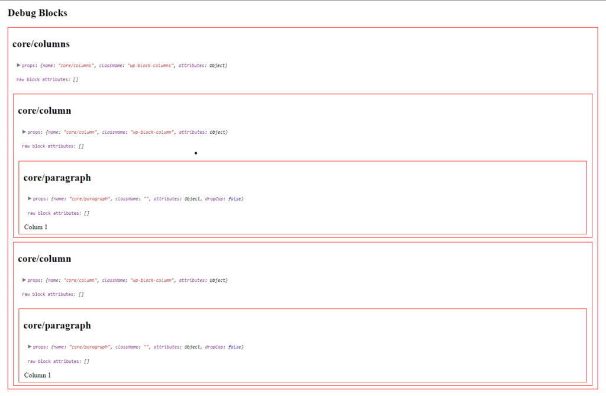

# Rendering Blocks

## Introduction

There are multiple approaches to block rendering

### Naive Approach

Simply output the generated markup "as is", using dangerouslySetInnerHTML.

### Blocks as JSON Approach

With this approach, there's some custom PHP logic that parses blocks on the PHP side of things and converts them to JSON to be included in the REST API (or GraphQL). 

This approach makes it very easy (and portable) to render blocks anywhere, but on the other hand, it forces the implementation of all supported blocks. Handling server-rendered blocks is also a problem.

In this approach, blocks are parsed on the Backend.

### Blocks as Markup Approach

Instead of simply outputting the generated markup “as is”, it runs the block markup through an HTML parser (after sanitizing) and selectively (and progressively) replaces block markup with actual React components as needed.

This approach is the simplest way to render blocks as not all blocks need to be actual React components (e.g paragraphs, lists, etc). You only need to create React Components for very specific blocks such as Links, Images, and “dynamic blocks” such as accordion, etc. You can still ignore certain blocks if you want better control of supported blocks (both on the WP side and the front-end side).

In this approach, blocks are parsed on the Frontend.


### Which approach should you use?

The Headless Framework supports all of these approaches. However, it does not ship with a “blocks-to-rest” plugin. But nothing is stopping you from shipping your own.

Instead, it provides a React API for selectively choosing blocks to be replaced with React components and as we’ll show in this article this approach works well for most content-focused websites and can even be implemented in React Native apps to power App screens fully curated by Gutenberg.


## The BlocksRenderer component

The `BlocksRenderer` component is the heart of the “HTML to React” approach. It receives arbitrary HTML markup, runs its content through wpKsesPost, and replaces markup with react component based on the child components passed to it. This approach is not tied to Gutenberg markup in any way, it can be used as a generic HTML-to-React conversion tool. Here’s a simple example of how it works

```js
const MyLinkBlock = ({ domNode, children }) => {
    // get the html attributes from the dom node
    const { href, rel } = domNode.attribs;

    return (
        <MyFrameWorkSpecificLinkComponent href={href} rel={rel}>
            {children}
        </MyFrameWorkSpecificLinkComponent>
    );
};

export const Blocks = ({ html }) => {
    return (
        <BlocksRenderer html={html}>
            <MyLinkBlock tagName="a" classList="my-special-anchor" />
        </BlocksRenderer>
    );
};
```

In the example above, we’re passing the HTML content directly to BlocksRenderer and we’re specifying that any anchor tags with a class of “my-special-anchor” should be replaced with MyLinkBlock.

The MyLinkBlock then gets one special prop called domNode which is the DOM Node that’s being replaced with a React component. You can use domNode to access attributes of the node such as href and rel in this case.

Alternatively, you can also specify a test function to match dom nodes, the example above could also have been written as shown below

```js
<MyLinkBlock 
  test={ 
        (node) => node.type === 'tag' 
               && node.name === 'a' 
               && node.attribs.class === 'my-special-anchor'
  } 
/>
```

There are a number of utility functions that make matching nodes and blocks specifically very easy as we’ll see now.

### Matching blocks with isBlock

The isBlock function matches a DOM node by its tagName and optionally CSS classes.

```js
<BlocksRenderer html={html}>
     <MyCustomBlock
            test={(node) => isBlock(node, { tagName: 'div', classList: ['block-class-name'] })}
        />
</BlocksRenderer>
```

### Matching Blocks with isBlockByName

The isBlockByName matches a DOM node by its Gutenberg block name. This function requires the Headless WP plugin to be installed. The Headless WP plugin appends two special attributes to every block: data-wp-block-name and data-wp-block-attrs.

This is a very handy function as it makes it very easy to match any registered Gutenberg block.

```js
<BlocksRenderer html={html}>
     <MyCustomParagraphBlock
            test={(node) => isBlock(node, 'core/paragraph')}
        />
</BlocksRenderer>
```

## Core Blocks

Not all core blocks would need to be rendered as React components, but when needed to replace core blocks with react components, the framework provides a set of components that does the heavy lifting of matching core blocks and getting their properties. This set of blocks can be seen here.

You can explore how this works by using a debug block component to inspect all of its props. 

```js
import {
	BlocksRenderer,
	YoutubeLiteBlock,
	ImageBlock,
	ColumnBlock,
	ColumnsBlock,
	ParagraphBlock,
	DebugBlock,
} from '@10up/headless-core/react';

<BlocksRenderer html={html}>
     { /* .... */ }
	<ColumnBlock component={DebugBlock} />
	<ColumnsBlock component={DebugBlock} />
	<ParagraphBlock component={DebugBlock} />
</BlocksRenderer>
```

You should see something like this


By inspecting the props you can see you have access to things like block name, className, and even the Gutenberg attributes. You could, in theory, build your implementation for every block without loading any of the default Gutenberg styles, shipping your own component library/design system.