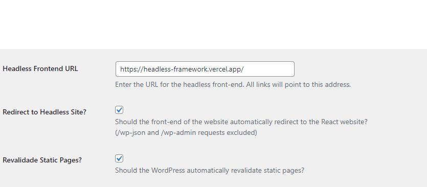

# On-demand ISR revalidation

[On-demand Revalidation](https://nextjs.org/docs/basic-features/data-fetching/incremental-static-regeneration#on-demand-revalidation) is the ability to revalidate static pages programatically from the CMS.

Without On-demand ISR revalidation users will need to wait until the time set in the `revalidate` prop has passed before they can see a updated version of that page. This means that if a `revalidate` is set to 5min, users would potentially have to wait up to 5min before they can see new content.

It is preffered to have the CMS ask the Next.js app to revalidate those pages when possible. This can be done via "On-Demand Revalidation".

## Usage

### Plugin setup

10up Headless Framework supports On-Demand Revalidation and it requires installing the WordPress Plugin. On-Demand Revalidation is opt-in and must be manually enabled in the plugin's settings (Settings -> General).


The plugin expects the revalidate endpoint to live at  `/api/revalidate`. It is possible to customize this endpoint via the `tenup_headless_isr_revalidate_endpoint`.

```php
/**
 * Filters the revalidate endpoint.
 *
 * @param string $revalidate_endpoint The revalidate endpoint
 */
$revalidate_endpoint = apply_filters( 
    'tenup_headless_isr_revalidate_endpoint', 
    trailingslashit( Plugin::get_react_url() ) . 'api/revalidate' 
);
```

### Revalidate Endpoint

Simply create an Next.js API endpoint that uses the `revalidateHandler` provided by the framework. 

:::caution
If you changed the default value of the endpoint path via the `tenup_headless_isr_revalidate_endpoint` filter, make sure you change it in the Next.js app as well. 
:::caution


```javascript title="src/pages/api/revalidate"
import { revalidateHandler } from '@10up/headless-next';

/**
 * The revalidate endpoint just needs to proxy the default revalidate handler
 *
 * @param {*} req Next.js request object
 * @param {*} res  Next.js response object
 *
 * @returns
 */
export default async function handler(req, res) {
	return revalidateHandler(req, res);
}
```

## How does it work?

The default implementation will revalidate any post or page upon saving in WordPress. You can see the logic [here](https://github.com/10up/headless/blob/develop/wp/headless-wp/includes/classes/CacheFlush/CacheFlush.php#L40).