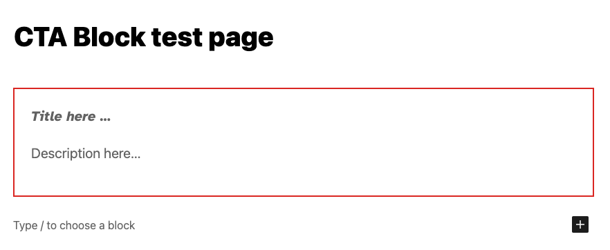
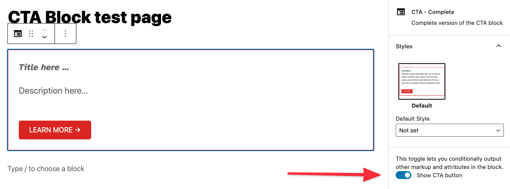

# Lesson 2: Creating a simple Block

This lesson provides a partially completed block that needs to have some features added to it to match the existing `cta-complete` block. All of the setup and files have been pre-configured as the focus here is to work with a block on its own without adding confusion around build tools and file locations.

These files can be found inside of the starter theme at: `/wp-content/themes/tenup-theme/includes/blocks`.

If you are stuck or need help, refer to the `cta-complete` block as a reference or reach out to #10up-gutenberg in Slack for help

## Learning Outcomes

1. Learn how to add new attributes to a block.
2. Use the RichText component and save the values to a block.
3. Add an Inspector Control to a block.
4. Displaying attributes on the frontend.

Here's the completed CTA block that we're going to build:


## Tasks

### 1: Adding a new attribute: `description`

Add a new attribute to the `cta-starter/block.json` file that will store the `description` field. Attributes are how data is stored with a block. [Here is a link to the official docs for reference](https://developer.wordpress.org/block-editor/reference-guides/block-api/block-attributes/) and some more reading [here](https://developer.wordpress.org/block-editor/handbook/tutorials/create-block/attributes/). For reference, you can see the existing `title` attribute in the file. Don't forget to set the "type"!:

```json
"title": {
	"type": "string"
}
```

**BONUS:** Set the "example" output for `description` as "Venenatis saepe perspiciatis illum qui voluptatum sagittis nihil litora ipsum sequi, eiusmod tellus soluta, pulvinar! Nemo exercitationem hic risus fugit! Omnis, proident tempora perspiciatis nulla." For reference, you can see the existing `title` content under "example."

```json
"title": "CTA Starter Example"
```

### 2: Adding a RichText component to manage the new attribute

We want the user to be able to visually edit the description right inline. To do this we need to add the actual editable text field to the markup of the block in the editor. This markup gets defined in the `ExampleBlockEdit` function in the `cta-starter/edit.js` file.

Before we can work with the `description` value we need to access the current value of the attribute. Gutenberg passes in an object containing the block attributes, a callback function to set the attributes to a new value and some other helpful values. To make it easier to work with we can use object deconstruction to get access to only the values we want to use. In this example, we have only pulled out the `title` so far but now need to access the `description` the same way.

```js
const {
	attributes,
	setAttributes,
} = props;

const {
	// highlight-start
	title,
	// highlight-end
} = attributes;
```

Next, in the same file, we can add a `RichText` component under the existing one for the title. This component can receive many props ( [see the docs here for the full list](https://github.com/WordPress/gutenberg/tree/trunk/packages/block-editor/src/components/rich-text) ) but for now, we only need to specify the `tagName`, the `value` and `onChange`. Although not required, let's also add `className`, and `placeholder`. If you use the existing `RichText` being used for the `title` attribute, be sure to update any references to the `title` attribute to the new one we created. Once you have the attribute saved and retrieved correctly, move on to the next task!

:::tip
Not sure what to use as values? Here you go:

```js
<RichText
	className="call-to-action-block__description"
	tagName="p"
	placeholder={__('Description here…', 'gutenberg-lessons')}
	value={description}
	onChange={(description) => setAttributes({ description })}
/>
```

:::tip

:::note
See that `setAttributes` call? That's a function that is provided by the block API to set attributes for the block you can read more about it [here](https://developer.wordpress.org/block-editor/reference-guides/block-api/block-attributes/)
:::note

### 3: Adding an optional field to the block

Now that we know how to add new attributes and use `setAttributes` to update them, we can a more complicated feature - let's add an optional CTA button!

When we're done, it will look like this:


To do this, we need to manage three new pieces of data:

1. Is the CTA enabled?
2. The button text.
3. The button link.

Add three more attributes to the `cta-starter/block.json` file for each of the new pieces of data with a `default` value and the appropriate `type` as needed. ( Refer to `cta-complete/block.json` if you get stuck )

:::note
**One of them is** NOT of the type `string`
:::note

:::tip
Attributes we are adding:

* `showCTALink`
* `ctaLink`
* `ctaText`
:::tip

**BONUS:** Let's set some defaults for these new attributes:

* `ctaLink`: "https://10up.com"
* `ctaText`: "Learn more →"

**BONUS:** Set the "example" output for each of these new attributes!

Next, we need to add a [`ToggleControl`](https://developer.wordpress.org/block-editor/reference-guides/components/toggle-control/) to the Inspector Sidebar for the block.

_FYI, there are lots of useful pre-built components like this one you can use. Reference the [pre-built components](https://developer.wordpress.org/block-editor/reference-guides/components/) before building any new ones._

The `InspectorControls` component has already been added to the `cta-starter/edit.js` for you, this is a special type of component that uses a concept called SlotFill. This is how we can add the code here, but have it appear in the Block Inspector sidebar. All of the imports have already been set up for you so you can just add the new `ToggleControl` inside the `PanelBody` (don't forget to add your new attributes to the `attribute` object at the top of the `ExampleBockEdit` call!). Set the props for the component to update the attribute that controls if CTA is enabled ( Refer to `cta-complete/edit.js` if you get stuck )

:::tip
place `ToggleControl` inside `PanelBody`:
:::tip

```jsx
<ToggleControl
	label={__('Show CTA button', 'gutenberg-lessons')}
	checked={showCTALink}
	onChange={() => setAttributes({ showCTALink: !showCTALink })}
/>
```

Once that is in-place, we want to add a `URLInput` component to the Inspector Side bar. This will allow the user to set the URL that the CTA button links to. The issue here is that we only want to show this new control if the attribute that stores if the CTA is enabled is set to true. Give this a try and again refer to the completed example if you get stuck.

:::tip

* We want to display the `URLInput` component just under our `ToggleControl` and **only** if `showCTALink` is `true`. In React, we can do something like `{showCTALink && ( ... )}`

```jsx
<URLInput
	label={__('URL', 'gutenberg-lessons')}
	value={ctaLink}
	onChange={(ctaLink) => {
		setAttributes({ ctaLink });
	}}
/>
```

:::tip

The next step is to add a new `RichText` component below the one for the `description` field that will manage the text of the CTA button. Be sure that this is only shown if the feature is enabled and that it sets and retrieves the associated attribute correctly.

:::tip

* Remember how we conditionally showed `URLInput` above? We can do the same thing for this new `RichText` component.
* NEW `RichText` component props:
  * `className="call-to-action-block__link"`
  * `tagName="a"`
  * `placeholder={__('CTA here…', 'gutenberg-lessons')}`
  * `value={ctaText}`
  * `onChange={(ctaText) => setAttributes({ ctaText })}`
:::tip

**A quick note on block UX best practices:** Generally, speaking content such as text or setting a featured image should be input into the actual block and "settings" such as the CTA on/off toggle should be in the inspector toolbar.

### 4: Rendering the front-end

The intention for any block we create at 10up is to have the Block Editor experience match the front-end experience match as closely as possible. Update the `cta-starter/markup.php` to show the new attributes correctly ( including the optional CTA button ).

:::tip

* Add `description`, and conditionally show `ctaLink`.
* All data needed should be passed found in $attributes.
* Don't forget class names.
:::tip

:::caution
You may see in the primary div in the class declaration the following: `<?php echo isset( $attributes['className'] ) ? esc_attr( $attributes['className'] ) : ''; ?>`. When a block is selected, within the block inspector controls (right sidebar), you will see a toggle for `Advanced` and, within that, an input to optionally add `Additional CSS class(es)`. This code included in the markup will display any custom / additional classes added here.
:::caution

## Next Steps

Congratulations! If you're here, you've created a block that should look and function the same as the `cta-complete` block. For this part of the training, get creative and add your feature to the block. Some ideas:

1. Change the style of the block if the "Show CTA" toggle is turned on.
2. Convert the toggle to a [radio control](https://developer.wordpress.org/block-editor/reference-guides/components/radio-control/).
3. Add a control that allows you to open the LEARN MORE link in a new tab.
