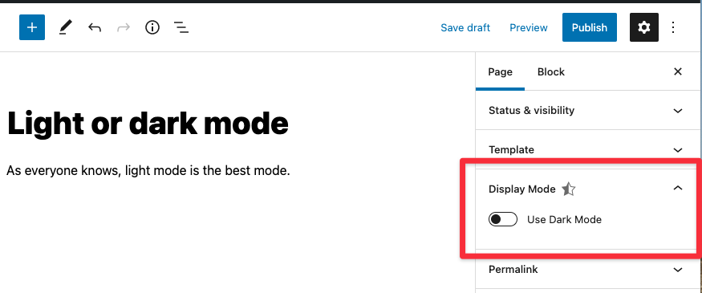

# Lesson 8: SlotFill

With the introduction of Gutenberg in WordPress 5.0, developers lost the ability to extend the post editor using PHP hooks. Instead, we now have the SlotFill system. At a high level, the SlotFill system allows developers to inject UI elements into Gutenberg into a predefined set of locations. For the full list of available locations please refer to the [SlotFills Reference docs on developer.wordpress.org](https://developer.wordpress.org/block-editor/reference-guides/slotfills/)

For a much deeper dive into the entire SlotFill system and how it works internally, watch this presentation from the 2019 JavaScript for WordPress conference.

<iframe width="560" height="315" src="https://www.youtube.com/embed/pMD0WpMaXEo" title="YouTube video player" frameborder="0" allow="accelerometer; autoplay; clipboard-write; encrypted-media; gyroscope; picture-in-picture" allowFullscreen></iframe>

## Lesson Outcomes

1. Understanding of the SlotFill system in Gutenberg.
2. Create and register a plugin to add a new Fill to the Document Settings panel.
3. How to register post meta to be used in Gutenberg.
4. Work with `useSelect` and `useDispatch` to retrieve and set custom post meta.
5. Add the `ToggleControl` component to display and update the meta value.
6. Filter the `body_class` to display the new class on the frontend.

## Overview

Imagine you're building a site that needs to support per-post [light/dark mode](https://css-tricks.com/a-complete-guide-to-dark-mode-on-the-web/). On each post, the editor can decide whether the post will have a dark background or a light one on the frontend.

We'll give the editor this control via a toggle in a Slot in the Inspector. In the template, we'll see if this toggle is checked or not and assign a corresponding class to the body tag: `<body class="light-mode">` or `<body class="dark-mode">`. *We can worry about the CSS details required to make this happen in another lesson.*

Here's the result in the editor:

## Tasks

### 1. Registering a plugin

In order to add a Fill to any of the available Slots, we first need to register a plugin using `registerPlugin` from the `@wordpress/plugins` package. Import the function and pass the appropriate parameters as defined in the [official docs](https://developer.wordpress.org/block-editor/reference-guides/packages/packages-plugins/#registerplugin). In the starter files, the SlotFill we're working with has already been imported do you only need to add the `CustomDocumentSettingsPanel` to the `render` property of `registerPlugin`.

### 2. Prepare the post meta for the REST API

In order to access or save post meta in Gutenberg, the meta needs to be exposed to the REST API. For the lesson, this has already been done in [includes/core.php](https://github.com/10up/gutenberg-lessons/blob/trunk/themes/tenup-theme/includes/core.php#L37) but this is a very important step as, without it, meta will not be saved to the database.

### 3. Add the ToggleControl component

Import the `ToggleControl` component and add it inside the `PluginDocumentSettingPanel` component. Anything inside that component will be displayed in the sidebar. Using the [official [docs](https://developer.wordpress.org/block-editor/reference-guides/components/toggle-control/) as a reference, set up the `ToggleControl` so that the value of the meta is set to `dark-mode` when checked and `light-mode` when unchecked and save the meta using the `editPost` function.

:::warning
**You will be updating all of the meta for the post, so be sure to combine the existing and new meta values when saving. If you get stuck, refer to the complete example.**
:::note

### 4. Display the class on the frontend

We can filter the `body_class` function to display this new meta as class a filter. This has been done already but have a look at it in [includes/core.php](https://github.com/10up/gutenberg-lessons/tree/trunk/themes/tenup-theme/includes/core.php#L63)

### 5. Add another control

We now have two modes for our posts: light and dark. Imagine your client comes back and says, "We want to be able to select from 4 different modes/themes - Light, Dark, Milkshake and Popsicle."  Swap the current toggle for a select dropdown with 4 options for the theme and output the appropriate body class on the frontend: `<body class="light-mode">`, `<body class="dark-mode">`, `<body class="milkshake-mode">`, `<body class="popsicle-mode">`.
